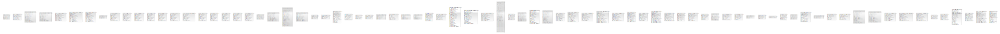

# db

## Tables

| Name | Columns | Comment | Type |
| ---- | ------- | ------- | ---- |
| [batch](batch.md) | 4 | Stores details about batches (processes that run in… | BASE TABLE |
| [block_content](block_content.md) | 5 | The base table for block_content entities. | BASE TABLE |
| [block_content_field_data](block_content_field_data.md) | 10 | The data table for block_content entities. | BASE TABLE |
| [block_content_field_revision](block_content_field_revision.md) | 8 | The revision data table for block_content entities. | BASE TABLE |
| [block_content_revision](block_content_revision.md) | 7 | The revision table for block_content entities. | BASE TABLE |
| [block_content_revision__body](block_content_revision__body.md) | 9 | Revision archive storage for block_content field body. | BASE TABLE |
| [block_content__body](block_content__body.md) | 9 | Data storage for block_content field body. | BASE TABLE |
| [cachetags](cachetags.md) | 2 | Cache table for tracking cache tag invalidations. | BASE TABLE |
| [cache_bootstrap](cache_bootstrap.md) | 7 | Storage for the cache API. | BASE TABLE |
| [cache_config](cache_config.md) | 7 | Storage for the cache API. | BASE TABLE |
| [cache_container](cache_container.md) | 7 | Storage for the cache API. | BASE TABLE |
| [cache_data](cache_data.md) | 7 | Storage for the cache API. | BASE TABLE |
| [cache_default](cache_default.md) | 7 | Storage for the cache API. | BASE TABLE |
| [cache_discovery](cache_discovery.md) | 7 | Storage for the cache API. | BASE TABLE |
| [cache_dynamic_page_cache](cache_dynamic_page_cache.md) | 7 | Storage for the cache API. | BASE TABLE |
| [cache_entity](cache_entity.md) | 7 | Storage for the cache API. | BASE TABLE |
| [cache_menu](cache_menu.md) | 7 | Storage for the cache API. | BASE TABLE |
| [cache_page](cache_page.md) | 7 | Storage for the cache API. | BASE TABLE |
| [cache_render](cache_render.md) | 7 | Storage for the cache API. | BASE TABLE |
| [cache_toolbar](cache_toolbar.md) | 7 | Storage for the cache API. | BASE TABLE |
| [comment](comment.md) | 4 | The base table for comment entities. | BASE TABLE |
| [comment_entity_statistics](comment_entity_statistics.md) | 8 | Maintains statistics of entity and comments posts to show … | BASE TABLE |
| [comment_field_data](comment_field_data.md) | 18 | The data table for comment entities. | BASE TABLE |
| [comment__comment_body](comment__comment_body.md) | 8 | Data storage for comment field comment_body. | BASE TABLE |
| [config](config.md) | 3 | The base table for configuration data. | BASE TABLE |
| [config_export](config_export.md) | 3 | The base table for configuration data. | BASE TABLE |
| [file_managed](file_managed.md) | 11 | The base table for file entities. | BASE TABLE |
| [file_usage](file_usage.md) | 5 | Track where a file is used. | BASE TABLE |
| [history](history.md) | 3 | A record of which "users" have read which "node"s. | BASE TABLE |
| [key_value](key_value.md) | 3 | Generic key-value storage table. See the state system for… | BASE TABLE |
| [key_value_expire](key_value_expire.md) | 4 | Generic key/value storage table with an expiration. | BASE TABLE |
| [locales_location](locales_location.md) | 5 | Location information for source strings. | BASE TABLE |
| [locales_source](locales_source.md) | 4 | List of English source strings. | BASE TABLE |
| [locales_target](locales_target.md) | 4 | Stores translated versions of strings. | BASE TABLE |
| [locale_file](locale_file.md) | 7 | File import status information for interface translation… | BASE TABLE |
| [menu_link_content](menu_link_content.md) | 5 | The base table for menu_link_content entities. | BASE TABLE |
| [menu_link_content_data](menu_link_content_data.md) | 19 | The data table for menu_link_content entities. | BASE TABLE |
| [menu_link_content_field_revision](menu_link_content_field_revision.md) | 13 | The revision data table for menu_link_content entities. | BASE TABLE |
| [menu_link_content_revision](menu_link_content_revision.md) | 7 | The revision table for menu_link_content entities. | BASE TABLE |
| [menu_tree](menu_tree.md) | 30 | Contains the menu tree hierarchy. | BASE TABLE |
| [node](node.md) | 5 | The base table for node entities. | BASE TABLE |
| [node_access](node_access.md) | 8 | Identifies which realm/grant pairs a user must possess in… | BASE TABLE |
| [node_field_data](node_field_data.md) | 13 | The data table for node entities. | BASE TABLE |
| [node_field_revision](node_field_revision.md) | 12 | The revision data table for node entities. | BASE TABLE |
| [node_revision](node_revision.md) | 7 | The revision table for node entities. | BASE TABLE |
| [node_revision__body](node_revision__body.md) | 9 | Revision archive storage for node field body. | BASE TABLE |
| [node_revision__comment](node_revision__comment.md) | 7 | Revision archive storage for node field comment. | BASE TABLE |
| [node_revision__field_image](node_revision__field_image.md) | 11 | Revision archive storage for node field field_image. | BASE TABLE |
| [node_revision__field_tags](node_revision__field_tags.md) | 7 | Revision archive storage for node field field_tags. | BASE TABLE |
| [node__body](node__body.md) | 9 | Data storage for node field body. | BASE TABLE |
| [node__comment](node__comment.md) | 7 | Data storage for node field comment. | BASE TABLE |
| [node__field_image](node__field_image.md) | 11 | Data storage for node field field_image. | BASE TABLE |
| [node__field_tags](node__field_tags.md) | 7 | Data storage for node field field_tags. | BASE TABLE |
| [path_alias](path_alias.md) | 7 | The base table for path_alias entities. | BASE TABLE |
| [path_alias_revision](path_alias_revision.md) | 7 | The revision table for path_alias entities. | BASE TABLE |
| [queue](queue.md) | 5 | Stores items in queues. | BASE TABLE |
| [router](router.md) | 6 | Maps paths to various callbacks (access, page and title) | BASE TABLE |
| [search_dataset](search_dataset.md) | 5 | Stores items that will be searched. | BASE TABLE |
| [search_index](search_index.md) | 5 | Stores the search index, associating words, items and… | BASE TABLE |
| [search_total](search_total.md) | 2 | Stores search totals for words. | BASE TABLE |
| [semaphore](semaphore.md) | 3 | Table for holding semaphores, locks, flags, etc. that… | BASE TABLE |
| [sequences](sequences.md) | 1 | Stores IDs. | BASE TABLE |
| [sessions](sessions.md) | 5 | Drupal's session handlers read and write into the sessions… | BASE TABLE |
| [shortcut](shortcut.md) | 4 | The base table for shortcut entities. | BASE TABLE |
| [shortcut_field_data](shortcut_field_data.md) | 9 | The data table for shortcut entities. | BASE TABLE |
| [shortcut_set_users](shortcut_set_users.md) | 2 | Maps users to shortcut sets. | BASE TABLE |
| [taxonomy_index](taxonomy_index.md) | 5 | Maintains denormalized information about node/term… | BASE TABLE |
| [taxonomy_term_data](taxonomy_term_data.md) | 5 | The base table for taxonomy_term entities. | BASE TABLE |
| [taxonomy_term_field_data](taxonomy_term_field_data.md) | 12 | The data table for taxonomy_term entities. | BASE TABLE |
| [taxonomy_term_field_revision](taxonomy_term_field_revision.md) | 10 | The revision data table for taxonomy_term entities. | BASE TABLE |
| [taxonomy_term_revision](taxonomy_term_revision.md) | 7 | The revision table for taxonomy_term entities. | BASE TABLE |
| [taxonomy_term_revision__parent](taxonomy_term_revision__parent.md) | 7 | Revision archive storage for taxonomy_term field parent. | BASE TABLE |
| [taxonomy_term__parent](taxonomy_term__parent.md) | 7 | Data storage for taxonomy_term field parent. | BASE TABLE |
| [users](users.md) | 3 | The base table for user entities. | BASE TABLE |
| [users_data](users_data.md) | 5 | Stores module data as key/value pairs per user. | BASE TABLE |
| [users_field_data](users_field_data.md) | 15 | The data table for user entities. | BASE TABLE |
| [user__roles](user__roles.md) | 7 | Data storage for user field roles. | BASE TABLE |
| [user__user_picture](user__user_picture.md) | 11 | Data storage for user field user_picture. | BASE TABLE |
| [watchdog](watchdog.md) | 11 | Table that contains logs of all system events. | BASE TABLE |

## Relations

---

> Generated by [tbls](https://github.com/k1LoW/tbls)
