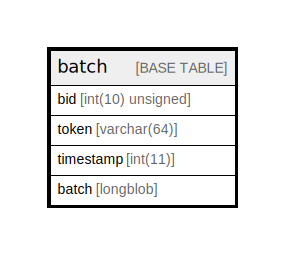

# batch

## Description

Stores details about batches (processes that run in…

<details>
<summary><strong>Table Definition</strong></summary>

```sql
CREATE TABLE `batch` (
  `bid` int(10) unsigned NOT NULL COMMENT 'Primary Key: Unique batch ID.',
  `token` varchar(64) CHARACTER SET ascii COLLATE ascii_general_ci NOT NULL COMMENT 'A string token generated against the current user''s session id and the batch id, used to ensure that only the user who submitted the batch can effectively access it.',
  `timestamp` int(11) NOT NULL COMMENT 'A Unix timestamp indicating when this batch was submitted for processing. Stale batches are purged at cron time.',
  `batch` longblob DEFAULT NULL COMMENT 'A serialized array containing the processing data for the batch.',
  PRIMARY KEY (`bid`),
  KEY `token` (`token`)
) ENGINE=InnoDB DEFAULT CHARSET=utf8mb4 COLLATE=utf8mb4_general_ci COMMENT='Stores details about batches (processes that run in…'
```

</details>

## Columns

| Name | Type | Default | Nullable | Children | Parents | Comment |
| ---- | ---- | ------- | -------- | -------- | ------- | ------- |
| bid | int(10) unsigned |  | false |  |  | Primary Key: Unique batch ID. |
| token | varchar(64) |  | false |  |  | A string token generated against the current user's session id and the batch id, used to ensure that only the user who submitted the batch can effectively access it. |
| timestamp | int(11) |  | false |  |  | A Unix timestamp indicating when this batch was submitted for processing. Stale batches are purged at cron time. |
| batch | longblob | NULL | true |  |  | A serialized array containing the processing data for the batch. |

## Constraints

| Name | Type | Definition |
| ---- | ---- | ---------- |
| PRIMARY | PRIMARY KEY | PRIMARY KEY (bid) |

## Indexes

| Name | Definition |
| ---- | ---------- |
| token | KEY token (token) USING BTREE |
| PRIMARY | PRIMARY KEY (bid) USING BTREE |

## Relations



---

> Generated by [tbls](https://github.com/k1LoW/tbls)
