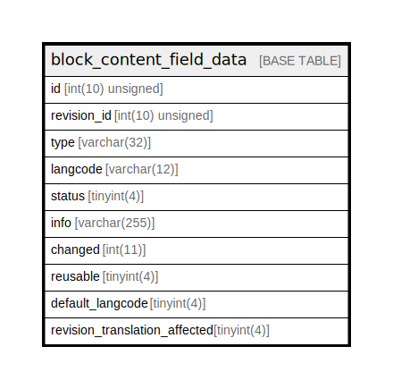

# block_content_field_data

## Description

The data table for block_content entities.

<details>
<summary><strong>Table Definition</strong></summary>

```sql
CREATE TABLE `block_content_field_data` (
  `id` int(10) unsigned NOT NULL,
  `revision_id` int(10) unsigned NOT NULL,
  `type` varchar(32) CHARACTER SET ascii COLLATE ascii_general_ci NOT NULL COMMENT 'The ID of the target entity.',
  `langcode` varchar(12) CHARACTER SET ascii COLLATE ascii_general_ci NOT NULL,
  `status` tinyint(4) NOT NULL,
  `info` varchar(255) DEFAULT NULL,
  `changed` int(11) DEFAULT NULL,
  `reusable` tinyint(4) DEFAULT NULL,
  `default_langcode` tinyint(4) NOT NULL,
  `revision_translation_affected` tinyint(4) DEFAULT NULL,
  PRIMARY KEY (`id`,`langcode`),
  KEY `block_content__id__default_langcode__langcode` (`id`,`default_langcode`,`langcode`),
  KEY `block_content__revision_id` (`revision_id`),
  KEY `block_content_field__type__target_id` (`type`),
  KEY `block_content__status_type` (`status`,`type`,`id`)
) ENGINE=InnoDB DEFAULT CHARSET=utf8mb4 COLLATE=utf8mb4_general_ci COMMENT='The data table for block_content entities.'
```

</details>

## Columns

| Name | Type | Default | Nullable | Children | Parents | Comment |
| ---- | ---- | ------- | -------- | -------- | ------- | ------- |
| id | int(10) unsigned |  | false |  |  |  |
| revision_id | int(10) unsigned |  | false |  |  |  |
| type | varchar(32) |  | false |  |  | The ID of the target entity. |
| langcode | varchar(12) |  | false |  |  |  |
| status | tinyint(4) |  | false |  |  |  |
| info | varchar(255) | NULL | true |  |  |  |
| changed | int(11) | NULL | true |  |  |  |
| reusable | tinyint(4) | NULL | true |  |  |  |
| default_langcode | tinyint(4) |  | false |  |  |  |
| revision_translation_affected | tinyint(4) | NULL | true |  |  |  |

## Constraints

| Name | Type | Definition |
| ---- | ---- | ---------- |
| PRIMARY | PRIMARY KEY | PRIMARY KEY (id, langcode) |

## Indexes

| Name | Definition |
| ---- | ---------- |
| block_content_field__type__target_id | KEY block_content_field__type__target_id (type) USING BTREE |
| block_content__id__default_langcode__langcode | KEY block_content__id__default_langcode__langcode (id, default_langcode, langcode) USING BTREE |
| block_content__revision_id | KEY block_content__revision_id (revision_id) USING BTREE |
| block_content__status_type | KEY block_content__status_type (status, type, id) USING BTREE |
| PRIMARY | PRIMARY KEY (id, langcode) USING BTREE |

## Relations



---

> Generated by [tbls](https://github.com/k1LoW/tbls)
