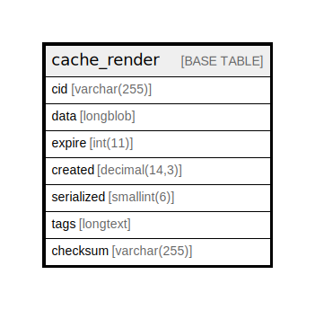

# cache_render

## Description

Storage for the cache API.

<details>
<summary><strong>Table Definition</strong></summary>

```sql
CREATE TABLE `cache_render` (
  `cid` varchar(255) CHARACTER SET ascii COLLATE ascii_bin NOT NULL DEFAULT '' COMMENT 'Primary Key: Unique cache ID.',
  `data` longblob DEFAULT NULL COMMENT 'A collection of data to cache.',
  `expire` int(11) NOT NULL DEFAULT 0 COMMENT 'A Unix timestamp indicating when the cache entry should expire, or -1 for never.',
  `created` decimal(14,3) NOT NULL DEFAULT 0.000 COMMENT 'A timestamp with millisecond precision indicating when the cache entry was created.',
  `serialized` smallint(6) NOT NULL DEFAULT 0 COMMENT 'A flag to indicate whether content is serialized (1) or not (0).',
  `tags` longtext DEFAULT NULL COMMENT 'Space-separated list of cache tags for this entry.',
  `checksum` varchar(255) CHARACTER SET ascii COLLATE ascii_general_ci NOT NULL COMMENT 'The tag invalidation checksum when this entry was saved.',
  PRIMARY KEY (`cid`),
  KEY `expire` (`expire`),
  KEY `created` (`created`)
) ENGINE=InnoDB DEFAULT CHARSET=utf8mb4 COLLATE=utf8mb4_general_ci COMMENT='Storage for the cache API.'
```

</details>

## Columns

| Name | Type | Default | Nullable | Children | Parents | Comment |
| ---- | ---- | ------- | -------- | -------- | ------- | ------- |
| cid | varchar(255) | '' | false |  |  | Primary Key: Unique cache ID. |
| data | longblob | NULL | true |  |  | A collection of data to cache. |
| expire | int(11) | 0 | false |  |  | A Unix timestamp indicating when the cache entry should expire, or -1 for never. |
| created | decimal(14,3) | 0.000 | false |  |  | A timestamp with millisecond precision indicating when the cache entry was created. |
| serialized | smallint(6) | 0 | false |  |  | A flag to indicate whether content is serialized (1) or not (0). |
| tags | longtext | NULL | true |  |  | Space-separated list of cache tags for this entry. |
| checksum | varchar(255) |  | false |  |  | The tag invalidation checksum when this entry was saved. |

## Constraints

| Name | Type | Definition |
| ---- | ---- | ---------- |
| PRIMARY | PRIMARY KEY | PRIMARY KEY (cid) |

## Indexes

| Name | Definition |
| ---- | ---------- |
| created | KEY created (created) USING BTREE |
| expire | KEY expire (expire) USING BTREE |
| PRIMARY | PRIMARY KEY (cid) USING BTREE |

## Relations



---

> Generated by [tbls](https://github.com/k1LoW/tbls)
