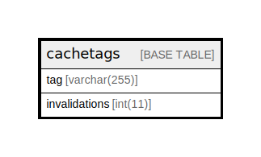

# cachetags

## Description

Cache table for tracking cache tag invalidations.

<details>
<summary><strong>Table Definition</strong></summary>

```sql
CREATE TABLE `cachetags` (
  `tag` varchar(255) CHARACTER SET ascii COLLATE ascii_general_ci NOT NULL DEFAULT '' COMMENT 'Namespace-prefixed tag string.',
  `invalidations` int(11) NOT NULL DEFAULT 0 COMMENT 'Number incremented when the tag is invalidated.',
  PRIMARY KEY (`tag`)
) ENGINE=InnoDB DEFAULT CHARSET=utf8mb4 COLLATE=utf8mb4_general_ci COMMENT='Cache table for tracking cache tag invalidations.'
```

</details>

## Columns

| Name | Type | Default | Nullable | Children | Parents | Comment |
| ---- | ---- | ------- | -------- | -------- | ------- | ------- |
| tag | varchar(255) | '' | false |  |  | Namespace-prefixed tag string. |
| invalidations | int(11) | 0 | false |  |  | Number incremented when the tag is invalidated. |

## Constraints

| Name | Type | Definition |
| ---- | ---- | ---------- |
| PRIMARY | PRIMARY KEY | PRIMARY KEY (tag) |

## Indexes

| Name | Definition |
| ---- | ---------- |
| PRIMARY | PRIMARY KEY (tag) USING BTREE |

## Relations



---

> Generated by [tbls](https://github.com/k1LoW/tbls)
