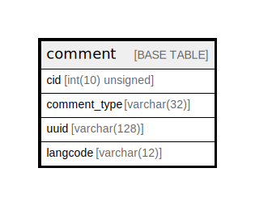

# comment

## Description

The base table for comment entities.

<details>
<summary><strong>Table Definition</strong></summary>

```sql
CREATE TABLE `comment` (
  `cid` int(10) unsigned NOT NULL AUTO_INCREMENT,
  `comment_type` varchar(32) CHARACTER SET ascii COLLATE ascii_general_ci NOT NULL COMMENT 'The ID of the target entity.',
  `uuid` varchar(128) CHARACTER SET ascii COLLATE ascii_general_ci NOT NULL,
  `langcode` varchar(12) CHARACTER SET ascii COLLATE ascii_general_ci NOT NULL,
  PRIMARY KEY (`cid`),
  UNIQUE KEY `comment_field__uuid__value` (`uuid`),
  KEY `comment_field__comment_type__target_id` (`comment_type`)
) ENGINE=InnoDB DEFAULT CHARSET=utf8mb4 COLLATE=utf8mb4_general_ci COMMENT='The base table for comment entities.'
```

</details>

## Columns

| Name | Type | Default | Nullable | Extra Definition | Children | Parents | Comment |
| ---- | ---- | ------- | -------- | ---------------- | -------- | ------- | ------- |
| cid | int(10) unsigned |  | false | auto_increment |  |  |  |
| comment_type | varchar(32) |  | false |  |  |  | The ID of the target entity. |
| uuid | varchar(128) |  | false |  |  |  |  |
| langcode | varchar(12) |  | false |  |  |  |  |

## Constraints

| Name | Type | Definition |
| ---- | ---- | ---------- |
| comment_field__uuid__value | UNIQUE | UNIQUE KEY comment_field__uuid__value (uuid) |
| PRIMARY | PRIMARY KEY | PRIMARY KEY (cid) |

## Indexes

| Name | Definition |
| ---- | ---------- |
| comment_field__comment_type__target_id | KEY comment_field__comment_type__target_id (comment_type) USING BTREE |
| PRIMARY | PRIMARY KEY (cid) USING BTREE |
| comment_field__uuid__value | UNIQUE KEY comment_field__uuid__value (uuid) USING BTREE |

## Relations



---

> Generated by [tbls](https://github.com/k1LoW/tbls)
