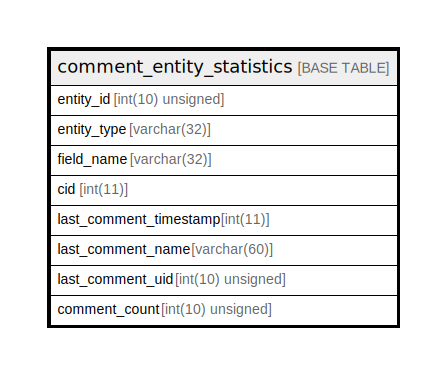

# comment_entity_statistics

## Description

Maintains statistics of entity and comments posts to show …

<details>
<summary><strong>Table Definition</strong></summary>

```sql
CREATE TABLE `comment_entity_statistics` (
  `entity_id` int(10) unsigned NOT NULL DEFAULT 0 COMMENT 'The entity_id of the entity for which the statistics are compiled.',
  `entity_type` varchar(32) CHARACTER SET ascii COLLATE ascii_general_ci NOT NULL DEFAULT 'node' COMMENT 'The entity_type of the entity to which this comment is a reply.',
  `field_name` varchar(32) CHARACTER SET ascii COLLATE ascii_general_ci NOT NULL DEFAULT '' COMMENT 'The field_name of the field that was used to add this comment.',
  `cid` int(11) NOT NULL DEFAULT 0 COMMENT 'The "comment".cid of the last comment.',
  `last_comment_timestamp` int(11) NOT NULL DEFAULT 0 COMMENT 'The Unix timestamp of the last comment that was posted within this node, from "comment".changed.',
  `last_comment_name` varchar(60) DEFAULT NULL COMMENT 'The name of the latest author to post a comment on this node, from "comment".name.',
  `last_comment_uid` int(10) unsigned NOT NULL DEFAULT 0 COMMENT 'The user ID of the latest author to post a comment on this node, from "comment".uid.',
  `comment_count` int(10) unsigned NOT NULL DEFAULT 0 COMMENT 'The total number of comments on this entity.',
  PRIMARY KEY (`entity_id`,`entity_type`,`field_name`),
  KEY `last_comment_timestamp` (`last_comment_timestamp`),
  KEY `comment_count` (`comment_count`),
  KEY `last_comment_uid` (`last_comment_uid`)
) ENGINE=InnoDB DEFAULT CHARSET=utf8mb4 COLLATE=utf8mb4_general_ci COMMENT='Maintains statistics of entity and comments posts to show …'
```

</details>

## Columns

| Name | Type | Default | Nullable | Children | Parents | Comment |
| ---- | ---- | ------- | -------- | -------- | ------- | ------- |
| entity_id | int(10) unsigned | 0 | false |  |  | The entity_id of the entity for which the statistics are compiled. |
| entity_type | varchar(32) | 'node' | false |  |  | The entity_type of the entity to which this comment is a reply. |
| field_name | varchar(32) | '' | false |  |  | The field_name of the field that was used to add this comment. |
| cid | int(11) | 0 | false |  |  | The "comment".cid of the last comment. |
| last_comment_timestamp | int(11) | 0 | false |  |  | The Unix timestamp of the last comment that was posted within this node, from "comment".changed. |
| last_comment_name | varchar(60) | NULL | true |  |  | The name of the latest author to post a comment on this node, from "comment".name. |
| last_comment_uid | int(10) unsigned | 0 | false |  |  | The user ID of the latest author to post a comment on this node, from "comment".uid. |
| comment_count | int(10) unsigned | 0 | false |  |  | The total number of comments on this entity. |

## Constraints

| Name | Type | Definition |
| ---- | ---- | ---------- |
| PRIMARY | PRIMARY KEY | PRIMARY KEY (entity_id, entity_type, field_name) |

## Indexes

| Name | Definition |
| ---- | ---------- |
| comment_count | KEY comment_count (comment_count) USING BTREE |
| last_comment_timestamp | KEY last_comment_timestamp (last_comment_timestamp) USING BTREE |
| last_comment_uid | KEY last_comment_uid (last_comment_uid) USING BTREE |
| PRIMARY | PRIMARY KEY (entity_id, entity_type, field_name) USING BTREE |

## Relations



---

> Generated by [tbls](https://github.com/k1LoW/tbls)
