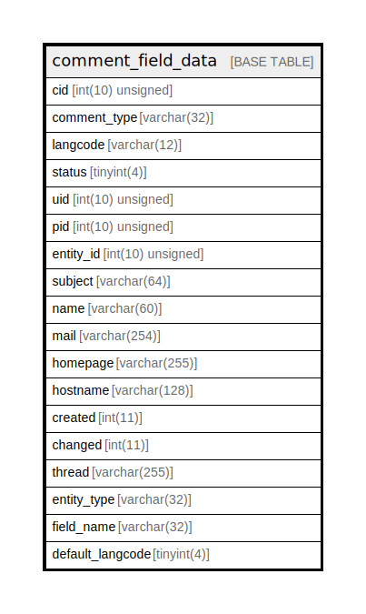

# comment_field_data

## Description

The data table for comment entities.

<details>
<summary><strong>Table Definition</strong></summary>

```sql
CREATE TABLE `comment_field_data` (
  `cid` int(10) unsigned NOT NULL,
  `comment_type` varchar(32) CHARACTER SET ascii COLLATE ascii_general_ci NOT NULL COMMENT 'The ID of the target entity.',
  `langcode` varchar(12) CHARACTER SET ascii COLLATE ascii_general_ci NOT NULL,
  `status` tinyint(4) NOT NULL,
  `uid` int(10) unsigned NOT NULL COMMENT 'The ID of the target entity.',
  `pid` int(10) unsigned DEFAULT NULL COMMENT 'The ID of the target entity.',
  `entity_id` int(10) unsigned DEFAULT NULL COMMENT 'The ID of the target entity.',
  `subject` varchar(64) DEFAULT NULL,
  `name` varchar(60) DEFAULT NULL,
  `mail` varchar(254) DEFAULT NULL,
  `homepage` varchar(255) DEFAULT NULL,
  `hostname` varchar(128) DEFAULT NULL,
  `created` int(11) NOT NULL,
  `changed` int(11) DEFAULT NULL,
  `thread` varchar(255) NOT NULL,
  `entity_type` varchar(32) CHARACTER SET ascii COLLATE ascii_general_ci NOT NULL,
  `field_name` varchar(32) CHARACTER SET ascii COLLATE ascii_general_ci NOT NULL,
  `default_langcode` tinyint(4) NOT NULL,
  PRIMARY KEY (`cid`,`langcode`),
  KEY `comment__id__default_langcode__langcode` (`cid`,`default_langcode`,`langcode`),
  KEY `comment_field__comment_type__target_id` (`comment_type`),
  KEY `comment_field__uid__target_id` (`uid`),
  KEY `comment_field__created` (`created`),
  KEY `comment__status_comment_type` (`status`,`comment_type`,`cid`),
  KEY `comment__status_pid` (`pid`,`status`),
  KEY `comment__num_new` (`entity_id`,`entity_type`,`comment_type`,`status`,`created`,`cid`,`thread`(191)),
  KEY `comment__entity_langcode` (`entity_id`,`entity_type`,`comment_type`,`default_langcode`)
) ENGINE=InnoDB DEFAULT CHARSET=utf8mb4 COLLATE=utf8mb4_general_ci COMMENT='The data table for comment entities.'
```

</details>

## Columns

| Name | Type | Default | Nullable | Children | Parents | Comment |
| ---- | ---- | ------- | -------- | -------- | ------- | ------- |
| cid | int(10) unsigned |  | false |  |  |  |
| comment_type | varchar(32) |  | false |  |  | The ID of the target entity. |
| langcode | varchar(12) |  | false |  |  |  |
| status | tinyint(4) |  | false |  |  |  |
| uid | int(10) unsigned |  | false |  |  | The ID of the target entity. |
| pid | int(10) unsigned | NULL | true |  |  | The ID of the target entity. |
| entity_id | int(10) unsigned | NULL | true |  |  | The ID of the target entity. |
| subject | varchar(64) | NULL | true |  |  |  |
| name | varchar(60) | NULL | true |  |  |  |
| mail | varchar(254) | NULL | true |  |  |  |
| homepage | varchar(255) | NULL | true |  |  |  |
| hostname | varchar(128) | NULL | true |  |  |  |
| created | int(11) |  | false |  |  |  |
| changed | int(11) | NULL | true |  |  |  |
| thread | varchar(255) |  | false |  |  |  |
| entity_type | varchar(32) |  | false |  |  |  |
| field_name | varchar(32) |  | false |  |  |  |
| default_langcode | tinyint(4) |  | false |  |  |  |

## Constraints

| Name | Type | Definition |
| ---- | ---- | ---------- |
| PRIMARY | PRIMARY KEY | PRIMARY KEY (cid, langcode) |

## Indexes

| Name | Definition |
| ---- | ---------- |
| comment_field__comment_type__target_id | KEY comment_field__comment_type__target_id (comment_type) USING BTREE |
| comment_field__created | KEY comment_field__created (created) USING BTREE |
| comment_field__uid__target_id | KEY comment_field__uid__target_id (uid) USING BTREE |
| comment__entity_langcode | KEY comment__entity_langcode (entity_id, entity_type, comment_type, default_langcode) USING BTREE |
| comment__id__default_langcode__langcode | KEY comment__id__default_langcode__langcode (cid, default_langcode, langcode) USING BTREE |
| comment__num_new | KEY comment__num_new (entity_id, entity_type, comment_type, status, created, cid, thread) USING BTREE |
| comment__status_comment_type | KEY comment__status_comment_type (status, comment_type, cid) USING BTREE |
| comment__status_pid | KEY comment__status_pid (pid, status) USING BTREE |
| PRIMARY | PRIMARY KEY (cid, langcode) USING BTREE |

## Relations



---

> Generated by [tbls](https://github.com/k1LoW/tbls)
