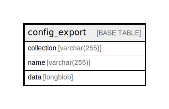

# config_export

## Description

The base table for configuration data.

<details>
<summary><strong>Table Definition</strong></summary>

```sql
CREATE TABLE `config_export` (
  `collection` varchar(255) CHARACTER SET ascii COLLATE ascii_general_ci NOT NULL DEFAULT '' COMMENT 'Primary Key: Config object collection.',
  `name` varchar(255) CHARACTER SET ascii COLLATE ascii_general_ci NOT NULL DEFAULT '' COMMENT 'Primary Key: Config object name.',
  `data` longblob DEFAULT NULL COMMENT 'A serialized configuration object data.',
  PRIMARY KEY (`collection`,`name`)
) ENGINE=InnoDB DEFAULT CHARSET=utf8mb4 COLLATE=utf8mb4_general_ci COMMENT='The base table for configuration data.'
```

</details>

## Columns

| Name | Type | Default | Nullable | Children | Parents | Comment |
| ---- | ---- | ------- | -------- | -------- | ------- | ------- |
| collection | varchar(255) | '' | false |  |  | Primary Key: Config object collection. |
| name | varchar(255) | '' | false |  |  | Primary Key: Config object name. |
| data | longblob | NULL | true |  |  | A serialized configuration object data. |

## Constraints

| Name | Type | Definition |
| ---- | ---- | ---------- |
| PRIMARY | PRIMARY KEY | PRIMARY KEY (collection, name) |

## Indexes

| Name | Definition |
| ---- | ---------- |
| PRIMARY | PRIMARY KEY (collection, name) USING BTREE |

## Relations



---

> Generated by [tbls](https://github.com/k1LoW/tbls)
