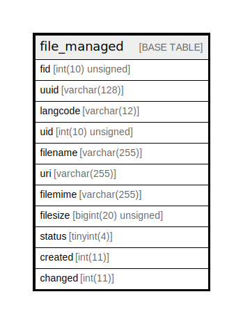

# file_managed

## Description

The base table for file entities.

<details>
<summary><strong>Table Definition</strong></summary>

```sql
CREATE TABLE `file_managed` (
  `fid` int(10) unsigned NOT NULL AUTO_INCREMENT,
  `uuid` varchar(128) CHARACTER SET ascii COLLATE ascii_general_ci NOT NULL,
  `langcode` varchar(12) CHARACTER SET ascii COLLATE ascii_general_ci NOT NULL,
  `uid` int(10) unsigned DEFAULT NULL COMMENT 'The ID of the target entity.',
  `filename` varchar(255) DEFAULT NULL,
  `uri` varchar(255) CHARACTER SET utf8mb4 COLLATE utf8mb4_bin NOT NULL,
  `filemime` varchar(255) CHARACTER SET ascii COLLATE ascii_general_ci DEFAULT NULL,
  `filesize` bigint(20) unsigned DEFAULT NULL,
  `status` tinyint(4) NOT NULL,
  `created` int(11) DEFAULT NULL,
  `changed` int(11) NOT NULL,
  PRIMARY KEY (`fid`),
  UNIQUE KEY `file_field__uuid__value` (`uuid`),
  KEY `file_field__uid__target_id` (`uid`),
  KEY `file_field__uri` (`uri`(191)),
  KEY `file_field__status` (`status`),
  KEY `file_field__changed` (`changed`)
) ENGINE=InnoDB DEFAULT CHARSET=utf8mb4 COLLATE=utf8mb4_general_ci COMMENT='The base table for file entities.'
```

</details>

## Columns

| Name | Type | Default | Nullable | Extra Definition | Children | Parents | Comment |
| ---- | ---- | ------- | -------- | ---------------- | -------- | ------- | ------- |
| fid | int(10) unsigned |  | false | auto_increment |  |  |  |
| uuid | varchar(128) |  | false |  |  |  |  |
| langcode | varchar(12) |  | false |  |  |  |  |
| uid | int(10) unsigned | NULL | true |  |  |  | The ID of the target entity. |
| filename | varchar(255) | NULL | true |  |  |  |  |
| uri | varchar(255) |  | false |  |  |  |  |
| filemime | varchar(255) | NULL | true |  |  |  |  |
| filesize | bigint(20) unsigned | NULL | true |  |  |  |  |
| status | tinyint(4) |  | false |  |  |  |  |
| created | int(11) | NULL | true |  |  |  |  |
| changed | int(11) |  | false |  |  |  |  |

## Constraints

| Name | Type | Definition |
| ---- | ---- | ---------- |
| file_field__uuid__value | UNIQUE | UNIQUE KEY file_field__uuid__value (uuid) |
| PRIMARY | PRIMARY KEY | PRIMARY KEY (fid) |

## Indexes

| Name | Definition |
| ---- | ---------- |
| file_field__changed | KEY file_field__changed (changed) USING BTREE |
| file_field__status | KEY file_field__status (status) USING BTREE |
| file_field__uid__target_id | KEY file_field__uid__target_id (uid) USING BTREE |
| file_field__uri | KEY file_field__uri (uri) USING BTREE |
| PRIMARY | PRIMARY KEY (fid) USING BTREE |
| file_field__uuid__value | UNIQUE KEY file_field__uuid__value (uuid) USING BTREE |

## Relations



---

> Generated by [tbls](https://github.com/k1LoW/tbls)
