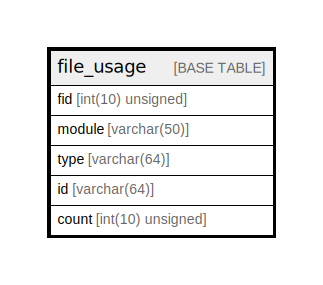

# file_usage

## Description

Track where a file is used.

<details>
<summary><strong>Table Definition</strong></summary>

```sql
CREATE TABLE `file_usage` (
  `fid` int(10) unsigned NOT NULL COMMENT 'File ID.',
  `module` varchar(50) CHARACTER SET ascii COLLATE ascii_general_ci NOT NULL DEFAULT '' COMMENT 'The name of the module that is using the file.',
  `type` varchar(64) CHARACTER SET ascii COLLATE ascii_general_ci NOT NULL DEFAULT '' COMMENT 'The name of the object type in which the file is used.',
  `id` varchar(64) CHARACTER SET ascii COLLATE ascii_general_ci NOT NULL DEFAULT '0' COMMENT 'The primary key of the object using the file.',
  `count` int(10) unsigned NOT NULL DEFAULT 0 COMMENT 'The number of times this file is used by this object.',
  PRIMARY KEY (`fid`,`type`,`id`,`module`),
  KEY `type_id` (`type`,`id`),
  KEY `fid_count` (`fid`,`count`),
  KEY `fid_module` (`fid`,`module`)
) ENGINE=InnoDB DEFAULT CHARSET=utf8mb4 COLLATE=utf8mb4_general_ci COMMENT='Track where a file is used.'
```

</details>

## Columns

| Name | Type | Default | Nullable | Children | Parents | Comment |
| ---- | ---- | ------- | -------- | -------- | ------- | ------- |
| fid | int(10) unsigned |  | false |  |  | File ID. |
| module | varchar(50) | '' | false |  |  | The name of the module that is using the file. |
| type | varchar(64) | '' | false |  |  | The name of the object type in which the file is used. |
| id | varchar(64) | '0' | false |  |  | The primary key of the object using the file. |
| count | int(10) unsigned | 0 | false |  |  | The number of times this file is used by this object. |

## Constraints

| Name | Type | Definition |
| ---- | ---- | ---------- |
| PRIMARY | PRIMARY KEY | PRIMARY KEY (fid, type, id, module) |

## Indexes

| Name | Definition |
| ---- | ---------- |
| fid_count | KEY fid_count (fid, count) USING BTREE |
| fid_module | KEY fid_module (fid, module) USING BTREE |
| type_id | KEY type_id (type, id) USING BTREE |
| PRIMARY | PRIMARY KEY (fid, type, id, module) USING BTREE |

## Relations



---

> Generated by [tbls](https://github.com/k1LoW/tbls)
