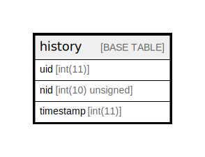

# history

## Description

A record of which "users" have read which "node"s.

<details>
<summary><strong>Table Definition</strong></summary>

```sql
CREATE TABLE `history` (
  `uid` int(11) NOT NULL DEFAULT 0 COMMENT 'The "users".uid that read the "node" nid.',
  `nid` int(10) unsigned NOT NULL DEFAULT 0 COMMENT 'The "node".nid that was read.',
  `timestamp` int(11) NOT NULL DEFAULT 0 COMMENT 'The Unix timestamp at which the read occurred.',
  PRIMARY KEY (`uid`,`nid`),
  KEY `nid` (`nid`)
) ENGINE=InnoDB DEFAULT CHARSET=utf8mb4 COLLATE=utf8mb4_general_ci COMMENT='A record of which "users" have read which "node"s.'
```

</details>

## Columns

| Name | Type | Default | Nullable | Children | Parents | Comment |
| ---- | ---- | ------- | -------- | -------- | ------- | ------- |
| uid | int(11) | 0 | false |  |  | The "users".uid that read the "node" nid. |
| nid | int(10) unsigned | 0 | false |  |  | The "node".nid that was read. |
| timestamp | int(11) | 0 | false |  |  | The Unix timestamp at which the read occurred. |

## Constraints

| Name | Type | Definition |
| ---- | ---- | ---------- |
| PRIMARY | PRIMARY KEY | PRIMARY KEY (uid, nid) |

## Indexes

| Name | Definition |
| ---- | ---------- |
| nid | KEY nid (nid) USING BTREE |
| PRIMARY | PRIMARY KEY (uid, nid) USING BTREE |

## Relations



---

> Generated by [tbls](https://github.com/k1LoW/tbls)
