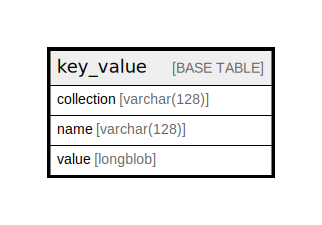

# key_value

## Description

Generic key-value storage table. See the state system for…

<details>
<summary><strong>Table Definition</strong></summary>

```sql
CREATE TABLE `key_value` (
  `collection` varchar(128) CHARACTER SET ascii COLLATE ascii_general_ci NOT NULL DEFAULT '' COMMENT 'A named collection of key and value pairs.',
  `name` varchar(128) CHARACTER SET ascii COLLATE ascii_general_ci NOT NULL DEFAULT '' COMMENT 'The key of the key-value pair. As KEY is a SQL reserved keyword, name was chosen instead.',
  `value` longblob NOT NULL COMMENT 'The value.',
  PRIMARY KEY (`collection`,`name`)
) ENGINE=InnoDB DEFAULT CHARSET=utf8mb4 COLLATE=utf8mb4_general_ci COMMENT='Generic key-value storage table. See the state system for…'
```

</details>

## Columns

| Name | Type | Default | Nullable | Children | Parents | Comment |
| ---- | ---- | ------- | -------- | -------- | ------- | ------- |
| collection | varchar(128) | '' | false |  |  | A named collection of key and value pairs. |
| name | varchar(128) | '' | false |  |  | The key of the key-value pair. As KEY is a SQL reserved keyword, name was chosen instead. |
| value | longblob |  | false |  |  | The value. |

## Constraints

| Name | Type | Definition |
| ---- | ---- | ---------- |
| PRIMARY | PRIMARY KEY | PRIMARY KEY (collection, name) |

## Indexes

| Name | Definition |
| ---- | ---------- |
| PRIMARY | PRIMARY KEY (collection, name) USING BTREE |

## Relations



---

> Generated by [tbls](https://github.com/k1LoW/tbls)
