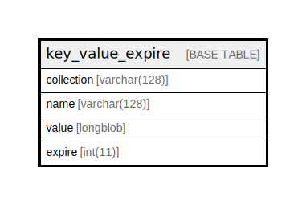

# key_value_expire

## Description

Generic key/value storage table with an expiration.

<details>
<summary><strong>Table Definition</strong></summary>

```sql
CREATE TABLE `key_value_expire` (
  `collection` varchar(128) CHARACTER SET ascii COLLATE ascii_general_ci NOT NULL DEFAULT '' COMMENT 'A named collection of key and value pairs.',
  `name` varchar(128) CHARACTER SET ascii COLLATE ascii_general_ci NOT NULL DEFAULT '' COMMENT 'The key of the key/value pair.',
  `value` longblob NOT NULL COMMENT 'The value of the key/value pair.',
  `expire` int(11) NOT NULL DEFAULT 2147483647 COMMENT 'The time since Unix epoch in seconds when this item expires. Defaults to the maximum possible time.',
  PRIMARY KEY (`collection`,`name`),
  KEY `expire` (`expire`)
) ENGINE=InnoDB DEFAULT CHARSET=utf8mb4 COLLATE=utf8mb4_general_ci COMMENT='Generic key/value storage table with an expiration.'
```

</details>

## Columns

| Name | Type | Default | Nullable | Children | Parents | Comment |
| ---- | ---- | ------- | -------- | -------- | ------- | ------- |
| collection | varchar(128) | '' | false |  |  | A named collection of key and value pairs. |
| name | varchar(128) | '' | false |  |  | The key of the key/value pair. |
| value | longblob |  | false |  |  | The value of the key/value pair. |
| expire | int(11) | 2147483647 | false |  |  | The time since Unix epoch in seconds when this item expires. Defaults to the maximum possible time. |

## Constraints

| Name | Type | Definition |
| ---- | ---- | ---------- |
| PRIMARY | PRIMARY KEY | PRIMARY KEY (collection, name) |

## Indexes

| Name | Definition |
| ---- | ---------- |
| expire | KEY expire (expire) USING BTREE |
| PRIMARY | PRIMARY KEY (collection, name) USING BTREE |

## Relations



---

> Generated by [tbls](https://github.com/k1LoW/tbls)
