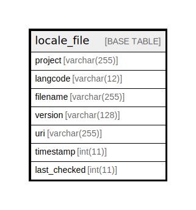

# locale_file

## Description

File import status information for interface translation…

<details>
<summary><strong>Table Definition</strong></summary>

```sql
CREATE TABLE `locale_file` (
  `project` varchar(255) CHARACTER SET ascii COLLATE ascii_general_ci NOT NULL DEFAULT '' COMMENT 'A unique short name to identify the project the file belongs to.',
  `langcode` varchar(12) CHARACTER SET ascii COLLATE ascii_general_ci NOT NULL DEFAULT '' COMMENT 'Language code of this translation. References "language".langcode.',
  `filename` varchar(255) NOT NULL DEFAULT '' COMMENT 'Filename of the imported file.',
  `version` varchar(128) NOT NULL DEFAULT '' COMMENT 'Version tag of the imported file.',
  `uri` varchar(255) NOT NULL DEFAULT '' COMMENT 'URI of the remote file, the resulting local file or the locally imported file.',
  `timestamp` int(11) DEFAULT 0 COMMENT 'Unix timestamp of the imported file.',
  `last_checked` int(11) DEFAULT 0 COMMENT 'Unix timestamp of the last time this translation was confirmed to be the most recent release available.',
  PRIMARY KEY (`project`,`langcode`)
) ENGINE=InnoDB DEFAULT CHARSET=utf8mb4 COLLATE=utf8mb4_general_ci COMMENT='File import status information for interface translation…'
```

</details>

## Columns

| Name | Type | Default | Nullable | Children | Parents | Comment |
| ---- | ---- | ------- | -------- | -------- | ------- | ------- |
| project | varchar(255) | '' | false |  |  | A unique short name to identify the project the file belongs to. |
| langcode | varchar(12) | '' | false |  |  | Language code of this translation. References "language".langcode. |
| filename | varchar(255) | '' | false |  |  | Filename of the imported file. |
| version | varchar(128) | '' | false |  |  | Version tag of the imported file. |
| uri | varchar(255) | '' | false |  |  | URI of the remote file, the resulting local file or the locally imported file. |
| timestamp | int(11) | 0 | true |  |  | Unix timestamp of the imported file. |
| last_checked | int(11) | 0 | true |  |  | Unix timestamp of the last time this translation was confirmed to be the most recent release available. |

## Constraints

| Name | Type | Definition |
| ---- | ---- | ---------- |
| PRIMARY | PRIMARY KEY | PRIMARY KEY (project, langcode) |

## Indexes

| Name | Definition |
| ---- | ---------- |
| PRIMARY | PRIMARY KEY (project, langcode) USING BTREE |

## Relations



---

> Generated by [tbls](https://github.com/k1LoW/tbls)
