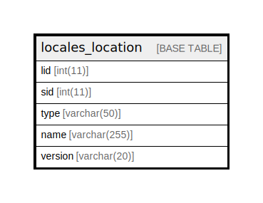

# locales_location

## Description

Location information for source strings.

<details>
<summary><strong>Table Definition</strong></summary>

```sql
CREATE TABLE `locales_location` (
  `lid` int(11) NOT NULL AUTO_INCREMENT COMMENT 'Unique identifier of this location.',
  `sid` int(11) NOT NULL COMMENT 'Unique identifier of this string.',
  `type` varchar(50) CHARACTER SET ascii COLLATE ascii_general_ci NOT NULL DEFAULT '' COMMENT 'The location type (file, config, path, etc).',
  `name` varchar(255) NOT NULL DEFAULT '' COMMENT 'Type dependent location information (file name, path, etc).',
  `version` varchar(20) CHARACTER SET ascii COLLATE ascii_general_ci NOT NULL DEFAULT 'none' COMMENT 'Version of Drupal where the location was found.',
  PRIMARY KEY (`lid`),
  KEY `string_type` (`sid`,`type`)
) ENGINE=InnoDB AUTO_INCREMENT=[Redacted by tbls] DEFAULT CHARSET=utf8mb4 COLLATE=utf8mb4_general_ci COMMENT='Location information for source strings.'
```

</details>

## Columns

| Name | Type | Default | Nullable | Extra Definition | Children | Parents | Comment |
| ---- | ---- | ------- | -------- | ---------------- | -------- | ------- | ------- |
| lid | int(11) |  | false | auto_increment |  |  | Unique identifier of this location. |
| sid | int(11) |  | false |  |  |  | Unique identifier of this string. |
| type | varchar(50) | '' | false |  |  |  | The location type (file, config, path, etc). |
| name | varchar(255) | '' | false |  |  |  | Type dependent location information (file name, path, etc). |
| version | varchar(20) | 'none' | false |  |  |  | Version of Drupal where the location was found. |

## Constraints

| Name | Type | Definition |
| ---- | ---- | ---------- |
| PRIMARY | PRIMARY KEY | PRIMARY KEY (lid) |

## Indexes

| Name | Definition |
| ---- | ---------- |
| string_type | KEY string_type (sid, type) USING BTREE |
| PRIMARY | PRIMARY KEY (lid) USING BTREE |

## Relations



---

> Generated by [tbls](https://github.com/k1LoW/tbls)
