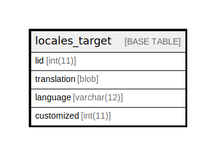

# locales_target

## Description

Stores translated versions of strings.

<details>
<summary><strong>Table Definition</strong></summary>

```sql
CREATE TABLE `locales_target` (
  `lid` int(11) NOT NULL DEFAULT 0 COMMENT 'Source string ID. References "locales_source".lid.',
  `translation` blob NOT NULL COMMENT 'Translation string value in this language.',
  `language` varchar(12) CHARACTER SET ascii COLLATE ascii_general_ci NOT NULL DEFAULT '' COMMENT 'Language code. References "language".langcode.',
  `customized` int(11) NOT NULL DEFAULT 0 COMMENT 'Boolean indicating whether the translation is custom to this site.',
  PRIMARY KEY (`language`,`lid`),
  KEY `lid` (`lid`)
) ENGINE=InnoDB DEFAULT CHARSET=utf8mb4 COLLATE=utf8mb4_general_ci COMMENT='Stores translated versions of strings.'
```

</details>

## Columns

| Name | Type | Default | Nullable | Children | Parents | Comment |
| ---- | ---- | ------- | -------- | -------- | ------- | ------- |
| lid | int(11) | 0 | false |  |  | Source string ID. References "locales_source".lid. |
| translation | blob |  | false |  |  | Translation string value in this language. |
| language | varchar(12) | '' | false |  |  | Language code. References "language".langcode. |
| customized | int(11) | 0 | false |  |  | Boolean indicating whether the translation is custom to this site. |

## Constraints

| Name | Type | Definition |
| ---- | ---- | ---------- |
| PRIMARY | PRIMARY KEY | PRIMARY KEY (language, lid) |

## Indexes

| Name | Definition |
| ---- | ---------- |
| lid | KEY lid (lid) USING BTREE |
| PRIMARY | PRIMARY KEY (language, lid) USING BTREE |

## Relations



---

> Generated by [tbls](https://github.com/k1LoW/tbls)
