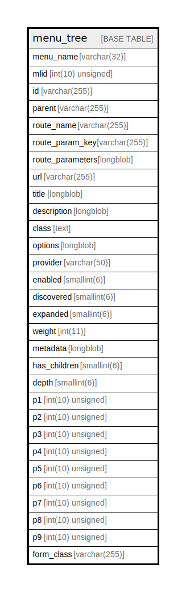

# menu_tree

## Description

Contains the menu tree hierarchy.

<details>
<summary><strong>Table Definition</strong></summary>

```sql
CREATE TABLE `menu_tree` (
  `menu_name` varchar(32) CHARACTER SET ascii COLLATE ascii_general_ci NOT NULL DEFAULT '' COMMENT 'The menu name. All links with the same menu name (such as ''tools'') are part of the same menu.',
  `mlid` int(10) unsigned NOT NULL AUTO_INCREMENT COMMENT 'The menu link ID (mlid) is the integer primary key.',
  `id` varchar(255) CHARACTER SET ascii COLLATE ascii_general_ci NOT NULL COMMENT 'Unique machine name: the plugin ID.',
  `parent` varchar(255) CHARACTER SET ascii COLLATE ascii_general_ci NOT NULL DEFAULT '' COMMENT 'The plugin ID for the parent of this link.',
  `route_name` varchar(255) CHARACTER SET ascii COLLATE ascii_general_ci DEFAULT NULL COMMENT 'The machine name of a defined Symfony Route this menu link represents.',
  `route_param_key` varchar(255) DEFAULT NULL COMMENT 'An encoded string of route parameters for loading by route.',
  `route_parameters` longblob DEFAULT NULL COMMENT 'Serialized array of route parameters of this menu link.',
  `url` varchar(255) NOT NULL DEFAULT '' COMMENT 'The external path this link points to (when not using a route).',
  `title` longblob DEFAULT NULL COMMENT 'The serialized title for the link. May be a TranslatableMarkup.',
  `description` longblob DEFAULT NULL COMMENT 'The serialized description of this link - used for admin pages and title attribute. May be a TranslatableMarkup.',
  `class` text DEFAULT NULL COMMENT 'The class for this link plugin.',
  `options` longblob DEFAULT NULL COMMENT 'A serialized array of URL options, such as a query string or HTML attributes.',
  `provider` varchar(50) CHARACTER SET ascii COLLATE ascii_general_ci NOT NULL DEFAULT 'system' COMMENT 'The name of the module that generated this link.',
  `enabled` smallint(6) NOT NULL DEFAULT 1 COMMENT 'A flag for whether the link should be rendered in menus. (0 = a disabled menu link that may be shown on admin screens, 1 = a normal, visible link)',
  `discovered` smallint(6) NOT NULL DEFAULT 0 COMMENT 'A flag for whether the link was discovered, so can be purged on rebuild',
  `expanded` smallint(6) NOT NULL DEFAULT 0 COMMENT 'Flag for whether this link should be rendered as expanded in menus - expanded links always have their child links displayed, instead of only when the link is in the active trail (1 = expanded, 0 = not expanded)',
  `weight` int(11) NOT NULL DEFAULT 0 COMMENT 'Link weight among links in the same menu at the same depth.',
  `metadata` longblob DEFAULT NULL COMMENT 'A serialized array of data that may be used by the plugin instance.',
  `has_children` smallint(6) NOT NULL DEFAULT 0 COMMENT 'Flag indicating whether any enabled links have this link as a parent (1 = enabled children exist, 0 = no enabled children).',
  `depth` smallint(6) NOT NULL DEFAULT 0 COMMENT 'The depth relative to the top level. A link with empty parent will have depth == 1.',
  `p1` int(10) unsigned NOT NULL DEFAULT 0 COMMENT 'The first mlid in the materialized path. If N = depth, then pN must equal the mlid. If depth > 1 then p(N-1) must equal the parent link mlid. All pX where X > depth must equal zero. The columns p1 .. p9 are also called the parents.',
  `p2` int(10) unsigned NOT NULL DEFAULT 0 COMMENT 'The second mlid in the materialized path. See p1.',
  `p3` int(10) unsigned NOT NULL DEFAULT 0 COMMENT 'The third mlid in the materialized path. See p1.',
  `p4` int(10) unsigned NOT NULL DEFAULT 0 COMMENT 'The fourth mlid in the materialized path. See p1.',
  `p5` int(10) unsigned NOT NULL DEFAULT 0 COMMENT 'The fifth mlid in the materialized path. See p1.',
  `p6` int(10) unsigned NOT NULL DEFAULT 0 COMMENT 'The sixth mlid in the materialized path. See p1.',
  `p7` int(10) unsigned NOT NULL DEFAULT 0 COMMENT 'The seventh mlid in the materialized path. See p1.',
  `p8` int(10) unsigned NOT NULL DEFAULT 0 COMMENT 'The eighth mlid in the materialized path. See p1.',
  `p9` int(10) unsigned NOT NULL DEFAULT 0 COMMENT 'The ninth mlid in the materialized path. See p1.',
  `form_class` varchar(255) DEFAULT NULL COMMENT 'meh',
  PRIMARY KEY (`mlid`),
  UNIQUE KEY `id` (`id`),
  KEY `menu_parents` (`menu_name`,`p1`,`p2`,`p3`,`p4`,`p5`,`p6`,`p7`,`p8`,`p9`),
  KEY `menu_parent_expand_child` (`menu_name`,`expanded`,`has_children`,`parent`(16)),
  KEY `route_values` (`route_name`(32),`route_param_key`(16))
) ENGINE=InnoDB AUTO_INCREMENT=[Redacted by tbls] DEFAULT CHARSET=utf8mb4 COLLATE=utf8mb4_general_ci COMMENT='Contains the menu tree hierarchy.'
```

</details>

## Columns

| Name | Type | Default | Nullable | Extra Definition | Children | Parents | Comment |
| ---- | ---- | ------- | -------- | ---------------- | -------- | ------- | ------- |
| menu_name | varchar(32) | '' | false |  |  |  | The menu name. All links with the same menu name (such as 'tools') are part of the same menu. |
| mlid | int(10) unsigned |  | false | auto_increment |  |  | The menu link ID (mlid) is the integer primary key. |
| id | varchar(255) |  | false |  |  |  | Unique machine name: the plugin ID. |
| parent | varchar(255) | '' | false |  |  |  | The plugin ID for the parent of this link. |
| route_name | varchar(255) | NULL | true |  |  |  | The machine name of a defined Symfony Route this menu link represents. |
| route_param_key | varchar(255) | NULL | true |  |  |  | An encoded string of route parameters for loading by route. |
| route_parameters | longblob | NULL | true |  |  |  | Serialized array of route parameters of this menu link. |
| url | varchar(255) | '' | false |  |  |  | The external path this link points to (when not using a route). |
| title | longblob | NULL | true |  |  |  | The serialized title for the link. May be a TranslatableMarkup. |
| description | longblob | NULL | true |  |  |  | The serialized description of this link - used for admin pages and title attribute. May be a TranslatableMarkup. |
| class | text | NULL | true |  |  |  | The class for this link plugin. |
| options | longblob | NULL | true |  |  |  | A serialized array of URL options, such as a query string or HTML attributes. |
| provider | varchar(50) | 'system' | false |  |  |  | The name of the module that generated this link. |
| enabled | smallint(6) | 1 | false |  |  |  | A flag for whether the link should be rendered in menus. (0 = a disabled menu link that may be shown on admin screens, 1 = a normal, visible link) |
| discovered | smallint(6) | 0 | false |  |  |  | A flag for whether the link was discovered, so can be purged on rebuild |
| expanded | smallint(6) | 0 | false |  |  |  | Flag for whether this link should be rendered as expanded in menus - expanded links always have their child links displayed, instead of only when the link is in the active trail (1 = expanded, 0 = not expanded) |
| weight | int(11) | 0 | false |  |  |  | Link weight among links in the same menu at the same depth. |
| metadata | longblob | NULL | true |  |  |  | A serialized array of data that may be used by the plugin instance. |
| has_children | smallint(6) | 0 | false |  |  |  | Flag indicating whether any enabled links have this link as a parent (1 = enabled children exist, 0 = no enabled children). |
| depth | smallint(6) | 0 | false |  |  |  | The depth relative to the top level. A link with empty parent will have depth == 1. |
| p1 | int(10) unsigned | 0 | false |  |  |  | The first mlid in the materialized path. If N = depth, then pN must equal the mlid. If depth > 1 then p(N-1) must equal the parent link mlid. All pX where X > depth must equal zero. The columns p1 .. p9 are also called the parents. |
| p2 | int(10) unsigned | 0 | false |  |  |  | The second mlid in the materialized path. See p1. |
| p3 | int(10) unsigned | 0 | false |  |  |  | The third mlid in the materialized path. See p1. |
| p4 | int(10) unsigned | 0 | false |  |  |  | The fourth mlid in the materialized path. See p1. |
| p5 | int(10) unsigned | 0 | false |  |  |  | The fifth mlid in the materialized path. See p1. |
| p6 | int(10) unsigned | 0 | false |  |  |  | The sixth mlid in the materialized path. See p1. |
| p7 | int(10) unsigned | 0 | false |  |  |  | The seventh mlid in the materialized path. See p1. |
| p8 | int(10) unsigned | 0 | false |  |  |  | The eighth mlid in the materialized path. See p1. |
| p9 | int(10) unsigned | 0 | false |  |  |  | The ninth mlid in the materialized path. See p1. |
| form_class | varchar(255) | NULL | true |  |  |  | meh |

## Constraints

| Name | Type | Definition |
| ---- | ---- | ---------- |
| id | UNIQUE | UNIQUE KEY id (id) |
| PRIMARY | PRIMARY KEY | PRIMARY KEY (mlid) |

## Indexes

| Name | Definition |
| ---- | ---------- |
| menu_parents | KEY menu_parents (menu_name, p1, p2, p3, p4, p5, p6, p7, p8, p9) USING BTREE |
| menu_parent_expand_child | KEY menu_parent_expand_child (menu_name, expanded, has_children, parent) USING BTREE |
| route_values | KEY route_values (route_name, route_param_key) USING BTREE |
| PRIMARY | PRIMARY KEY (mlid) USING BTREE |
| id | UNIQUE KEY id (id) USING BTREE |

## Relations



---

> Generated by [tbls](https://github.com/k1LoW/tbls)
