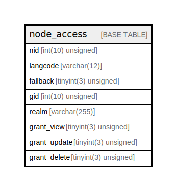

# node_access

## Description

Identifies which realm/grant pairs a user must possess in…

<details>
<summary><strong>Table Definition</strong></summary>

```sql
CREATE TABLE `node_access` (
  `nid` int(10) unsigned NOT NULL DEFAULT 0 COMMENT 'The "node".nid this record affects.',
  `langcode` varchar(12) CHARACTER SET ascii COLLATE ascii_general_ci NOT NULL DEFAULT '' COMMENT 'The "language".langcode of this node.',
  `fallback` tinyint(3) unsigned NOT NULL DEFAULT 1 COMMENT 'Boolean indicating whether this record should be used as a fallback if a language condition is not provided.',
  `gid` int(10) unsigned NOT NULL DEFAULT 0 COMMENT 'The grant ID a user must possess in the specified realm to gain this row''s privileges on the node.',
  `realm` varchar(255) CHARACTER SET ascii COLLATE ascii_general_ci NOT NULL DEFAULT '' COMMENT 'The realm in which the user must possess the grant ID. Modules can define one or more realms by implementing hook_node_grants().',
  `grant_view` tinyint(3) unsigned NOT NULL DEFAULT 0 COMMENT 'Boolean indicating whether a user with the realm/grant pair can view this node.',
  `grant_update` tinyint(3) unsigned NOT NULL DEFAULT 0 COMMENT 'Boolean indicating whether a user with the realm/grant pair can edit this node.',
  `grant_delete` tinyint(3) unsigned NOT NULL DEFAULT 0 COMMENT 'Boolean indicating whether a user with the realm/grant pair can delete this node.',
  PRIMARY KEY (`nid`,`gid`,`realm`,`langcode`)
) ENGINE=InnoDB DEFAULT CHARSET=utf8mb4 COLLATE=utf8mb4_general_ci COMMENT='Identifies which realm/grant pairs a user must possess in…'
```

</details>

## Columns

| Name | Type | Default | Nullable | Children | Parents | Comment |
| ---- | ---- | ------- | -------- | -------- | ------- | ------- |
| nid | int(10) unsigned | 0 | false |  |  | The "node".nid this record affects. |
| langcode | varchar(12) | '' | false |  |  | The "language".langcode of this node. |
| fallback | tinyint(3) unsigned | 1 | false |  |  | Boolean indicating whether this record should be used as a fallback if a language condition is not provided. |
| gid | int(10) unsigned | 0 | false |  |  | The grant ID a user must possess in the specified realm to gain this row's privileges on the node. |
| realm | varchar(255) | '' | false |  |  | The realm in which the user must possess the grant ID. Modules can define one or more realms by implementing hook_node_grants(). |
| grant_view | tinyint(3) unsigned | 0 | false |  |  | Boolean indicating whether a user with the realm/grant pair can view this node. |
| grant_update | tinyint(3) unsigned | 0 | false |  |  | Boolean indicating whether a user with the realm/grant pair can edit this node. |
| grant_delete | tinyint(3) unsigned | 0 | false |  |  | Boolean indicating whether a user with the realm/grant pair can delete this node. |

## Constraints

| Name | Type | Definition |
| ---- | ---- | ---------- |
| PRIMARY | PRIMARY KEY | PRIMARY KEY (nid, gid, realm, langcode) |

## Indexes

| Name | Definition |
| ---- | ---------- |
| PRIMARY | PRIMARY KEY (nid, gid, realm, langcode) USING BTREE |

## Relations



---

> Generated by [tbls](https://github.com/k1LoW/tbls)
