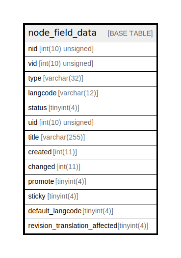

# node_field_data

## Description

The data table for node entities.

<details>
<summary><strong>Table Definition</strong></summary>

```sql
CREATE TABLE `node_field_data` (
  `nid` int(10) unsigned NOT NULL,
  `vid` int(10) unsigned NOT NULL,
  `type` varchar(32) CHARACTER SET ascii COLLATE ascii_general_ci NOT NULL COMMENT 'The ID of the target entity.',
  `langcode` varchar(12) CHARACTER SET ascii COLLATE ascii_general_ci NOT NULL,
  `status` tinyint(4) NOT NULL,
  `uid` int(10) unsigned NOT NULL COMMENT 'The ID of the target entity.',
  `title` varchar(255) NOT NULL,
  `created` int(11) NOT NULL,
  `changed` int(11) NOT NULL,
  `promote` tinyint(4) NOT NULL,
  `sticky` tinyint(4) NOT NULL,
  `default_langcode` tinyint(4) NOT NULL,
  `revision_translation_affected` tinyint(4) DEFAULT NULL,
  PRIMARY KEY (`nid`,`langcode`),
  KEY `node__id__default_langcode__langcode` (`nid`,`default_langcode`,`langcode`),
  KEY `node__vid` (`vid`),
  KEY `node_field__type__target_id` (`type`),
  KEY `node_field__uid__target_id` (`uid`),
  KEY `node_field__created` (`created`),
  KEY `node_field__changed` (`changed`),
  KEY `node__status_type` (`status`,`type`,`nid`),
  KEY `node__frontpage` (`promote`,`status`,`sticky`,`created`),
  KEY `node__title_type` (`title`(191),`type`(4))
) ENGINE=InnoDB DEFAULT CHARSET=utf8mb4 COLLATE=utf8mb4_general_ci COMMENT='The data table for node entities.'
```

</details>

## Columns

| Name | Type | Default | Nullable | Children | Parents | Comment |
| ---- | ---- | ------- | -------- | -------- | ------- | ------- |
| nid | int(10) unsigned |  | false |  |  |  |
| vid | int(10) unsigned |  | false |  |  |  |
| type | varchar(32) |  | false |  |  | The ID of the target entity. |
| langcode | varchar(12) |  | false |  |  |  |
| status | tinyint(4) |  | false |  |  |  |
| uid | int(10) unsigned |  | false |  |  | The ID of the target entity. |
| title | varchar(255) |  | false |  |  |  |
| created | int(11) |  | false |  |  |  |
| changed | int(11) |  | false |  |  |  |
| promote | tinyint(4) |  | false |  |  |  |
| sticky | tinyint(4) |  | false |  |  |  |
| default_langcode | tinyint(4) |  | false |  |  |  |
| revision_translation_affected | tinyint(4) | NULL | true |  |  |  |

## Constraints

| Name | Type | Definition |
| ---- | ---- | ---------- |
| PRIMARY | PRIMARY KEY | PRIMARY KEY (nid, langcode) |

## Indexes

| Name | Definition |
| ---- | ---------- |
| node_field__changed | KEY node_field__changed (changed) USING BTREE |
| node_field__created | KEY node_field__created (created) USING BTREE |
| node_field__type__target_id | KEY node_field__type__target_id (type) USING BTREE |
| node_field__uid__target_id | KEY node_field__uid__target_id (uid) USING BTREE |
| node__frontpage | KEY node__frontpage (promote, status, sticky, created) USING BTREE |
| node__id__default_langcode__langcode | KEY node__id__default_langcode__langcode (nid, default_langcode, langcode) USING BTREE |
| node__status_type | KEY node__status_type (status, type, nid) USING BTREE |
| node__title_type | KEY node__title_type (title, type) USING BTREE |
| node__vid | KEY node__vid (vid) USING BTREE |
| PRIMARY | PRIMARY KEY (nid, langcode) USING BTREE |

## Relations



---

> Generated by [tbls](https://github.com/k1LoW/tbls)
