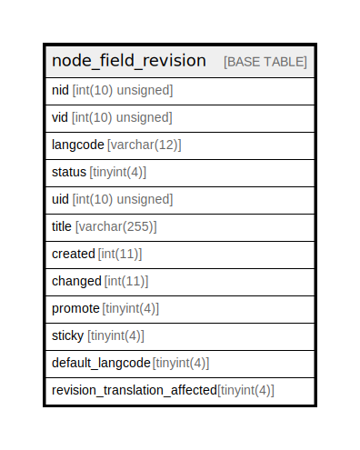

# node_field_revision

## Description

The revision data table for node entities.

<details>
<summary><strong>Table Definition</strong></summary>

```sql
CREATE TABLE `node_field_revision` (
  `nid` int(10) unsigned NOT NULL,
  `vid` int(10) unsigned NOT NULL,
  `langcode` varchar(12) CHARACTER SET ascii COLLATE ascii_general_ci NOT NULL,
  `status` tinyint(4) NOT NULL,
  `uid` int(10) unsigned NOT NULL COMMENT 'The ID of the target entity.',
  `title` varchar(255) DEFAULT NULL,
  `created` int(11) DEFAULT NULL,
  `changed` int(11) DEFAULT NULL,
  `promote` tinyint(4) DEFAULT NULL,
  `sticky` tinyint(4) DEFAULT NULL,
  `default_langcode` tinyint(4) NOT NULL,
  `revision_translation_affected` tinyint(4) DEFAULT NULL,
  PRIMARY KEY (`vid`,`langcode`),
  KEY `node__id__default_langcode__langcode` (`nid`,`default_langcode`,`langcode`),
  KEY `node_field__uid__target_id` (`uid`)
) ENGINE=InnoDB DEFAULT CHARSET=utf8mb4 COLLATE=utf8mb4_general_ci COMMENT='The revision data table for node entities.'
```

</details>

## Columns

| Name | Type | Default | Nullable | Children | Parents | Comment |
| ---- | ---- | ------- | -------- | -------- | ------- | ------- |
| nid | int(10) unsigned |  | false |  |  |  |
| vid | int(10) unsigned |  | false |  |  |  |
| langcode | varchar(12) |  | false |  |  |  |
| status | tinyint(4) |  | false |  |  |  |
| uid | int(10) unsigned |  | false |  |  | The ID of the target entity. |
| title | varchar(255) | NULL | true |  |  |  |
| created | int(11) | NULL | true |  |  |  |
| changed | int(11) | NULL | true |  |  |  |
| promote | tinyint(4) | NULL | true |  |  |  |
| sticky | tinyint(4) | NULL | true |  |  |  |
| default_langcode | tinyint(4) |  | false |  |  |  |
| revision_translation_affected | tinyint(4) | NULL | true |  |  |  |

## Constraints

| Name | Type | Definition |
| ---- | ---- | ---------- |
| PRIMARY | PRIMARY KEY | PRIMARY KEY (vid, langcode) |

## Indexes

| Name | Definition |
| ---- | ---------- |
| node_field__uid__target_id | KEY node_field__uid__target_id (uid) USING BTREE |
| node__id__default_langcode__langcode | KEY node__id__default_langcode__langcode (nid, default_langcode, langcode) USING BTREE |
| PRIMARY | PRIMARY KEY (vid, langcode) USING BTREE |

## Relations



---

> Generated by [tbls](https://github.com/k1LoW/tbls)
