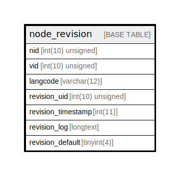

# node_revision

## Description

The revision table for node entities.

<details>
<summary><strong>Table Definition</strong></summary>

```sql
CREATE TABLE `node_revision` (
  `nid` int(10) unsigned NOT NULL,
  `vid` int(10) unsigned NOT NULL AUTO_INCREMENT,
  `langcode` varchar(12) CHARACTER SET ascii COLLATE ascii_general_ci NOT NULL,
  `revision_uid` int(10) unsigned DEFAULT NULL COMMENT 'The ID of the target entity.',
  `revision_timestamp` int(11) DEFAULT NULL,
  `revision_log` longtext DEFAULT NULL,
  `revision_default` tinyint(4) DEFAULT NULL,
  PRIMARY KEY (`vid`),
  KEY `node__nid` (`nid`),
  KEY `node_field__langcode` (`langcode`),
  KEY `node_field__revision_uid__target_id` (`revision_uid`)
) ENGINE=InnoDB AUTO_INCREMENT=[Redacted by tbls] DEFAULT CHARSET=utf8mb4 COLLATE=utf8mb4_general_ci COMMENT='The revision table for node entities.'
```

</details>

## Columns

| Name | Type | Default | Nullable | Extra Definition | Children | Parents | Comment |
| ---- | ---- | ------- | -------- | ---------------- | -------- | ------- | ------- |
| nid | int(10) unsigned |  | false |  |  |  |  |
| vid | int(10) unsigned |  | false | auto_increment |  |  |  |
| langcode | varchar(12) |  | false |  |  |  |  |
| revision_uid | int(10) unsigned | NULL | true |  |  |  | The ID of the target entity. |
| revision_timestamp | int(11) | NULL | true |  |  |  |  |
| revision_log | longtext | NULL | true |  |  |  |  |
| revision_default | tinyint(4) | NULL | true |  |  |  |  |

## Constraints

| Name | Type | Definition |
| ---- | ---- | ---------- |
| PRIMARY | PRIMARY KEY | PRIMARY KEY (vid) |

## Indexes

| Name | Definition |
| ---- | ---------- |
| node_field__langcode | KEY node_field__langcode (langcode) USING BTREE |
| node_field__revision_uid__target_id | KEY node_field__revision_uid__target_id (revision_uid) USING BTREE |
| node__nid | KEY node__nid (nid) USING BTREE |
| PRIMARY | PRIMARY KEY (vid) USING BTREE |

## Relations



---

> Generated by [tbls](https://github.com/k1LoW/tbls)
