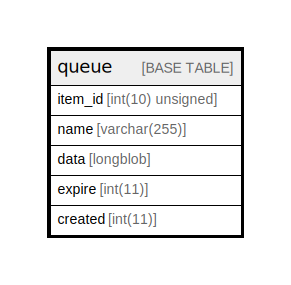

# queue

## Description

Stores items in queues.

<details>
<summary><strong>Table Definition</strong></summary>

```sql
CREATE TABLE `queue` (
  `item_id` int(10) unsigned NOT NULL AUTO_INCREMENT COMMENT 'Primary Key: Unique item ID.',
  `name` varchar(255) CHARACTER SET ascii COLLATE ascii_general_ci NOT NULL DEFAULT '' COMMENT 'The queue name.',
  `data` longblob DEFAULT NULL COMMENT 'The arbitrary data for the item.',
  `expire` int(11) NOT NULL DEFAULT 0 COMMENT 'Timestamp when the claim lease expires on the item.',
  `created` int(11) NOT NULL DEFAULT 0 COMMENT 'Timestamp when the item was created.',
  PRIMARY KEY (`item_id`),
  KEY `name_created` (`name`,`created`),
  KEY `expire` (`expire`)
) ENGINE=InnoDB AUTO_INCREMENT=[Redacted by tbls] DEFAULT CHARSET=utf8mb4 COLLATE=utf8mb4_general_ci COMMENT='Stores items in queues.'
```

</details>

## Columns

| Name | Type | Default | Nullable | Extra Definition | Children | Parents | Comment |
| ---- | ---- | ------- | -------- | ---------------- | -------- | ------- | ------- |
| item_id | int(10) unsigned |  | false | auto_increment |  |  | Primary Key: Unique item ID. |
| name | varchar(255) | '' | false |  |  |  | The queue name. |
| data | longblob | NULL | true |  |  |  | The arbitrary data for the item. |
| expire | int(11) | 0 | false |  |  |  | Timestamp when the claim lease expires on the item. |
| created | int(11) | 0 | false |  |  |  | Timestamp when the item was created. |

## Constraints

| Name | Type | Definition |
| ---- | ---- | ---------- |
| PRIMARY | PRIMARY KEY | PRIMARY KEY (item_id) |

## Indexes

| Name | Definition |
| ---- | ---------- |
| expire | KEY expire (expire) USING BTREE |
| name_created | KEY name_created (name, created) USING BTREE |
| PRIMARY | PRIMARY KEY (item_id) USING BTREE |

## Relations



---

> Generated by [tbls](https://github.com/k1LoW/tbls)
