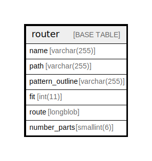

# router

## Description

Maps paths to various callbacks (access, page and title)

<details>
<summary><strong>Table Definition</strong></summary>

```sql
CREATE TABLE `router` (
  `name` varchar(255) CHARACTER SET ascii COLLATE ascii_general_ci NOT NULL DEFAULT '' COMMENT 'Primary Key: Machine name of this route',
  `path` varchar(255) NOT NULL DEFAULT '' COMMENT 'The path for this URI',
  `pattern_outline` varchar(255) NOT NULL DEFAULT '' COMMENT 'The pattern',
  `fit` int(11) NOT NULL DEFAULT 0 COMMENT 'A numeric representation of how specific the path is.',
  `route` longblob DEFAULT NULL COMMENT 'A serialized Route object',
  `number_parts` smallint(6) NOT NULL DEFAULT 0 COMMENT 'Number of parts in this router path.',
  PRIMARY KEY (`name`),
  KEY `pattern_outline_parts` (`pattern_outline`(191),`number_parts`)
) ENGINE=InnoDB DEFAULT CHARSET=utf8mb4 COLLATE=utf8mb4_general_ci COMMENT='Maps paths to various callbacks (access, page and title)'
```

</details>

## Columns

| Name | Type | Default | Nullable | Children | Parents | Comment |
| ---- | ---- | ------- | -------- | -------- | ------- | ------- |
| name | varchar(255) | '' | false |  |  | Primary Key: Machine name of this route |
| path | varchar(255) | '' | false |  |  | The path for this URI |
| pattern_outline | varchar(255) | '' | false |  |  | The pattern |
| fit | int(11) | 0 | false |  |  | A numeric representation of how specific the path is. |
| route | longblob | NULL | true |  |  | A serialized Route object |
| number_parts | smallint(6) | 0 | false |  |  | Number of parts in this router path. |

## Constraints

| Name | Type | Definition |
| ---- | ---- | ---------- |
| PRIMARY | PRIMARY KEY | PRIMARY KEY (name) |

## Indexes

| Name | Definition |
| ---- | ---------- |
| pattern_outline_parts | KEY pattern_outline_parts (pattern_outline, number_parts) USING BTREE |
| PRIMARY | PRIMARY KEY (name) USING BTREE |

## Relations



---

> Generated by [tbls](https://github.com/k1LoW/tbls)
