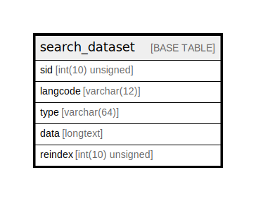

# search_dataset

## Description

Stores items that will be searched.

<details>
<summary><strong>Table Definition</strong></summary>

```sql
CREATE TABLE `search_dataset` (
  `sid` int(10) unsigned NOT NULL DEFAULT 0 COMMENT 'Search item ID, e.g. node ID for nodes.',
  `langcode` varchar(12) CHARACTER SET ascii COLLATE ascii_general_ci NOT NULL DEFAULT '' COMMENT 'The "languages".langcode of the item variant.',
  `type` varchar(64) CHARACTER SET ascii COLLATE ascii_general_ci NOT NULL COMMENT 'Type of item, e.g. node.',
  `data` longtext NOT NULL COMMENT 'List of space-separated words from the item.',
  `reindex` int(10) unsigned NOT NULL DEFAULT 0 COMMENT 'Set to force node reindexing.',
  PRIMARY KEY (`sid`,`langcode`,`type`)
) ENGINE=InnoDB DEFAULT CHARSET=utf8mb4 COLLATE=utf8mb4_general_ci COMMENT='Stores items that will be searched.'
```

</details>

## Columns

| Name | Type | Default | Nullable | Children | Parents | Comment |
| ---- | ---- | ------- | -------- | -------- | ------- | ------- |
| sid | int(10) unsigned | 0 | false |  |  | Search item ID, e.g. node ID for nodes. |
| langcode | varchar(12) | '' | false |  |  | The "languages".langcode of the item variant. |
| type | varchar(64) |  | false |  |  | Type of item, e.g. node. |
| data | longtext |  | false |  |  | List of space-separated words from the item. |
| reindex | int(10) unsigned | 0 | false |  |  | Set to force node reindexing. |

## Constraints

| Name | Type | Definition |
| ---- | ---- | ---------- |
| PRIMARY | PRIMARY KEY | PRIMARY KEY (sid, langcode, type) |

## Indexes

| Name | Definition |
| ---- | ---------- |
| PRIMARY | PRIMARY KEY (sid, langcode, type) USING BTREE |

## Relations



---

> Generated by [tbls](https://github.com/k1LoW/tbls)
