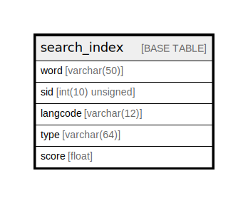

# search_index

## Description

Stores the search index, associating words, items and…

<details>
<summary><strong>Table Definition</strong></summary>

```sql
CREATE TABLE `search_index` (
  `word` varchar(50) NOT NULL DEFAULT '' COMMENT 'The "search_total".word that is associated with the search item.',
  `sid` int(10) unsigned NOT NULL DEFAULT 0 COMMENT 'The "search_dataset".sid of the searchable item to which the word belongs.',
  `langcode` varchar(12) CHARACTER SET ascii COLLATE ascii_general_ci NOT NULL DEFAULT '' COMMENT 'The "languages".langcode of the item variant.',
  `type` varchar(64) CHARACTER SET ascii COLLATE ascii_general_ci NOT NULL COMMENT 'The "search_dataset".type of the searchable item to which the word belongs.',
  `score` float DEFAULT NULL COMMENT 'The numeric score of the word, higher being more important.',
  PRIMARY KEY (`word`,`sid`,`langcode`,`type`),
  KEY `sid_type` (`sid`,`langcode`,`type`)
) ENGINE=InnoDB DEFAULT CHARSET=utf8mb4 COLLATE=utf8mb4_general_ci COMMENT='Stores the search index, associating words, items and…'
```

</details>

## Columns

| Name | Type | Default | Nullable | Children | Parents | Comment |
| ---- | ---- | ------- | -------- | -------- | ------- | ------- |
| word | varchar(50) | '' | false |  |  | The "search_total".word that is associated with the search item. |
| sid | int(10) unsigned | 0 | false |  |  | The "search_dataset".sid of the searchable item to which the word belongs. |
| langcode | varchar(12) | '' | false |  |  | The "languages".langcode of the item variant. |
| type | varchar(64) |  | false |  |  | The "search_dataset".type of the searchable item to which the word belongs. |
| score | float | NULL | true |  |  | The numeric score of the word, higher being more important. |

## Constraints

| Name | Type | Definition |
| ---- | ---- | ---------- |
| PRIMARY | PRIMARY KEY | PRIMARY KEY (word, sid, langcode, type) |

## Indexes

| Name | Definition |
| ---- | ---------- |
| sid_type | KEY sid_type (sid, langcode, type) USING BTREE |
| PRIMARY | PRIMARY KEY (word, sid, langcode, type) USING BTREE |

## Relations



---

> Generated by [tbls](https://github.com/k1LoW/tbls)
