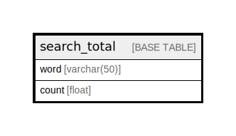

# search_total

## Description

Stores search totals for words.

<details>
<summary><strong>Table Definition</strong></summary>

```sql
CREATE TABLE `search_total` (
  `word` varchar(50) NOT NULL DEFAULT '' COMMENT 'Primary Key: Unique word in the search index.',
  `count` float DEFAULT NULL COMMENT 'The count of the word in the index using Zipf''s law to equalize the probability distribution.',
  PRIMARY KEY (`word`)
) ENGINE=InnoDB DEFAULT CHARSET=utf8mb4 COLLATE=utf8mb4_general_ci COMMENT='Stores search totals for words.'
```

</details>

## Columns

| Name | Type | Default | Nullable | Children | Parents | Comment |
| ---- | ---- | ------- | -------- | -------- | ------- | ------- |
| word | varchar(50) | '' | false |  |  | Primary Key: Unique word in the search index. |
| count | float | NULL | true |  |  | The count of the word in the index using Zipf's law to equalize the probability distribution. |

## Constraints

| Name | Type | Definition |
| ---- | ---- | ---------- |
| PRIMARY | PRIMARY KEY | PRIMARY KEY (word) |

## Indexes

| Name | Definition |
| ---- | ---------- |
| PRIMARY | PRIMARY KEY (word) USING BTREE |

## Relations



---

> Generated by [tbls](https://github.com/k1LoW/tbls)
