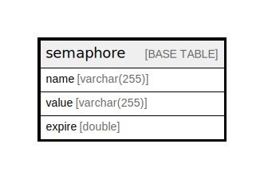

# semaphore

## Description

Table for holding semaphores, locks, flags, etc. that…

<details>
<summary><strong>Table Definition</strong></summary>

```sql
CREATE TABLE `semaphore` (
  `name` varchar(255) CHARACTER SET ascii COLLATE ascii_general_ci NOT NULL DEFAULT '' COMMENT 'Primary Key: Unique name.',
  `value` varchar(255) CHARACTER SET ascii COLLATE ascii_general_ci NOT NULL DEFAULT '' COMMENT 'A value for the semaphore.',
  `expire` double NOT NULL COMMENT 'A Unix timestamp with microseconds indicating when the semaphore should expire.',
  PRIMARY KEY (`name`),
  KEY `value` (`value`),
  KEY `expire` (`expire`)
) ENGINE=InnoDB DEFAULT CHARSET=utf8mb4 COLLATE=utf8mb4_general_ci COMMENT='Table for holding semaphores, locks, flags, etc. that…'
```

</details>

## Columns

| Name | Type | Default | Nullable | Children | Parents | Comment |
| ---- | ---- | ------- | -------- | -------- | ------- | ------- |
| name | varchar(255) | '' | false |  |  | Primary Key: Unique name. |
| value | varchar(255) | '' | false |  |  | A value for the semaphore. |
| expire | double |  | false |  |  | A Unix timestamp with microseconds indicating when the semaphore should expire. |

## Constraints

| Name | Type | Definition |
| ---- | ---- | ---------- |
| PRIMARY | PRIMARY KEY | PRIMARY KEY (name) |

## Indexes

| Name | Definition |
| ---- | ---------- |
| expire | KEY expire (expire) USING BTREE |
| value | KEY value (value) USING BTREE |
| PRIMARY | PRIMARY KEY (name) USING BTREE |

## Relations



---

> Generated by [tbls](https://github.com/k1LoW/tbls)
