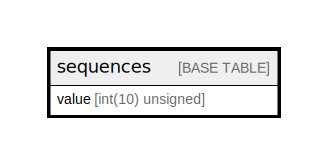

# sequences

## Description

Stores IDs.

<details>
<summary><strong>Table Definition</strong></summary>

```sql
CREATE TABLE `sequences` (
  `value` int(10) unsigned NOT NULL AUTO_INCREMENT COMMENT 'The value of the sequence.',
  PRIMARY KEY (`value`)
) ENGINE=InnoDB AUTO_INCREMENT=[Redacted by tbls] DEFAULT CHARSET=utf8mb4 COLLATE=utf8mb4_general_ci COMMENT='Stores IDs.'
```

</details>

## Columns

| Name | Type | Default | Nullable | Extra Definition | Children | Parents | Comment |
| ---- | ---- | ------- | -------- | ---------------- | -------- | ------- | ------- |
| value | int(10) unsigned |  | false | auto_increment |  |  | The value of the sequence. |

## Constraints

| Name | Type | Definition |
| ---- | ---- | ---------- |
| PRIMARY | PRIMARY KEY | PRIMARY KEY (value) |

## Indexes

| Name | Definition |
| ---- | ---------- |
| PRIMARY | PRIMARY KEY (value) USING BTREE |

## Relations



---

> Generated by [tbls](https://github.com/k1LoW/tbls)
