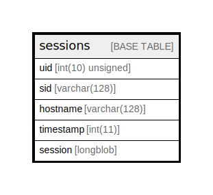

# sessions

## Description

Drupal's session handlers read and write into the sessions…

<details>
<summary><strong>Table Definition</strong></summary>

```sql
CREATE TABLE `sessions` (
  `uid` int(10) unsigned NOT NULL COMMENT 'The "users".uid corresponding to a session, or 0 for anonymous user.',
  `sid` varchar(128) CHARACTER SET ascii COLLATE ascii_general_ci NOT NULL COMMENT 'A session ID (hashed). The value is generated by Drupal''s session handlers.',
  `hostname` varchar(128) CHARACTER SET ascii COLLATE ascii_general_ci NOT NULL DEFAULT '' COMMENT 'The IP address that last used this session ID (sid).',
  `timestamp` int(11) NOT NULL DEFAULT 0 COMMENT 'The Unix timestamp when this session last requested a page. Old records are purged by PHP automatically.',
  `session` longblob DEFAULT NULL COMMENT 'The serialized contents of the user''s session, an array of name/value pairs that persists across page requests by this session ID. Drupal loads the user''s session from here at the start of each request and saves it at the end.',
  PRIMARY KEY (`sid`),
  KEY `timestamp` (`timestamp`),
  KEY `uid` (`uid`)
) ENGINE=InnoDB DEFAULT CHARSET=utf8mb4 COLLATE=utf8mb4_general_ci COMMENT='Drupal''s session handlers read and write into the sessions…'
```

</details>

## Columns

| Name | Type | Default | Nullable | Children | Parents | Comment |
| ---- | ---- | ------- | -------- | -------- | ------- | ------- |
| uid | int(10) unsigned |  | false |  |  | The "users".uid corresponding to a session, or 0 for anonymous user. |
| sid | varchar(128) |  | false |  |  | A session ID (hashed). The value is generated by Drupal's session handlers. |
| hostname | varchar(128) | '' | false |  |  | The IP address that last used this session ID (sid). |
| timestamp | int(11) | 0 | false |  |  | The Unix timestamp when this session last requested a page. Old records are purged by PHP automatically. |
| session | longblob | NULL | true |  |  | The serialized contents of the user's session, an array of name/value pairs that persists across page requests by this session ID. Drupal loads the user's session from here at the start of each request and saves it at the end. |

## Constraints

| Name | Type | Definition |
| ---- | ---- | ---------- |
| PRIMARY | PRIMARY KEY | PRIMARY KEY (sid) |

## Indexes

| Name | Definition |
| ---- | ---------- |
| timestamp | KEY timestamp (timestamp) USING BTREE |
| uid | KEY uid (uid) USING BTREE |
| PRIMARY | PRIMARY KEY (sid) USING BTREE |

## Relations



---

> Generated by [tbls](https://github.com/k1LoW/tbls)
