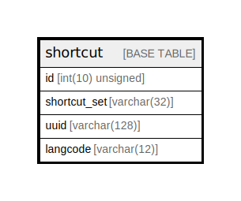

# shortcut

## Description

The base table for shortcut entities.

<details>
<summary><strong>Table Definition</strong></summary>

```sql
CREATE TABLE `shortcut` (
  `id` int(10) unsigned NOT NULL AUTO_INCREMENT,
  `shortcut_set` varchar(32) CHARACTER SET ascii COLLATE ascii_general_ci NOT NULL COMMENT 'The ID of the target entity.',
  `uuid` varchar(128) CHARACTER SET ascii COLLATE ascii_general_ci NOT NULL,
  `langcode` varchar(12) CHARACTER SET ascii COLLATE ascii_general_ci NOT NULL,
  PRIMARY KEY (`id`),
  UNIQUE KEY `shortcut_field__uuid__value` (`uuid`),
  KEY `shortcut_field__shortcut_set__target_id` (`shortcut_set`)
) ENGINE=InnoDB AUTO_INCREMENT=[Redacted by tbls] DEFAULT CHARSET=utf8mb4 COLLATE=utf8mb4_general_ci COMMENT='The base table for shortcut entities.'
```

</details>

## Columns

| Name | Type | Default | Nullable | Extra Definition | Children | Parents | Comment |
| ---- | ---- | ------- | -------- | ---------------- | -------- | ------- | ------- |
| id | int(10) unsigned |  | false | auto_increment |  |  |  |
| shortcut_set | varchar(32) |  | false |  |  |  | The ID of the target entity. |
| uuid | varchar(128) |  | false |  |  |  |  |
| langcode | varchar(12) |  | false |  |  |  |  |

## Constraints

| Name | Type | Definition |
| ---- | ---- | ---------- |
| PRIMARY | PRIMARY KEY | PRIMARY KEY (id) |
| shortcut_field__uuid__value | UNIQUE | UNIQUE KEY shortcut_field__uuid__value (uuid) |

## Indexes

| Name | Definition |
| ---- | ---------- |
| shortcut_field__shortcut_set__target_id | KEY shortcut_field__shortcut_set__target_id (shortcut_set) USING BTREE |
| PRIMARY | PRIMARY KEY (id) USING BTREE |
| shortcut_field__uuid__value | UNIQUE KEY shortcut_field__uuid__value (uuid) USING BTREE |

## Relations



---

> Generated by [tbls](https://github.com/k1LoW/tbls)
