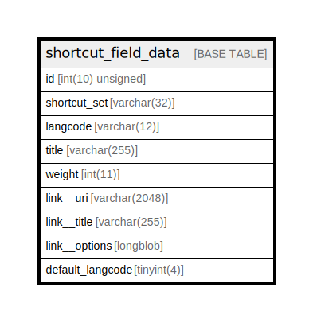

# shortcut_field_data

## Description

The data table for shortcut entities.

<details>
<summary><strong>Table Definition</strong></summary>

```sql
CREATE TABLE `shortcut_field_data` (
  `id` int(10) unsigned NOT NULL,
  `shortcut_set` varchar(32) CHARACTER SET ascii COLLATE ascii_general_ci NOT NULL COMMENT 'The ID of the target entity.',
  `langcode` varchar(12) CHARACTER SET ascii COLLATE ascii_general_ci NOT NULL,
  `title` varchar(255) DEFAULT NULL,
  `weight` int(11) DEFAULT NULL,
  `link__uri` varchar(2048) DEFAULT NULL COMMENT 'The URI of the link.',
  `link__title` varchar(255) DEFAULT NULL COMMENT 'The link text.',
  `link__options` longblob DEFAULT NULL COMMENT 'Serialized array of options for the link.',
  `default_langcode` tinyint(4) NOT NULL,
  PRIMARY KEY (`id`,`langcode`),
  KEY `shortcut__id__default_langcode__langcode` (`id`,`default_langcode`,`langcode`),
  KEY `shortcut_field__shortcut_set__target_id` (`shortcut_set`),
  KEY `shortcut_field__link__uri` (`link__uri`(30))
) ENGINE=InnoDB DEFAULT CHARSET=utf8mb4 COLLATE=utf8mb4_general_ci COMMENT='The data table for shortcut entities.'
```

</details>

## Columns

| Name | Type | Default | Nullable | Children | Parents | Comment |
| ---- | ---- | ------- | -------- | -------- | ------- | ------- |
| id | int(10) unsigned |  | false |  |  |  |
| shortcut_set | varchar(32) |  | false |  |  | The ID of the target entity. |
| langcode | varchar(12) |  | false |  |  |  |
| title | varchar(255) | NULL | true |  |  |  |
| weight | int(11) | NULL | true |  |  |  |
| link__uri | varchar(2048) | NULL | true |  |  | The URI of the link. |
| link__title | varchar(255) | NULL | true |  |  | The link text. |
| link__options | longblob | NULL | true |  |  | Serialized array of options for the link. |
| default_langcode | tinyint(4) |  | false |  |  |  |

## Constraints

| Name | Type | Definition |
| ---- | ---- | ---------- |
| PRIMARY | PRIMARY KEY | PRIMARY KEY (id, langcode) |

## Indexes

| Name | Definition |
| ---- | ---------- |
| shortcut_field__link__uri | KEY shortcut_field__link__uri (link__uri) USING BTREE |
| shortcut_field__shortcut_set__target_id | KEY shortcut_field__shortcut_set__target_id (shortcut_set) USING BTREE |
| shortcut__id__default_langcode__langcode | KEY shortcut__id__default_langcode__langcode (id, default_langcode, langcode) USING BTREE |
| PRIMARY | PRIMARY KEY (id, langcode) USING BTREE |

## Relations



---

> Generated by [tbls](https://github.com/k1LoW/tbls)
