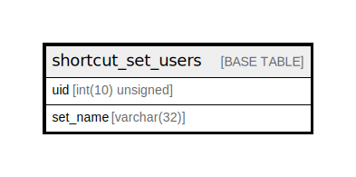

# shortcut_set_users

## Description

Maps users to shortcut sets.

<details>
<summary><strong>Table Definition</strong></summary>

```sql
CREATE TABLE `shortcut_set_users` (
  `uid` int(10) unsigned NOT NULL DEFAULT 0 COMMENT 'The "users".uid for this set.',
  `set_name` varchar(32) CHARACTER SET ascii COLLATE ascii_general_ci NOT NULL DEFAULT '' COMMENT 'The "shortcut_set".set_name that will be displayed for this user.',
  PRIMARY KEY (`uid`),
  KEY `set_name` (`set_name`)
) ENGINE=InnoDB DEFAULT CHARSET=utf8mb4 COLLATE=utf8mb4_general_ci COMMENT='Maps users to shortcut sets.'
```

</details>

## Columns

| Name | Type | Default | Nullable | Children | Parents | Comment |
| ---- | ---- | ------- | -------- | -------- | ------- | ------- |
| uid | int(10) unsigned | 0 | false |  |  | The "users".uid for this set. |
| set_name | varchar(32) | '' | false |  |  | The "shortcut_set".set_name that will be displayed for this user. |

## Constraints

| Name | Type | Definition |
| ---- | ---- | ---------- |
| PRIMARY | PRIMARY KEY | PRIMARY KEY (uid) |

## Indexes

| Name | Definition |
| ---- | ---------- |
| set_name | KEY set_name (set_name) USING BTREE |
| PRIMARY | PRIMARY KEY (uid) USING BTREE |

## Relations



---

> Generated by [tbls](https://github.com/k1LoW/tbls)
