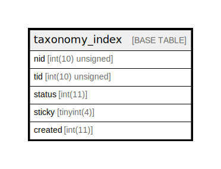

# taxonomy_index

## Description

Maintains denormalized information about node/term…

<details>
<summary><strong>Table Definition</strong></summary>

```sql
CREATE TABLE `taxonomy_index` (
  `nid` int(10) unsigned NOT NULL DEFAULT 0 COMMENT 'The "node".nid this record tracks.',
  `tid` int(10) unsigned NOT NULL DEFAULT 0 COMMENT 'The term ID.',
  `status` int(11) NOT NULL DEFAULT 1 COMMENT 'Boolean indicating whether the node is published (visible to non-administrators).',
  `sticky` tinyint(4) DEFAULT 0 COMMENT 'Boolean indicating whether the node is sticky.',
  `created` int(11) NOT NULL DEFAULT 0 COMMENT 'The Unix timestamp when the node was created.',
  PRIMARY KEY (`nid`,`tid`),
  KEY `term_node` (`tid`,`status`,`sticky`,`created`)
) ENGINE=InnoDB DEFAULT CHARSET=utf8mb4 COLLATE=utf8mb4_general_ci COMMENT='Maintains denormalized information about node/term…'
```

</details>

## Columns

| Name | Type | Default | Nullable | Children | Parents | Comment |
| ---- | ---- | ------- | -------- | -------- | ------- | ------- |
| nid | int(10) unsigned | 0 | false |  |  | The "node".nid this record tracks. |
| tid | int(10) unsigned | 0 | false |  |  | The term ID. |
| status | int(11) | 1 | false |  |  | Boolean indicating whether the node is published (visible to non-administrators). |
| sticky | tinyint(4) | 0 | true |  |  | Boolean indicating whether the node is sticky. |
| created | int(11) | 0 | false |  |  | The Unix timestamp when the node was created. |

## Constraints

| Name | Type | Definition |
| ---- | ---- | ---------- |
| PRIMARY | PRIMARY KEY | PRIMARY KEY (nid, tid) |

## Indexes

| Name | Definition |
| ---- | ---------- |
| term_node | KEY term_node (tid, status, sticky, created) USING BTREE |
| PRIMARY | PRIMARY KEY (nid, tid) USING BTREE |

## Relations



---

> Generated by [tbls](https://github.com/k1LoW/tbls)
