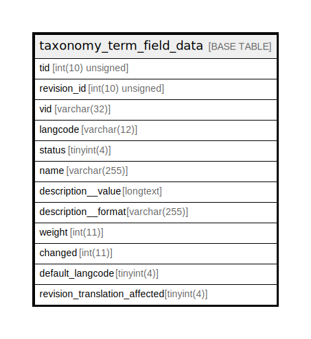

# taxonomy_term_field_data

## Description

The data table for taxonomy_term entities.

<details>
<summary><strong>Table Definition</strong></summary>

```sql
CREATE TABLE `taxonomy_term_field_data` (
  `tid` int(10) unsigned NOT NULL,
  `revision_id` int(10) unsigned NOT NULL,
  `vid` varchar(32) CHARACTER SET ascii COLLATE ascii_general_ci NOT NULL COMMENT 'The ID of the target entity.',
  `langcode` varchar(12) CHARACTER SET ascii COLLATE ascii_general_ci NOT NULL,
  `status` tinyint(4) NOT NULL,
  `name` varchar(255) NOT NULL,
  `description__value` longtext DEFAULT NULL,
  `description__format` varchar(255) CHARACTER SET ascii COLLATE ascii_general_ci DEFAULT NULL,
  `weight` int(11) NOT NULL,
  `changed` int(11) DEFAULT NULL,
  `default_langcode` tinyint(4) NOT NULL,
  `revision_translation_affected` tinyint(4) DEFAULT NULL,
  PRIMARY KEY (`tid`,`langcode`),
  KEY `taxonomy_term__id__default_langcode__langcode` (`tid`,`default_langcode`,`langcode`),
  KEY `taxonomy_term__revision_id` (`revision_id`),
  KEY `taxonomy_term_field__name` (`name`(191)),
  KEY `taxonomy_term__status_vid` (`status`,`vid`,`tid`),
  KEY `taxonomy_term__tree` (`vid`,`weight`,`name`(191)),
  KEY `taxonomy_term__vid_name` (`vid`,`name`(191))
) ENGINE=InnoDB DEFAULT CHARSET=utf8mb4 COLLATE=utf8mb4_general_ci COMMENT='The data table for taxonomy_term entities.'
```

</details>

## Columns

| Name | Type | Default | Nullable | Children | Parents | Comment |
| ---- | ---- | ------- | -------- | -------- | ------- | ------- |
| tid | int(10) unsigned |  | false |  |  |  |
| revision_id | int(10) unsigned |  | false |  |  |  |
| vid | varchar(32) |  | false |  |  | The ID of the target entity. |
| langcode | varchar(12) |  | false |  |  |  |
| status | tinyint(4) |  | false |  |  |  |
| name | varchar(255) |  | false |  |  |  |
| description__value | longtext | NULL | true |  |  |  |
| description__format | varchar(255) | NULL | true |  |  |  |
| weight | int(11) |  | false |  |  |  |
| changed | int(11) | NULL | true |  |  |  |
| default_langcode | tinyint(4) |  | false |  |  |  |
| revision_translation_affected | tinyint(4) | NULL | true |  |  |  |

## Constraints

| Name | Type | Definition |
| ---- | ---- | ---------- |
| PRIMARY | PRIMARY KEY | PRIMARY KEY (tid, langcode) |

## Indexes

| Name | Definition |
| ---- | ---------- |
| taxonomy_term_field__name | KEY taxonomy_term_field__name (name) USING BTREE |
| taxonomy_term__id__default_langcode__langcode | KEY taxonomy_term__id__default_langcode__langcode (tid, default_langcode, langcode) USING BTREE |
| taxonomy_term__revision_id | KEY taxonomy_term__revision_id (revision_id) USING BTREE |
| taxonomy_term__status_vid | KEY taxonomy_term__status_vid (status, vid, tid) USING BTREE |
| taxonomy_term__tree | KEY taxonomy_term__tree (vid, weight, name) USING BTREE |
| taxonomy_term__vid_name | KEY taxonomy_term__vid_name (vid, name) USING BTREE |
| PRIMARY | PRIMARY KEY (tid, langcode) USING BTREE |

## Relations



---

> Generated by [tbls](https://github.com/k1LoW/tbls)
