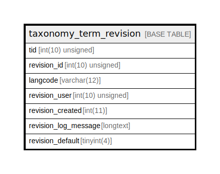

# taxonomy_term_revision

## Description

The revision table for taxonomy_term entities.

<details>
<summary><strong>Table Definition</strong></summary>

```sql
CREATE TABLE `taxonomy_term_revision` (
  `tid` int(10) unsigned NOT NULL,
  `revision_id` int(10) unsigned NOT NULL AUTO_INCREMENT,
  `langcode` varchar(12) CHARACTER SET ascii COLLATE ascii_general_ci NOT NULL,
  `revision_user` int(10) unsigned DEFAULT NULL COMMENT 'The ID of the target entity.',
  `revision_created` int(11) DEFAULT NULL,
  `revision_log_message` longtext DEFAULT NULL,
  `revision_default` tinyint(4) DEFAULT NULL,
  PRIMARY KEY (`revision_id`),
  KEY `taxonomy_term__tid` (`tid`),
  KEY `taxonomy_term_field__revision_user__target_id` (`revision_user`)
) ENGINE=InnoDB DEFAULT CHARSET=utf8mb4 COLLATE=utf8mb4_general_ci COMMENT='The revision table for taxonomy_term entities.'
```

</details>

## Columns

| Name | Type | Default | Nullable | Extra Definition | Children | Parents | Comment |
| ---- | ---- | ------- | -------- | ---------------- | -------- | ------- | ------- |
| tid | int(10) unsigned |  | false |  |  |  |  |
| revision_id | int(10) unsigned |  | false | auto_increment |  |  |  |
| langcode | varchar(12) |  | false |  |  |  |  |
| revision_user | int(10) unsigned | NULL | true |  |  |  | The ID of the target entity. |
| revision_created | int(11) | NULL | true |  |  |  |  |
| revision_log_message | longtext | NULL | true |  |  |  |  |
| revision_default | tinyint(4) | NULL | true |  |  |  |  |

## Constraints

| Name | Type | Definition |
| ---- | ---- | ---------- |
| PRIMARY | PRIMARY KEY | PRIMARY KEY (revision_id) |

## Indexes

| Name | Definition |
| ---- | ---------- |
| taxonomy_term_field__revision_user__target_id | KEY taxonomy_term_field__revision_user__target_id (revision_user) USING BTREE |
| taxonomy_term__tid | KEY taxonomy_term__tid (tid) USING BTREE |
| PRIMARY | PRIMARY KEY (revision_id) USING BTREE |

## Relations



---

> Generated by [tbls](https://github.com/k1LoW/tbls)
