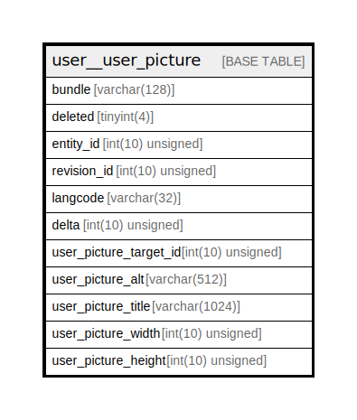

# user__user_picture

## Description

Data storage for user field user_picture.

<details>
<summary><strong>Table Definition</strong></summary>

```sql
CREATE TABLE `user__user_picture` (
  `bundle` varchar(128) CHARACTER SET ascii COLLATE ascii_general_ci NOT NULL DEFAULT '' COMMENT 'The field instance bundle to which this row belongs, used when deleting a field instance',
  `deleted` tinyint(4) NOT NULL DEFAULT 0 COMMENT 'A boolean indicating whether this data item has been deleted',
  `entity_id` int(10) unsigned NOT NULL COMMENT 'The entity id this data is attached to',
  `revision_id` int(10) unsigned NOT NULL COMMENT 'The entity revision id this data is attached to, which for an unversioned entity type is the same as the entity id',
  `langcode` varchar(32) CHARACTER SET ascii COLLATE ascii_general_ci NOT NULL DEFAULT '' COMMENT 'The language code for this data item.',
  `delta` int(10) unsigned NOT NULL COMMENT 'The sequence number for this data item, used for multi-value fields',
  `user_picture_target_id` int(10) unsigned NOT NULL COMMENT 'The ID of the file entity.',
  `user_picture_alt` varchar(512) DEFAULT NULL COMMENT 'Alternative image text, for the image''s ''alt'' attribute.',
  `user_picture_title` varchar(1024) DEFAULT NULL COMMENT 'Image title text, for the image''s ''title'' attribute.',
  `user_picture_width` int(10) unsigned DEFAULT NULL COMMENT 'The width of the image in pixels.',
  `user_picture_height` int(10) unsigned DEFAULT NULL COMMENT 'The height of the image in pixels.',
  PRIMARY KEY (`entity_id`,`deleted`,`delta`,`langcode`),
  KEY `bundle` (`bundle`),
  KEY `revision_id` (`revision_id`),
  KEY `user_picture_target_id` (`user_picture_target_id`)
) ENGINE=InnoDB DEFAULT CHARSET=utf8mb4 COLLATE=utf8mb4_general_ci COMMENT='Data storage for user field user_picture.'
```

</details>

## Columns

| Name | Type | Default | Nullable | Children | Parents | Comment |
| ---- | ---- | ------- | -------- | -------- | ------- | ------- |
| bundle | varchar(128) | '' | false |  |  | The field instance bundle to which this row belongs, used when deleting a field instance |
| deleted | tinyint(4) | 0 | false |  |  | A boolean indicating whether this data item has been deleted |
| entity_id | int(10) unsigned |  | false |  |  | The entity id this data is attached to |
| revision_id | int(10) unsigned |  | false |  |  | The entity revision id this data is attached to, which for an unversioned entity type is the same as the entity id |
| langcode | varchar(32) | '' | false |  |  | The language code for this data item. |
| delta | int(10) unsigned |  | false |  |  | The sequence number for this data item, used for multi-value fields |
| user_picture_target_id | int(10) unsigned |  | false |  |  | The ID of the file entity. |
| user_picture_alt | varchar(512) | NULL | true |  |  | Alternative image text, for the image's 'alt' attribute. |
| user_picture_title | varchar(1024) | NULL | true |  |  | Image title text, for the image's 'title' attribute. |
| user_picture_width | int(10) unsigned | NULL | true |  |  | The width of the image in pixels. |
| user_picture_height | int(10) unsigned | NULL | true |  |  | The height of the image in pixels. |

## Constraints

| Name | Type | Definition |
| ---- | ---- | ---------- |
| PRIMARY | PRIMARY KEY | PRIMARY KEY (entity_id, deleted, delta, langcode) |

## Indexes

| Name | Definition |
| ---- | ---------- |
| bundle | KEY bundle (bundle) USING BTREE |
| revision_id | KEY revision_id (revision_id) USING BTREE |
| user_picture_target_id | KEY user_picture_target_id (user_picture_target_id) USING BTREE |
| PRIMARY | PRIMARY KEY (entity_id, deleted, delta, langcode) USING BTREE |

## Relations



---

> Generated by [tbls](https://github.com/k1LoW/tbls)
