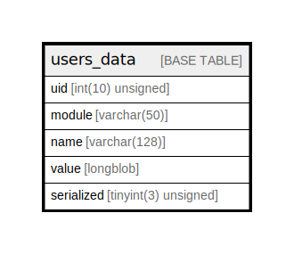

# users_data

## Description

Stores module data as key/value pairs per user.

<details>
<summary><strong>Table Definition</strong></summary>

```sql
CREATE TABLE `users_data` (
  `uid` int(10) unsigned NOT NULL DEFAULT 0 COMMENT 'The "users".uid this record affects.',
  `module` varchar(50) CHARACTER SET ascii COLLATE ascii_general_ci NOT NULL DEFAULT '' COMMENT 'The name of the module declaring the variable.',
  `name` varchar(128) CHARACTER SET ascii COLLATE ascii_general_ci NOT NULL DEFAULT '' COMMENT 'The identifier of the data.',
  `value` longblob DEFAULT NULL COMMENT 'The value.',
  `serialized` tinyint(3) unsigned DEFAULT 0 COMMENT 'Whether value is serialized.',
  PRIMARY KEY (`uid`,`module`,`name`),
  KEY `module` (`module`),
  KEY `name` (`name`)
) ENGINE=InnoDB DEFAULT CHARSET=utf8mb4 COLLATE=utf8mb4_general_ci COMMENT='Stores module data as key/value pairs per user.'
```

</details>

## Columns

| Name | Type | Default | Nullable | Children | Parents | Comment |
| ---- | ---- | ------- | -------- | -------- | ------- | ------- |
| uid | int(10) unsigned | 0 | false |  |  | The "users".uid this record affects. |
| module | varchar(50) | '' | false |  |  | The name of the module declaring the variable. |
| name | varchar(128) | '' | false |  |  | The identifier of the data. |
| value | longblob | NULL | true |  |  | The value. |
| serialized | tinyint(3) unsigned | 0 | true |  |  | Whether value is serialized. |

## Constraints

| Name | Type | Definition |
| ---- | ---- | ---------- |
| PRIMARY | PRIMARY KEY | PRIMARY KEY (uid, module, name) |

## Indexes

| Name | Definition |
| ---- | ---------- |
| module | KEY module (module) USING BTREE |
| name | KEY name (name) USING BTREE |
| PRIMARY | PRIMARY KEY (uid, module, name) USING BTREE |

## Relations



---

> Generated by [tbls](https://github.com/k1LoW/tbls)
