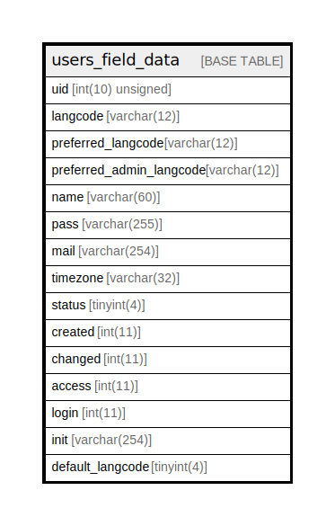

# users_field_data

## Description

The data table for user entities.

<details>
<summary><strong>Table Definition</strong></summary>

```sql
CREATE TABLE `users_field_data` (
  `uid` int(10) unsigned NOT NULL,
  `langcode` varchar(12) CHARACTER SET ascii COLLATE ascii_general_ci NOT NULL,
  `preferred_langcode` varchar(12) CHARACTER SET ascii COLLATE ascii_general_ci DEFAULT NULL,
  `preferred_admin_langcode` varchar(12) CHARACTER SET ascii COLLATE ascii_general_ci DEFAULT NULL,
  `name` varchar(60) NOT NULL,
  `pass` varchar(255) DEFAULT NULL,
  `mail` varchar(254) DEFAULT NULL,
  `timezone` varchar(32) DEFAULT NULL,
  `status` tinyint(4) DEFAULT NULL,
  `created` int(11) NOT NULL,
  `changed` int(11) DEFAULT NULL,
  `access` int(11) NOT NULL,
  `login` int(11) DEFAULT NULL,
  `init` varchar(254) DEFAULT NULL,
  `default_langcode` tinyint(4) NOT NULL,
  PRIMARY KEY (`uid`,`langcode`),
  UNIQUE KEY `user__name` (`name`,`langcode`),
  KEY `user__id__default_langcode__langcode` (`uid`,`default_langcode`,`langcode`),
  KEY `user_field__mail` (`mail`(191)),
  KEY `user_field__created` (`created`),
  KEY `user_field__access` (`access`)
) ENGINE=InnoDB DEFAULT CHARSET=utf8mb4 COLLATE=utf8mb4_general_ci COMMENT='The data table for user entities.'
```

</details>

## Columns

| Name | Type | Default | Nullable | Children | Parents | Comment |
| ---- | ---- | ------- | -------- | -------- | ------- | ------- |
| uid | int(10) unsigned |  | false |  |  |  |
| langcode | varchar(12) |  | false |  |  |  |
| preferred_langcode | varchar(12) | NULL | true |  |  |  |
| preferred_admin_langcode | varchar(12) | NULL | true |  |  |  |
| name | varchar(60) |  | false |  |  |  |
| pass | varchar(255) | NULL | true |  |  |  |
| mail | varchar(254) | NULL | true |  |  |  |
| timezone | varchar(32) | NULL | true |  |  |  |
| status | tinyint(4) | NULL | true |  |  |  |
| created | int(11) |  | false |  |  |  |
| changed | int(11) | NULL | true |  |  |  |
| access | int(11) |  | false |  |  |  |
| login | int(11) | NULL | true |  |  |  |
| init | varchar(254) | NULL | true |  |  |  |
| default_langcode | tinyint(4) |  | false |  |  |  |

## Constraints

| Name | Type | Definition |
| ---- | ---- | ---------- |
| PRIMARY | PRIMARY KEY | PRIMARY KEY (uid, langcode) |
| user__name | UNIQUE | UNIQUE KEY user__name (name, langcode) |

## Indexes

| Name | Definition |
| ---- | ---------- |
| user_field__access | KEY user_field__access (access) USING BTREE |
| user_field__created | KEY user_field__created (created) USING BTREE |
| user_field__mail | KEY user_field__mail (mail) USING BTREE |
| user__id__default_langcode__langcode | KEY user__id__default_langcode__langcode (uid, default_langcode, langcode) USING BTREE |
| PRIMARY | PRIMARY KEY (uid, langcode) USING BTREE |
| user__name | UNIQUE KEY user__name (name, langcode) USING BTREE |

## Relations



---

> Generated by [tbls](https://github.com/k1LoW/tbls)
