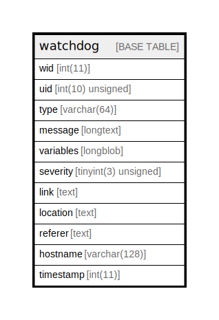

# watchdog

## Description

Table that contains logs of all system events.

<details>
<summary><strong>Table Definition</strong></summary>

```sql
CREATE TABLE `watchdog` (
  `wid` int(11) NOT NULL AUTO_INCREMENT COMMENT 'Primary Key: Unique watchdog event ID.',
  `uid` int(10) unsigned NOT NULL DEFAULT 0 COMMENT 'The "users".uid of the user who triggered the event.',
  `type` varchar(64) CHARACTER SET ascii COLLATE ascii_general_ci NOT NULL DEFAULT '' COMMENT 'Type of log message, for example "user" or "page not found."',
  `message` longtext NOT NULL COMMENT 'Text of log message to be passed into the t() function.',
  `variables` longblob NOT NULL COMMENT 'Serialized array of variables that match the message string and that is passed into the t() function.',
  `severity` tinyint(3) unsigned NOT NULL DEFAULT 0 COMMENT 'The severity level of the event. ranges from 0 (Emergency) to 7 (Debug)',
  `link` text DEFAULT NULL COMMENT 'Link to view the result of the event.',
  `location` text NOT NULL COMMENT 'URL of the origin of the event.',
  `referer` text DEFAULT NULL COMMENT 'URL of referring page.',
  `hostname` varchar(128) CHARACTER SET ascii COLLATE ascii_general_ci NOT NULL DEFAULT '' COMMENT 'Hostname of the user who triggered the event.',
  `timestamp` int(11) NOT NULL DEFAULT 0 COMMENT 'Unix timestamp of when event occurred.',
  PRIMARY KEY (`wid`),
  KEY `type` (`type`),
  KEY `uid` (`uid`),
  KEY `severity` (`severity`)
) ENGINE=InnoDB AUTO_INCREMENT=[Redacted by tbls] DEFAULT CHARSET=utf8mb4 COLLATE=utf8mb4_general_ci COMMENT='Table that contains logs of all system events.'
```

</details>

## Columns

| Name | Type | Default | Nullable | Extra Definition | Children | Parents | Comment |
| ---- | ---- | ------- | -------- | ---------------- | -------- | ------- | ------- |
| wid | int(11) |  | false | auto_increment |  |  | Primary Key: Unique watchdog event ID. |
| uid | int(10) unsigned | 0 | false |  |  |  | The "users".uid of the user who triggered the event. |
| type | varchar(64) | '' | false |  |  |  | Type of log message, for example "user" or "page not found." |
| message | longtext |  | false |  |  |  | Text of log message to be passed into the t() function. |
| variables | longblob |  | false |  |  |  | Serialized array of variables that match the message string and that is passed into the t() function. |
| severity | tinyint(3) unsigned | 0 | false |  |  |  | The severity level of the event. ranges from 0 (Emergency) to 7 (Debug) |
| link | text | NULL | true |  |  |  | Link to view the result of the event. |
| location | text |  | false |  |  |  | URL of the origin of the event. |
| referer | text | NULL | true |  |  |  | URL of referring page. |
| hostname | varchar(128) | '' | false |  |  |  | Hostname of the user who triggered the event. |
| timestamp | int(11) | 0 | false |  |  |  | Unix timestamp of when event occurred. |

## Constraints

| Name | Type | Definition |
| ---- | ---- | ---------- |
| PRIMARY | PRIMARY KEY | PRIMARY KEY (wid) |

## Indexes

| Name | Definition |
| ---- | ---------- |
| severity | KEY severity (severity) USING BTREE |
| type | KEY type (type) USING BTREE |
| uid | KEY uid (uid) USING BTREE |
| PRIMARY | PRIMARY KEY (wid) USING BTREE |

## Relations



---

> Generated by [tbls](https://github.com/k1LoW/tbls)
