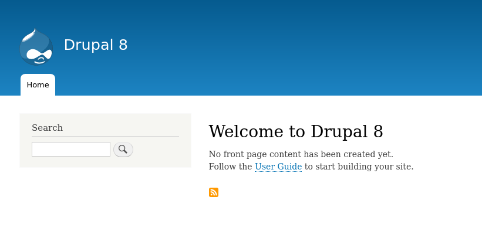

<!-- _class: lead -->
# 1.5 Drupalのインストール

---

<!-- _class: lead -->
## 1.5.1 ソースコードのダウンロード

---

Drupalソースコードは [Drupal.org](https://www.drupal.org/download) から取得可能です。

これを元にしてDrupalをインストールすることもできますが、[drupal-composer/drupal-project](https://github.com/drupal-composer/drupal-project) を使い、`composer create-project` コマンドでコードツリーを生成するほうがメリットが多くあります。

主要なメリットは以下のとおりです。

- Drupalコアのcompose.jsonとプロダクトのcomposer.jsonを分離できる
- Drush, DrupalConsole等の主要なツールが最初から組み込まれている
- 一部のパラメータがセキュリティ的により安全に初期化される

---

それでは、以下のコマンドを実行してソースコードをダウンロードしましょう。

```
$ composer create-project drupal-composer/drupal-project:8.x-dev --no-interaction drupal_developers_recipe
```

ダウンロードが完了すると、 `drupal_developers_recipe` ディレクトリに以下の様なファイルが生成されます。

```
$ cd drupal_developers_recipe
$ ls
config  drush  scripts  vendor  web  composer.json  composer.lock  LICENSE  load.environment.php  phpunit.xml.dist  README.md
```

`composer create-project` で利用可能なその他のオプションは [composerのドキュメント](https://getcomposer.org/doc/03-cli.md#create-project) を参照してください。

---

<!-- _class: lead -->
## 1.5.2 サイトの初期化

---

次にサイトを初期化しましょう。シンプルな環境でも動作するように今回はデータベースとしてsqliteを利用します。

```
$ vendor/bin/drupal site:install standard --db-type="sqlite" --no-interaction

Starting Drupal 8 install process
[OK] Your Drupal 8 installation was completed successfully
```

---

<!-- _class: lead -->
## 1.5.3 サイトの起動

---

次に、ブラウザからアクセスできるようにサイトを起動します。ここでも、シンプルな環境でも動作するようにWebサーバーにはApacheやnginxではなく、PHPの組み込みWebサーバーを使います。

```
$ vendor/bin/drupal server
[OK] Executing php from "/home/aoyama/.anyenv/envs/phpenv/versions/7.2.22/bin/php".

Listening on "http://127.0.0.1:8088".
```

`Executing php` の行にはphpコマンドのパスが表示されますが、実行環境によって表示内容は異なります。

---

<!-- _class: lead -->
## 1.5.4 サイトへのアクセス

---

それでは、ブラウザから http://127.0.0.1:8088 にアクセスしてみましょう。以下のようにトップページが表示されれば成功です。



---

<!-- _class: lead -->
## 1.5.5 最初の状態でgitのレポジトリを作成する

無事Drupalが動作したので、最初の状態でgitのレポジトリを作成しておきましょう。

```txt
$ git init
$ git add .
$ git commit -m "Initial commit"
```

---

## まとめ

このセクションでは、PHPの組み込みWebサーバーとSqliteを使うシンプルな環境でDrupalをインストールしました。

Ruby on RailsやLaravelなどのフレームワークを使ったことがある方であれば、「アプリケーションの初期化」→「組み込みWebサーバーとsqliteを使って起動」というおなじみのステップだったと思います。

1章はこれで終了です。2章からは、実際にモジュールのコードを書いてDrupalに機能を拡張していきます。
