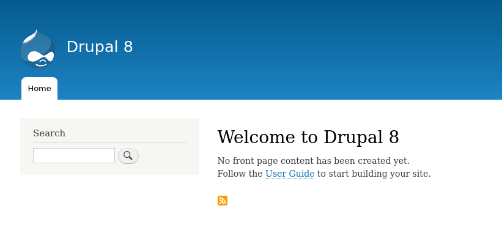

<!-- _class: lead -->
# Drupalのインストール

---

## ソースコードのダウンロード

```
$ composer create-project drupal-composer/drupal-project:8.x-dev --no-interaction drupal_training_book_code
```

```
$ cd drupal_training_book_code
$ ls
config  drush  scripts  vendor  web  composer.json  composer.lock  LICENSE  load.environment.php  phpunit.xml.dist  README.md
```

`composer create-project` で利用可能なその他のオプションは [composerのドキュメント](https://getcomposer.org/doc/03-cli.md#create-project) を参照してください。

---

## サイトの初期化

それではサイトを初期化しましょう。シンプルな環境でも動作するように今回はデータベースとしてsqliteを利用します。
```
$ vendor/bin/drupal site:install standard --db-type="sqlite" --no-interaction

Starting Drupal 8 install process
[OK] Your Drupal 8 installation was completed successfully
```

---

## サイトの起動

次に、ブラウザからアクセスできるようにサイトを起動します。ここでも、シンプルな環境でも動作するようにWebサーバーにはApacheやnginxではなく、PHPの組み込みWebサーバーを使います。

```
$ vendor/bin/drupal server
[OK] Executing php from "/home/aoyama/.anyenv/envs/phpenv/versions/7.2.22/bin/php".

Listening on "http://127.0.0.1:8088".
```

`Executing php` の行にはphpコマンドのパスが表示されますが、実行環境によって表示内容は異なります。

---

## サイトへのアクセス

それでは、ブラウザから http://127.0.0.1:8088 にアクセスしてみましょう。以下のようにトップページが表示されれば成功です。



---

## 最初の状態でgitのレポジトリを作成する

無事Drupalが動作したので、最初の状態でgitのレポジトリを作成しておきましょう。

```sh
$ git init
$ git add .
$ git commit -m "Initial commit"
```

---

## WebサーバーやDBサーバーがなくても起動できる

Ruby on RailsやLaravelなどのフレームワークを使ったことがある方であれば、「アプリケーションの初期化」→「組み込みWebサーバーとsqliteを使って起動」というおなじみのステップだったと思います。