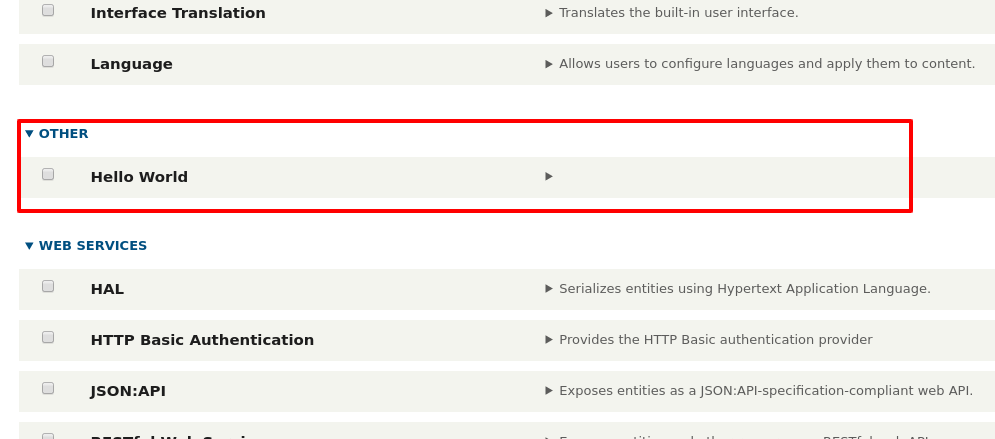

<!-- _class: lead -->
# 2.2 空モジュールの作成

---

## はじめに

Drupalのモジュールで実現できる機能は非常に多岐に渡ります。
また、Drupal 8以降は[Symfony](https://symfony.com/doc/4.4/configuration.html)やいくつかの[PSR](https://www.php-fig.org/psr/)の知識が必要となっており、Drupal自体の理解の前に覚えなくてはならない要素がたくさんあります。

開発者向けのサンプルとして公開されている[Exampleモジュール](https://www.drupal.org/project/examples)や、DrupalConsoleでscaffolding(自動生成)されるコードは包括的でとても参考になりますが、未経験者への情報量としては多すぎます。

そのため、まずは何の機能を持たないhello_worldモジュールを開発するところから始めましょう。

---

## モジュールのソースコードの配置先

前のセクションで説明したとおり、contribute moduleやカスタムモジュールは `web/modules` ディレクトリに格納されます。

モジュールやテーマなど、Drupal特有のファイルをどのディレクトリに配置するかは、composerの [installer-paths](https://getcomposer.org/doc/faqs/how-do-i-install-a-package-to-a-custom-path-for-my-framework.md#how-do-i-install-a-package-to-a-custom-path-for-my-framework-) で設定されています。

ルートディレクトリにある `composer.json` を見てみましょう。

---

```json
...
    "extra": {
        ...
        "installer-paths": {
            "web/core": ["type:drupal-core"],
            "web/libraries/{$name}": ["type:drupal-library"],
            "web/modules/contrib/{$name}": ["type:drupal-module"],
            "web/profiles/contrib/{$name}": ["type:drupal-profile"],
            "web/themes/contrib/{$name}": ["type:drupal-theme"],
            "drush/Commands/contrib/{$name}": ["type:drupal-drush"]
        }
        ...
```

---

`"web/modules/contrib/{$name}": ["type:drupal-module"]` の行を見ると、「drupal-moduleというtypeのライブラリは、web/modules/contrib/{$name} にインストールされる」ということがなんとなく読み取れるかと思います。

`type` と `name` の定義については以下を参照してください。
- [type](https://getcomposer.org/doc/04-schema.md#type)
- [name](https://getcomposer.org/doc/04-schema.md#name)

---

このようにcomposer.jsonの断片からだけでも、様々な情報を読み取ることができます。

「Drupalのルールはこれだ」と丸暗記や手順で覚えるのではなく、「drupalではcomposer.jsonのinstaller-pathsでライブラリのtype毎にファイルの配置先を振り分けている」というような考え方で理解するようにしてください。

抽象化して理解する習慣をつけることで、composerで構成管理されているLaravelやSymfonyで書かれた他のコードを見る時にも、知識を応用することができようになります。
(もちろん、これがgemやnpm等でも考え方は同じです)

---

前置きが長くなりましたが、実は「カスタムモジュール」を示す `type` は決まりがないため、どこにインストールするかについても明確な制限はありません。

慣習的には `web/modules/custom/` 以下に配置されますが、Drupalは`web/modules` 以下を再帰的に読み込んでモジュールの存在をチェックするため、 `web/modules` 以下であればどこに配置してもモジュールは認識されます。

本コンテンツでは、web/modules/custom/` 以下に配置していきます。

---

## hello_worldモジュールの開発

それでは、いよいよモジュールのコードを書いていきましょう。
(ここまで長かったですね！)

冒頭で説明したとおり、このセクションでは何の機能を持たない `hello_world` モジュールを開発します。

---

Drupalにモジュールを認識させるために最低限必要なことは、`{module_name}.info.yml` を作成することです。

それでは、 `web/modules/custom/hello_world` というディレクトリと、その下に `web/modules/custom/hello_world/hello_world.info.yml` を作成しましょう。ymlファイルの中身はまだ空のままで構いません。

つまり、ルートディレクトリから確認すると以下のようになります。

```bash
$ find web/modules/custom
web/modules/custom
web/modules/custom/hello_world
web/modules/custom/hello_world/hello_world.info.yml
```

---

次に `hello_world.info.yml` を次のように書き換えます。

```yml
name: Hello World
type: module
core: 8.x
```

この `name`、`type`、`core` が `{module_name}.info.yml` に必須で必要なキーとなります。その他のキーも含めて、 `{module_name}.info.yml` では次のようなキーが指定できます。

---

|キー|必須|値|
|---|---|---|
|name|yes|モジュール(テーマ)の名前|
|type|yes|モジュールの場合は `module`、テーマの場合は `theme`|
|core|yes|サポートするコアのバージョン。Drupal 8.8時点では有効な値は `8.x` のみ。|

---

|キー|必須|値|
|---|---|---|
|description|no|モジュール(テーマ)の説明。管理UI上に表示されます(後述)。|
|package|no|モジュール(テーマ)が属するパッケージ。動作には影響しない。管理UI上に表示されます。|
|dependencies|no|モジュール(テーマ)が依存する他のモジュールやテーマ|
|version|no|モジュール(テーマ)のバージョン|

---

それでは、hello_worldモジュールが無事Drupalに認識されたか確認してみましょう。

上部メニューの `Extend` をクリックして `/admin/modules` にアクセスしてください。以下のように表示されれば成功です。



---

無事に動いたところで、この状態をgitで保存しておきましょう。

```sh
$ git add web/modules/custom
$ git commit -m "congratulations! This is my first module!"
```

以降は明記しませんが、このようにgitでソースコードの変更を管理していってください。あとで見直したり、不具合が発生した場合の切り分けやロールバックなどを考えると、gitのコミットはなるべく細かい単位で行うことを推奨します。

---

## モジュールに説明を追加する

さて、descriptionを省略したため管理UI上でモジュールの説明が表示されていません。

以下のように `hello_world.info.yml` に `description` を追加してみましょう。

```yml
name: Hello World
type: module
core: 8.x
description: Hello World module
```

---

ブラウザをリロードして、以下の様に説明が表示されることを確認してください。


---

`description` は必須ではないため最初は実装しませんでしたが、コードや管理UIからの可読性を考えると必ず実装したほうが良いでしょう。

---

## モジュールの識別子(Machine name)

モジュールには `Machine name` と呼ばれるユニークなIDが付与されます。

管理画面のHello Worldモジュールの説明欄をクリックしてみてください。以下のようにモジュールのメタデータが展開して表示されます。


---

`Machine name` を見ると、 `hello_world` になっていることが分かります。

モジュールのMachine nameは、`{module name}.info.yml` の `{module name}` の部分から自動的に決定されます。つまり、Machine nameはモジュールが格納されているディレクトリ名や、`.info.yml` 内の `Name` とは必ずしも一致しない点に注意してください。

試しに `hello_world.info.yml` を `foo.info.yml` にリネームし、管理UI上でMachine nameがどのように変わるか確認してみてください。
(確認が終わったら、ファイル名は元通りに戻してください)

---

## まとめ

モジュール開発の最初の一歩として、機能を何も持たないhello_worldモジュールを開発し、Drupalがどのようにモジュールを認識するかの概要が理解できたと思います。

次のセクションでは、伝統的なDrupalの機能拡張方法であるhookを実装していきます。

---

## ストレッチゴール

- `package` キーを追加して、モジュールが `Custom` パッケージに所属するように変更してください。
- `version` キーを追加して、モジュールのバージョンを `8.x-1.0` に設定してください。
