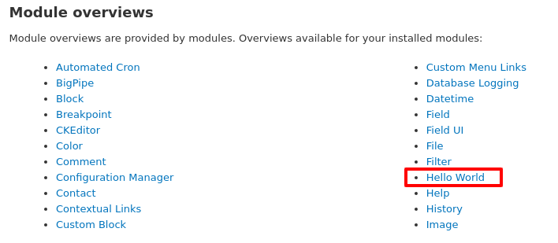

<!-- _class: lead -->
# 2.3 フックの実装 (1) - hook_help

---

前のセクションでは、何も機能を持たない空のモジュールを作成しました。

このセクションでは、Drupalの伝統的な機能拡張の方法であるフックを実装して、いくつかの機能を追加していきます。

---

<!-- _class: lead -->
## 2.3.1 フックとは

---

フックとは、「発生したあるイベントに連動して独自の処理を追加する」ための仕組みです。まず、**「フック(hook)という概念自体はDrupal独自のものではない」** ことを念頭に置いてください。

[gitにもフックがあります](https://git-scm.com/book/en/v2/Customizing-Git-Git-Hooks)し、最近ではslack等のWebサービスで [WebHook](https://slack.com/intl/ja-jp/help/articles/115005265063) という言葉を目にすることも多いと思います。

---

例えば、Ruby on Railsにはコントローラーのメソッドが実行される前にフィルター処理を差し込むための [before_action](https://railsguides.jp/action_controller_overview.html#%E3%83%95%E3%82%A3%E3%83%AB%E3%82%BF) や、モデルを保存する前に差し込むための [before_save](https://guides.rubyonrails.org/active_record_callbacks.html) などのインターフェースが用意されています(ちなみに `around_*` とか `after_*` もあります)

これらは概念的にはフックそのものです。before_saveのリンク先のドキュメント(Rails Guide)を読むと、`hook` というワードが使われていることが分かります。

---

似たようなことを何度も書いていますが、「これはDrupalに特有なものなのか？」を常に意識し、抽象化して理解しながら読み進めてください。抽象化した知識は学習効率を高め、実際に問題を解決する際の強力な力になります。

極論を言えば、APIなどは必要に応じてドキュメントを参照すればいいので、覚える必要は全くありません。本当に覚える必要があるのは、常に抽象化された概念の方です。

---

<!-- _class: lead -->
## 2.3.2 Drupalのフック

---

さて、フックの概念が理解できたところで「Drupalのフックとは？」を説明してきます。Drupalのフックは **「特定の命名規則で実装されたグローバル関数」** として実装します。

例えば、Drupal 7ではノードが読み込まれた時に実行される `hook_node_load` というフックがあります。このフックを実装することによって、ノードが読み込まれた後、表示される前に新たなデータを追加したり、逆に見せたくないデータを削除するような機能を追加することができます。

※説明しやすいので例に出しましたが、このフックはDrupal 8にはありません。:sweat_smile:

---

<!-- _class: lead -->
## 2.3.3 フックの命名規則

---

フックは `{module_name}_{hook_name}` という命名規則で実装します。また、ドキュメント上では `{module_name}` の部分は `hook` という名前になっている点に注意してください。

例えば、モジュールの機能に関するヘルプテキストを提供する `hook_help` というフックがあります。nodeモジュールは自身が提供するヘルプテキストを [node_help](https://github.com/drupal/drupal/blob/8.8.0/core/modules/node/node.module#L95) という関数名で実装しています。

---

<!-- _class: lead -->
## 2.3.4 フックの探し方 (ソースコードから探す)

---

コアやモジュールが外部から拡張可能なフックを提供する場合、 `{module_name}.api.php` というファイルでドキュメントを書くことが推奨されています。

どのようなファイルがあるか見てみましょう。

---

```sh
$ find web/core -type f -name "*.api.php"
web/core/modules/ckeditor/ckeditor.api.php
web/core/modules/views_ui/views_ui.api.php
web/core/modules/language/language.api.php
...
web/core/modules/help/help.api.php
...

$ find web/core -type f -name "*.api.php" |wc -l
54
```

Drupal 8.8.0時点では、コアにはフックに関するドキュメントが54個あるようです。

それでは、サンプルとして `web/core/modules/help/help.api.php` を見てみましょう。

---

```php
/**
 * Provide online user help.
 *
 * By implementing hook_help(), a module can make documentation available to
 * the user for the module as a whole, or for specific pages. ...
 * 
 * ...
 *
 * For detailed usage examples of:
 * - Module overview help, see content_translation_help(). Module overview
 *   help should follow
 *   @link https://www.drupal.org/node/632280 the standard help template. @endlink
 * - Page-specific help using only routes, see book_help().
 * - Page-specific help using routes and $request, see block_help().
 *
 * @param string $route_name
 *   For page-specific help, use the route name as identified in the
 *   module's routing.yml file. For module overview help, the route name
 *   will be in the form of "help.page.$modulename".
 * @param Drupal\Core\Routing\RouteMatchInterface $route_match
 *   The current route match. This can be used to generate different help
 *   output for different pages that share the same route.
 *
 * @return string|array
 *   A render array, localized string, or object that can be rendered into
 *   a string, containing the help text.
 */
function hook_help($route_name, \Drupal\Core\Routing\RouteMatchInterface $route_match) {
  switch ($route_name) {
    // Main module help for the block module.
    case 'help.page.block':
      return
        '<p>' . 
       t('Blocks are boxes of content rendered into an area, or region, of a web page. ...', [':blocks' => Url::fromRoute('block.admin_display')->toString()]) .
        '</p>';

    // Help for another path in the block module.
    case 'block.admin_display':
      return
        '<p>' .
        t('This page provides a drag-and-drop interface for assigning a block to a region, and for controlling the order of blocks within regions. ...') .
        '</p>';
  }
}
```

---

**「hook_help() という関数で、ルート毎のヘルプテキストを返すことができるんだなぁ」** という情報が何となく読み取れると思います。

---

<!-- _class: lead -->
## 2.3.5 フックの探し方 (Webサイトから探す)

---

コアが提供するフックは以下のURLで確認することができます。
https://api.drupal.org/api/drupal/core%21core.api.php/group/hooks/8.8.x

ちなみに、このサイトはDrupalのソースコードを元に自動生成されています。

フックの場合は `@addtogroup` に `hooks` が設定されたソースコード、つまり、先ほど見た `{module_name}.api.php` がオリジナルの情報です。

---

<!-- _class: lead -->
## 2.3.6 hook_helpの実装

---

それでは、hello_worldモジュールに `hook_help` を実装していきましょう。
先述したとおり、Drupalのフックはグローバル関数として実装する必要があります。

Drupalでは `{module_name}.module` というファイルに関数を定義するとグローバル関数として扱われます。

`web/core/modules/custom/hello_world/hello_world.module` を新規に作成し、次のコードを追加してください。

---

```php
<?php

use Drupal\Core\Routing\RouteMatchInterface;

/**
 * Implements hook_help().
 */
function hello_world_help($route_name, RouteMatchInterface $route_match) {
  switch ($route_name) {
    case 'help.page.hello_world':
      $output = '';
      $output .= '<h3>' . t('About') . '</h3>';
      $output .= '<p>' . t('This is an hello world module.') . '</p>';
      return $output;
    default:
  }
}
```

---

この時点では、このソースコードの詳細な意味まで理解できている必要はありません。

この関数が、 `help.page.hello_world` というルートに対して、 `$output` 変数に設定した文字列を返す、という点だけ抑えておいてください。

---

Drupalはモジュールがどのようなフックを実装しているかを把握していますが、その情報はキャッシュされています(都度、ソースコードを解析してフックの実装の有無を確認していたら遅いですよね？)。

先ほど実装した `hello_world_help` がDrupalに認識されるように、drushを使ってキャッシュをクリアしましょう。

```txt
$ vendor/bin/drush cr
```

---

それでは、上部のメニューから「Manage」→「Help」に進んで `/admin/help` にアクセスしてください。正しくフックが実装されていれば、以下のように「Hello World」のリンクが表示されています。



---

「Hello World」のリンクをクリックすると、 `hello_world_help` でreturnしている `$output` 変数の内容が表示されていることが分かります。


---

## まとめ

このセクションではフックの仕組みの解説と、hook_helpの実装を行いました。

フックにはhook_helpのような簡単なものから、データの保存やビジネスロジックに介入できるものまで様々なものがあります。次のセクションでは、デフォルトのフォームの振る舞いを変更するフックを実装します。

フックに関するまとまった情報が欲しい場合は、[Underdstanding hooks](https://www.drupal.org/docs/8/creating-custom-modules/understanding-hooks) を参照してください。
