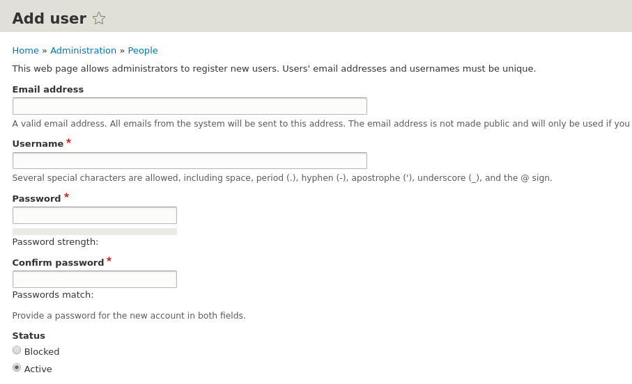
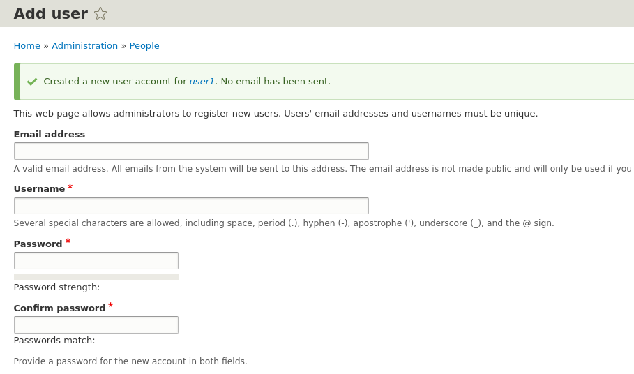
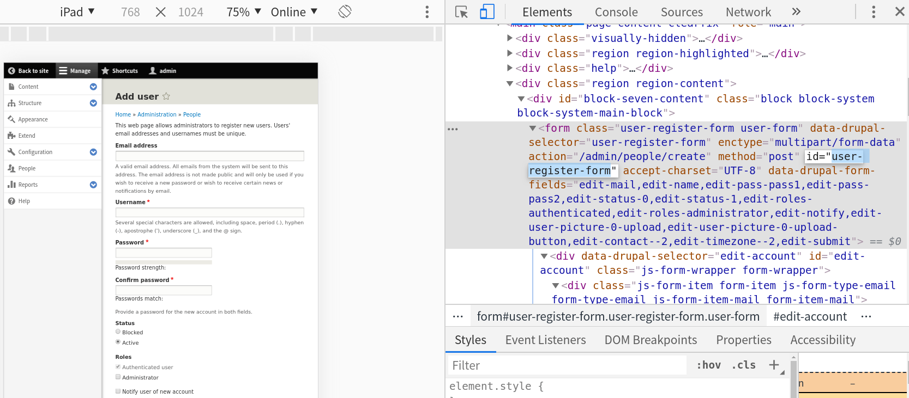
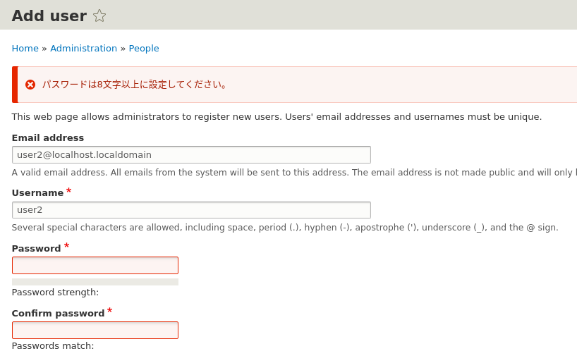

<!-- _class: lead -->
# 2.4 フックの実装 (2) - hook_form_alter

---

前のセクションでは、`hook_help` を実装してヘルプコンテンツを追加しました。

このセクションでは、もう少し実践的に既存のフォームの振る舞いを変更する機能を追加します。

---

## 既存のフォームの振る舞いを変更するフック: hook_form_alter

Drupalは主にCMSとして利用されているフレームワークです。
そのため、コアや他のモジュールが生成したフォームに対して、振る舞いを変更するためのインターフェースがデフォルトで提供されています。

これは [hook_form_alter](https://api.drupal.org/api/drupal/core%21lib%21Drupal%21Core%21Form%21form.api.php/function/hook_form_alter/8.8.x) というフックを実装することで実現できます。

このフックを実装することで、既存のフォームの項目を追加・削除したり、バリデーションを変更したりすることができます。

---

## hook_form_alterの実装

それでは、`hook_form_alter` の実装をしてみましょう。
今回は例として、ユーザー登録フォームに **「入力されたパスワードが8文字以上かどうかをチェックし、8文字未満の場合はエラーメッセージを表示する」** 機能を追加します。

---

まずは、ユーザー登録フォームの標準の動きを確認してみましょう。
`/admin/people/create` にアクセスしてユーザー登録フォームを表示してください。



---

以下のように入力して、ユーザーを新規に登録してください(記載がない項目はデフォルト値のままでOKです)

|キー|値|
|---|---|
|Email address|`user1@localhost.localdomain`|
|Username|`user1`|
|Password|`a`|
|Confirm password|`a`|

---

登録に成功すると以下のようなメッセージが表示されます。



---

「おや？」っと思われたかもしれませんが、実はDrupalのデフォルトではパスワードの文字数はチェックされません。[かなり昔から議論はされています](https://www.drupal.org/project/drupal/issues/1824800)が、なかなか標準の機能としては取り込まれていません。

この振る舞いはセキュリティ的にはかなり弱いですよね。この問題を解決するために `hook_form_alter` を実装して文字数をチェックしましょう。

---

では、`hook_form_alter` のドキュメントを見てみましょう。
前のセクションで説明したとおり、フックのドキュメントは `{module_name}.api.php` というファイルに記載されています。

ただし、モジュールではなくコアライブラリが提供するフックについては `{component}.api.php` というファイルになっています。

`hook_form_alter` でgrepして、該当ファイルを探してみましょう。

---

```
$ grep hook_form_alter -rl --include="*.api.php" web 
web/core/lib/Drupal/Core/Form/form.api.php
web/core/lib/Drupal/Core/Extension/module.api.php
web/core/lib/Drupal/Core/Entity/entity.api.php
```

`web/core/lib/Drupal/Core/Form/form.api.php` がそれらしいですね。

ちなみに、「grepを使って検索したソースコードを参照する」という例で情報の探し方を示しましたが、ブラウザで [hook_form_alter](https://api.drupal.org/api/drupal/core%21lib%21Drupal%21Core%21Form%21form.api.php/function/hook_form_alter/8.8.x) を見ても同じ情報にアクセスできます。

重要なのは **「情報を探すために必要な要素を理解すること」** であり、参照する媒体は何でも構いません。

---

それでは、 `web/core/lib/Drupal/Core/Form/form.api.php` を開いて `hook_form_alter` のコメントを見てみましょう。


```plain
/**
 * Perform alterations before a form is rendered.
 *
 * One popular use of this hook is to add form elements to the node form. When
 * altering a node form, the node entity can be retrieved by invoking
 * $form_state->getFormObject()->getEntity().
 *
 ...
```
このフックがフォームがレンダリングされる前に振る舞いを変更するためのものということが分かります。ノードの場合は、 `$form_state->getFormObject()->getEntity()` でノードのデータにアクセスできることが分かります。

---

```plain
 *
 * Implementations are responsible for adding cache contexts/tags/max-age as
 * needed. See https://www.drupal.org/developing/api/8/cache.
 *
```

フックを実装する側は、キャッシュの扱いについて責任を持って実装する必要があります。キャッシュAPIについては別のセクションで説明しますので、今は無視して先に進みましょう。

---

```plain
 *
 * In addition to hook_form_alter(), which is called for all forms, there are
 * two more specific form hooks available. The first,
 * hook_form_BASE_FORM_ID_alter(), allows targeting of a form/forms via a base
 * form (if one exists). The second, hook_form_FORM_ID_alter(), can be used to
 * target a specific form directly.
 *
 * The call order is as follows: all existing form alter functions are called
 * for module A, then all for module B, etc., followed by all for any base
 * theme(s), and finally for the theme itself. The module order is determined
 * by system weight, then by module name.
 *
 * Within each module, form alter hooks are called in the following order:
 * first, hook_form_alter(); second, hook_form_BASE_FORM_ID_alter(); third,
 * hook_form_FORM_ID_alter(). So, for each module, the more general hooks are
 * called first followed by the more specific.
 * 
```

---

少し長いので情報量が多いですが、以下のようなことが分かります。

- `hook_form_alter` は全てのフォームの生成時に実行されること
- 特定のフォームだけで動くようにするには `hook_form_BASE_FORM_ID_alter()` と `hook_form_FORM_ID_alter()` の2つの方法があること
- 各モジュールのフックが `system weight` の順、次にモジュール名の順に呼ばれ、最後にテーマのフックが実行されること 
- 同一モジュールで複数のフックを実装した場合は、`hook_form_alter`、 `hook_form_BASE_FORM_ID_alter`、 `hook_form_FORM_ID_alter` の順に実行されること

---

特に3つ目の **「各モジュールの同じフックがある順序に従って全て実行される」** ということを理解しておいてください。これについては、また後で解説します。

---

ここからやっと引数の説明に入ります。

```plain
 *
 * @param $form
 *   Nested array of form elements that comprise the form.
 * @param $form_state
 *   The current state of the form. The arguments that
 *   \Drupal::formBuilder()->getForm() was originally called with are available
 *   in the array $form_state->getBuildInfo()['args'].
 * @param $form_id
 *   String representing the name of the form itself. Typically this is the
 *   name of the function that generated the form.
 *
 * @see hook_form_BASE_FORM_ID_alter()
 * @see hook_form_FORM_ID_alter()
 *
 * @ingroup form_api
 */
function hook_form_alter(&$form, \Drupal\Core\Form\FormStateInterface $form_state, $form_id) {
```

---

hook_form_alter には以下の引数が渡されます。
- `$form` はフォームの構成要素が格納された配列
- `$form_state` はフォームの現在の状態
- `$form_id` は表示しようとしているフォームのID

`$form` が参照渡しになっているので、この変数を書き換えることで振る舞いを変更できそうですね。

それでは、いよいよ `hook_form_alter` の実装に入ります。

---

先ほど確認したドキュメントの通り、 `hook_form_alter` は全てのフォームの生成時に実行されます。そのため、特定のフォームだけで処理を実行するためには、まずは対象のフォームのIDを知る必要があります。フォームのIDはフォームを生成しているコードの [getFormId()](https://api.drupal.org/api/drupal/core%21lib%21Drupal%21Core%21Form%21FormBuilder.php/function/FormBuilder%3A%3AgetFormId/8.8.x) メソッドから読み取ることもできますが、それよりもブラウザ上でDOMから確認したほうが簡単です。

`/admin/people/create` にアクセスしてフォームの `id` 属性を確認すると、 `user-register-form` になっていることが分かります。この `id` 属性の `-` を `_` に置き換えたものがフォームのIDになります。

今回の場合だと、フォームIDは `user_register_form` です。

---



---

`hook_form_alter` の引数の `$form_id` が `user_register_form` の場合にだけ動くように処理を書けば、ユーザー登録フォームの振る舞いだけを変更することができます。

フック関数は `{module_name}.module` に追加するグローバル関数であることは前のセクションで説明したとおりです。

つまり、今回は `hello_world.module` に次のようなコードを追加することになります。

---

```php
use Drupal\Core\Form\FormStateInterface;

/**
 * Implements hook_form_alter().
 */
function hello_world_form_alter(&$form, FormStateInterface $form_state, $form_id) {
  if ($form_id === "user_register_form") {
    // something to do.
  }
}
```

---

あとは、このif文の中にパスワードの文字数をチェックする処理を入れればゴールです。

Drupalでフォームの入力値を検証するための伝統的な方法は、`$form` 変数(型は `array` です)の `#validate` というキーにコールバック関数を追加する方法です。

この辺りの仕様は、[Form API](https://www.drupal.org/docs/8/api/form-api) と呼ばれるものになっています。

この仕様は非常にボリュームが大きく、基本的な部分の説明だけでも10セクションは超えてしまうので、現時点では詳細な理解は必要ありません。

---

それでは、`hello_world_form_alter()` を以下のように変更しましょう。
```php
/**
 * Implements hook_form_alter().
 */
function hello_world_form_alter(&$form, FormStateInterface $form_state, $form_id) {
  if ($form_id === "user_register_form") {
    $form["#validate"][] = "hello_world_validate_password_length";
  }
}
```

---

次に、 `#validate` でコールバックに指定した関数を追加します。

```
/**
 * Validate that password length greater than 8 characters.
 *
 * @param array $form
 * @param FormStateInterface $form_state
 * @return void
 */
function hello_world_validate_password_length(array &$form, FormStateInterface $form_state) {
  $password_length = strlen($form_state->getValue("pass"));
  if ($password_length < 8) {
    $form_state->setErrorByName("pass", "パスワードは8文字以上に設定してください。");
  }
}
```

---

Form APIの仕様がわからないとこのコードの妥当性は判断できないため、簡単に説明すると以下のようになります。

- `$form` 変数の `#validate` キーに関数名(またはメソッド名)を指定すると、フォームをサブミットした際に実行される検証処理を登録できる
- 登録する関数名に制約はないが、引数として `array &$form` と `FormStateInterface $form_state` を受け取る必要がある(引数の型や順序、個数が違う場合は実行されない)
- `FormStateInterface::getValue()` でフォームの入力値を取得できる
- `FormStateInterface::setErrorByName()` でエラーが発生した要素とエラメッセージを登録できる

---

それでは、実装したフックが期待通り動くか確認してみましょう！

`/admin/people/create` にアクセスして、以下のパラメータでユーザーを登録してください。

|キー|値|
|---|---|
|Email address|`user2@localhost.localdomain`|
|Username|`user2`|
|Password|`aaaaaaa` (7文字)|
|Confirm password|`aaaaaaa`|

---

以下のようにエラーメッセージが表示されれば成功です。



---

(ここで安心してはいけませんよ。8文字以上のパスワードを入力すれば、ユーザーが登録できることも確認しておきましょう！)

---

## まとめ

このセクションでは `hook_form_alter` を実装して既存のフォームの振る舞いを変更しました。

1章でも少し説明したとおり、Drupal 8ではフックはレガシーな拡張方法のため、プラグインを作って機能を拡張する方が好ましいです。

しかし、フックしか拡張手段が用意されていなかったり、プラグインとして実装することで変更したい内容のわりにはコード量が大きくなるケースもあるため、必要に応じて使い分けているのが実情のようです。

---

例えば、このセクションのフックと同様の機能を `Constraint` というプラグイン (`Plugin`)のサブクラスを拡張して実現することもできます。

`Constraint` を実装するには、`Plugin` の理解が先に必要になりますので、これに関しては本コンテンツの後半で説明します。

---

## ストレッチゴール

1. このセクションで追加した `user2` でログインし、パスワードを変更すると8文字以下でも変更できてしまいます。原因を調査してhello_worldモジュールを修正してください。

2. 1.で修正したコードを別のフックを使って実装し直してください。ヒントは `hook_form_alter` のドキュメントにあります。
