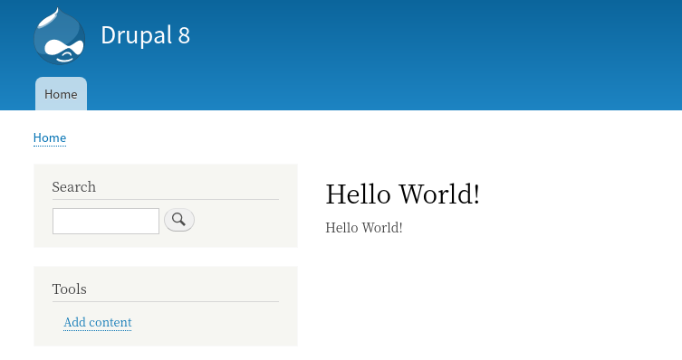

<!-- _class: lead -->
# ルーティングとコントローラー

---

ここまでのセクションでは、Drupalのフックを使って既存の機能を拡張しました。

では、全く新しい機能を追加するにはどうしたらいいでしょうか？

このセクションでは、これを実現するためにDrupalの [ルーティングシステム](https://www.drupal.org/docs/8/api/routing-system) について解説します。

---

Drupalがリクエストを受けてからレスポンスを返すまでの流れは次の図のようになっています。


https://www.drupal.org/docs/8/api/routing-system/routing-system-overview

---

リクエストが来ると、ルーティングシステムがそのルート(パス)に対して処理を担当するコントローラーを判断し、コントローラーがレスポンスを生成して返します。

ご存知の通り、ルーティングやコントローラーといった考え方はDrupalやSymfony独自のものではなく、どのWebアプリケーションフレームワークでも持っている概念です。

---

本セクションでは、Drupalに特有な要素にフォーカスして詳しく説明します。

もし、これらの概念について理解が不足していると感じる場合は、抽象化して理解をするために、まずはDrupal以外のドキュメントを参照することを推奨します(Drupal以外に使ったことのあるフレームワークのドキュメントや入門書などでOKです)。

それでは、 `/hello` にアクセスすると `Hello World!` を表示する簡単な機能を開発してみましょう。

---

## 簡単なルーティングとコントローラーの実装

Drupalでは、 `{module_name}.routing.yml` でルーティングの定義をすることができます。

Drupal 7以前で開発した事がある方は `hook_menu()` でルーティングの定義をしたことがあるかもしれませんが、このフックはDrupal 8からは削除されています。

Drupal 8からはルーティングに [Symofony Routingコンポーネント](https://symfony.com/doc/current/routing.html) が採用され、実装方法が大きく変更されています (逆にLaravelやSymofonyの開発者にとっては馴染みのある方法に近くなっています)。

---

`hello_world.routing.yml` を新規に作成し、以下のように実装してください (コードの説明は後で行います)。

```yml
hello_world.hello:
  path: '/hello'
  defaults:
    _controller: '\Drupal\hello_world\Controller\HelloWorldController::helloWorld'
    _title: 'Hello World!'
  requirements:
    _access: 'TRUE'
```

---

次に `src/Controller/HelloWorldController.php` を新規に作成し、以下のように実装してください (コードの説明は後で行います)。

```php
<?php

namespace Drupal\hello_world\Controller;

use Drupal\Core\Controller\ControllerBase;

/**
 * A example of custom controller.
 */
class HelloWorldController extends ControllerBase {

  /**
   * Just say "Hello World!".
   */
  public function helloWorld() {
    return [
      "#markup" => "Hello World!",
    ];
  }

}
```

---

それでは、 `/admin/config/development/performance` にアクセスしてキャッシュをクリアしてから `/hello` にアクセスしてみてください。以下のように「Hello World!」が表示されれば成功です。



---

## ルーティングの定義

無事に動いたところでまずは `hello_world.routing.yml` のコードから詳細を見ていきましょう。

### **ルート名**

ymlのルート要素、つまり `hello_world.hello` は **ルート名** です。
ルート名はシステム内でユニークな必要があるため、 `{module_name}.***` のようにモジュールのmachine nameをprefixにすることが推奨されています(このルールに従わなくても動きます)。

---

### **path**

その名の通り、ルートが反応するパスを定義します。今回は固定値としていますが、もちろん、 `/user/1`、 `/user/2` のようにidなどをパラメータに取るパスも定義可能です (後ほど解説します)。

### **defaults**

このルートのデフォルトプロパティを定義します。プロパティの種類は多数ありますが、今回はコントローラー(とそのメソッド)を指定しています。

---

#### **_controller**

このルートに対して処理を行うコントローラーのメソッド名です。 [namespace](https://www.php.net/manual/en/language.namespaces.rationale.php) は省略せずに記載する必要があります。

Drupalの仕様として、Drupal自体のnamespaceは `\Drupal`、モジュールのnamespaceは `\Drupal\{module_name}` となります。
それより下のnamespaceは[PSR-4](https://www.php-fig.org/psr/psr-4/) に従います。以下のコンテンツも合わせて参照してください。
- [Namespaces](https://www.drupal.org/docs/develop/coding-standards/namespaces)
- [PSR-4 namespaces and autoloading in Drupal 8](https://www.drupal.org/docs/develop/standards/psr-4-namespaces-and-autoloading-in-drupal-8)

---

#### **_title**

このルートのタイトルです。これは出力されるhtmlの `<title>` に設定されます。

### **requirements**

アクセス権限に関する要素がここに定義されます。今回はシンプルに `_access` だけを設定しましますが、設定可能なキーは他にも多数あります(後ほどいくつか解説します)。

---

#### **_access**

`TRUE` にすると無条件にこのルートにアクセスできるようになります。ちなみに、 `requirements` 以下に何もキーがない場合はアクセスは拒否されるのがデフォルトの振る舞いです。

---

## コントローラーの実装

続いて `src/Controller/HelloWorldController.php` を見ていきましょう。ファイル名とnamespaceに関しては、先ほど説明したとおり [PSR-4](https://www.php-fig.org/psr/psr-4/) に従います。これに関しては詳しくは解説しませんので、必ずPSR-4のドキュメントに目を通してください。

Drupalで独自のコントローラークラスを定義する場合、 `\Drupal\Core\Controller\ControllerBase` を継承します。

Ruby on Railsの [ApplicationController](https://guides.rubyonrails.org/action_controller_overview.html) や、Laravelの [Controller](https://laravel.com/docs/6.x/controllers) 相当のクラスが、Drupalでは `ControllerBase` です。

---

ルートの定義にコールバックとして `helloWorld` メソッドを設定したので、この前で実装をする必要があります。また、このメソッドはDrupalコアのルーティングシステムから実行できる必要があるので、アクセス修飾子は `public` にする必要があります。

メソッドの中を見てみると、 `#markup` というキーを持った配列を返しているだけです。これは、Drupalの　[Render arrays](https://www.drupal.org/docs/8/api/render-api/render-arrays) という仕様に従っています。

---

Render arraysについては本コンテンツで別途解説します。今のところは **「あるルートに割り当てられたコントローラーのメソッドで #markup というキーを持つ配列を返すと、それをコンテンツとしてページを生成してくれる」** というくらいの理解で進めてください。

---

WIP
