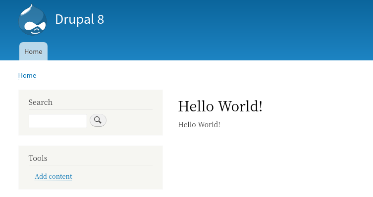
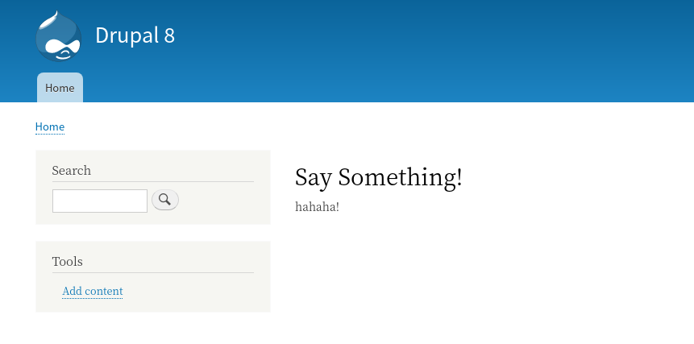
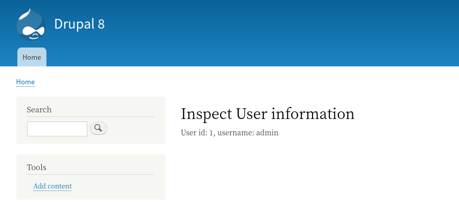
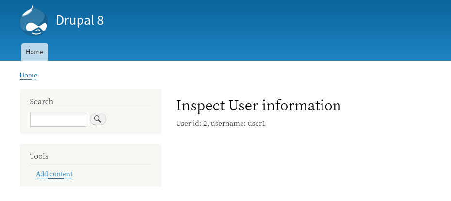

<!-- _class: lead -->
# 2.5 ルーティングとコントローラーの基本

---

ここまでのセクションでは、Drupalのフックを使って既存の機能を拡張しました。

では、全く新しい機能を追加するにはどうしたらいいでしょうか？

このセクションでは、これを実現するためにDrupalの [ルーティングシステム](https://www.drupal.org/docs/8/api/routing-system) について解説します。

---

Drupalがリクエストを受けてからレスポンスを返すまでの流れは次の図のようになっています。


https://www.drupal.org/docs/8/api/routing-system/routing-system-overview

---

リクエストが来ると、ルーティングシステムがそのルート(パス)に対して処理を担当するコントローラーを判断し、コントローラーがレスポンスを生成して返します。これは、 1章の「リクエストからレスポンスまでの流れ」で説明したとおりです。

ご存知の通り、ルーティングやコントローラーといった考え方はDrupalやSymfony独自のものではなく、どのWebアプリケーションフレームワークでも持っている概念です。

---

本セクションでは、Drupalに特有な要素にフォーカスして詳しく説明します。

もし、これらの概念について理解が不足していると感じる場合は、抽象化して理解をするために、まずはDrupal以外のドキュメントを参照することを推奨します(Drupal以外に使ったことのあるフレームワークのドキュメントや入門書などでOKです)。

それでは、 `/hello` にアクセスすると `Hello World!` を表示する簡単な機能を開発してみましょう。

---

<!-- _class: lead -->
## 簡単なルーティングとコントローラーの実装

---

Drupalでは、 `{module_name}.routing.yml` でルーティングの定義をすることができます。

Drupal 7以前で開発した事がある方は `hook_menu()` でルーティングの定義をしたことがあるかもしれませんが、このフックはDrupal 8からは削除されています。

Drupal 8からはルーティングに [Symofony Routingコンポーネント](https://symfony.com/doc/current/routing.html) が採用され、実装方法が大きく変更されています (逆にLaravelやSymofonyの開発者にとっては馴染みのある方法に近くなっています)。

---

`hello_world.routing.yml` を新規に作成し、以下のように実装してください (コードの説明は後で行います)。

```yml
hello_world.hello:
  path: '/hello'
  defaults:
    _controller: '\Drupal\hello_world\Controller\HelloWorldController::helloWorld'
    _title: 'Hello World!'
  requirements:
    _access: 'TRUE'
```

---

次に `src/Controller/HelloWorldController.php` を新規に作成し、以下のように実装してください (コードの説明は後で行います)。

```php
<?php

namespace Drupal\hello_world\Controller;

use Drupal\Core\Controller\ControllerBase;

/**
 * A example of custom controller.
 */
class HelloWorldController extends ControllerBase {

  /**
   * Just say "Hello World!".
   */
  public function helloWorld() {
    return [
      "#markup" => "Hello World!",
    ];
  }

}
```

---

それでは、 `/admin/config/development/performance` にアクセスしてキャッシュをクリアしてから `/hello` にアクセスしてみてください。

以下のように「Hello World!」が表示されれば成功です！



---

<!-- _class: lead -->
## ルーティングの定義

---

無事に動いたところでまずは `hello_world.routing.yml` のコードから詳細を見ていきましょう。

### **ルート名**

ymlのルート要素、つまり `hello_world.hello` は **ルート名** です。
ルート名はシステム内でユニークな必要があるため、 `{module_name}.***` のようにモジュールのmachine nameをprefixにすることが推奨されています(このルールに従わなくても動きます)。

---

### **path**

その名の通り、ルートが反応するパスを定義します。今回は固定値としていますが、もちろん、 `/user/1`、 `/user/2` のようにidなどをパラメータに取るパスも定義可能です (後ほど解説します)。

### **defaults**

このルートのデフォルトプロパティを定義します。プロパティの種類は多数ありますが、今回はコントローラー(とそのメソッド)を指定しています。

---

#### **_controller**

このルートに対して処理を行うコントローラーのメソッド名です。 [namespace](https://www.php.net/manual/en/language.namespaces.rationale.php) は省略せずに記載する必要があります。

Drupalの仕様として、Drupal自体のnamespaceは `\Drupal`、モジュールのnamespaceは `\Drupal\{module_name}` となります。
それより下のnamespaceは[PSR-4](https://www.php-fig.org/psr/psr-4/) に従います。以下のコンテンツも合わせて参照してください。
- [Namespaces](https://www.drupal.org/docs/develop/coding-standards/namespaces)
- [PSR-4 namespaces and autoloading in Drupal 8](https://www.drupal.org/docs/develop/standards/psr-4-namespaces-and-autoloading-in-drupal-8)

---

#### **_title**

このルートのタイトルです。これは出力されるhtmlの `<title>` に設定されます。 

### **requirements**

アクセス権限に関する要素がここに定義されます。今回はシンプルに `_access` だけを設定しましますが、設定可能なキーは他にも多数あります(後ほどいくつか解説します)。

---

#### **_access**

`TRUE` にすると無条件にこのルートにアクセスできるようになります。ちなみに、 `requirements` 以下に何もキーがない場合はアクセスは拒否されるのがデフォルトの振る舞いです。

---

<!-- _class: lead -->
## コントローラーの実装

---

続いて `src/Controller/HelloWorldController.php` を見ていきましょう。ファイル名とnamespaceに関しては、先ほど説明したとおり [PSR-4](https://www.php-fig.org/psr/psr-4/) に従います。これに関しては詳しくは解説しませんので、必ずPSR-4のドキュメントに目を通してください。

Drupalで独自のコントローラークラスを定義する場合、 `\Drupal\Core\Controller\ControllerBase` を継承します。

Ruby on Railsの [ApplicationController](https://guides.rubyonrails.org/action_controller_overview.html) や、Laravelの [Controller](https://laravel.com/docs/6.x/controllers) 相当のクラスが、Drupalでは `ControllerBase` です。

---

ルートの定義にコールバックとして `helloWorld` メソッドを設定したので、この前提で実装をする必要があります。また、このメソッドはDrupalコアのルーティングシステムから実行できる必要があるので、アクセス修飾子は `public` にする必要があります。

メソッドの中を見てみると、 `#markup` というキーを持った配列を返しているだけです。これは、Drupalの　[Render arrays](https://www.drupal.org/docs/8/api/render-api/render-arrays) という仕様に従っています。

---

Render arraysについては本コンテンツで別途解説します。

今のところは **「あるルートに割り当てられたコントローラーのメソッドで #markup というキーを持つ配列を返すと、それをコンテンツとしてページを生成してくれる」** というくらいの理解で進めてください。

---

<!-- _class: lead -->
## パラメータを受け取るルート

---

さて、あるパスに対して固定のレスポンスを返す機能が完成したので、次はパスの一部を可変にし、パラメートとして扱うサンプルを実装します。

[Symfonyのルーティングコンポーネントのドキュメント](https://symfony.com/doc/current/routing.html#route-parameters) を見てみましょう。

---

```plain
Route Parameters

The previous examples defined routes where the URL never changes (e.g. /blog).

However, it's common to define routes where some parts are variable.

For example, the URL to display some blog post will probably
include the title or slug
(e.g. /blog/my-first-post or /blog/all-about-symfony).

In Symfony routes, variable parts are wrapped in { ... } and
they must have a unique name.

For example, the route to display the blog post contents is defined as /blog/{slug}:
```

---

ルートの可変部分は `/blog/{slug}` のようにユニークな変数名を付与して `{...}` で括れば良いことが分かります。

それでは、 `/say_something/{message}` にアクセスしたら、 `{message}` の部分で指定されたパラメータを表示する機能を開発しましょう。

---

`hello_world.routing.yml` に以下のルートの定義を追加してください。

```yml
hello_world.say_something:
  path: '/say_something/{message}'
  defaults:
    _controller: '\Drupal\hello_world\Controller\HelloWorldController::saySomething'
    _title: 'Say Something!'
  requirements:
    _access: 'TRUE'
```

先ほどのルートとの違いとして、 `path` の一部に `{message}` という 可変部分があることと、 `_controller` のメソッド名が変わっている点に注意してください。

なお、このようなパスに含まれるパラメータは `slug` と呼ばれることがあります。検索する際に便利なので覚えておきましょう。

---

次に、 `HelloWorldController` に以下のメソッドを追加してください。

```php
  /**
   * Just say something by use param.
   */
  public function saySomething(string $message) {
    return [
      "#markup" => $message,
    ];
  }
```

---

`/say_something/hahaha!` にアクセスして以下のように表示されれば成功です。hahaha!の部分を他の文字列に変更し、表示内容が変わることも確認してください。



---

<!-- _class: lead -->
## オブジェクトを受け取るルート

---

パスの文字列をコントローラーに渡す機能が作成できました。しかし、ほとんどのシステムでは `/some_model/{id}` のようなルートにアクセスがあった場合、実際に関心があるデータは文字列としてのidではなく、このidを持つ何らかのオブジェクト(モデル)であるケースの方が多いと思います。

コントローラーのメソッド内で「idの文字列からデータベースを検索し目的のオブジェクトをロードする」コードを書くことはもちろん可能ですが、ルートが多くなると非常に冗長になります。

---

他の多くのフレームワークがそうであるように、Drupalもパスのパラメータからオブジェクトを自動的にロードし、コントローラーのメソッドに渡すことができます。

それは、もう少し実践的なサンプルとして `/inspect_user/{user}` にアクセスするとユーザーアカウントの情報を表示する機能を開発してみましょう。

---

`hello_world.routing.yml` に以下のルートの定義を追加してください。

```yml
hello_world.inspect_user:
  path: '/inspect_user/{user}'
  defaults:
    _controller: '\Drupal\hello_world\Controller\HelloWorldController::inspectUser'
    _title: 'Inspect User information'
  requirements:
    _access: 'TRUE'
  options:
    parameters:
      user:
        type: entity:user
```

---

`options` の部分にルートのパラメータをオブジェクトに変換する定義を記載しています。

```yml
options:
  parameters:
    user:
      type: entity:user
```

この定義により、 `/inspect_user/{user}` の `{user}` が `type: entity:user` のオブジェクトとして `_controller` で指定したコールバックに渡されます。

詳しくは、 [Using parameters in routes](https://www.drupal.org/docs/8/api/routing-system/parameters-in-routes/using-parameters-in-routes#s-example) のExampleのセクションを参照してください。

---

次に、 `HelloWorldController` に以下のメソッドを追加してください。

```php
use Drupal\Core\Session\AccountInterface;

...

  /**
   * Inspect user information.
   */
  public function inspectUser(AccountInterface $user = NULL) {
    $content = "User id: " . $user->id() . ", username: " . $user->getAccountName();

    return [
      "#markup" => $content,
    ];
  }
```

---

コールバックメソッドの引数の変数名は、routing.ymlのルートで定義した変数名と一致させる必要があります。なお、パスに複数の変数があるような場合は、変数名さえ一致していれば引数の順序に制約はありません。

このメソッドでは、Drupalのユーザーアカウント(`AccountInterface`) のidとユーザー名を表示しています。

なぜ `{user}` パラメータが変換されるオブジェクトのクラスが `AccountInterface` になるかは不思議だと思いますが、これについては後ほど説明します。

---

それでは、 `/inspect_user/1` にアクセスしてみましょう。以下のようにアカウント情報が表示されれば成功です。



---

今後は違うアカウントを指定してみましょう。先のセクションで、 `user1` というアカウントを作成していると思います。

そのユーザーのIDを調べて、 `/inspect_user/{ユーザーのID}` にアクセスしてください。先ほどとは異なるアカウント情報が表示されるはずです。

---



---

最後に、ルーティングの定義で `type: entity:user` と指定した時に、 `AccountInterface` という型がどのように決定されるのかを説明します。

Drupalでルートのパラメータを変換する処理は、[ParamConverterInterface](https://api.drupal.org/api/drupal/core%21lib%21Drupal%21Core%21ParamConverter%21ParamConverterInterface.php/interface/ParamConverterInterface/) というインターフェースで実現されています。

今回は `type` に `entity:user` を指定しましたが、これを `AccountInterface` のオブジェクトに変換 (upcast)する処理は [\Drupal\Core\ParamConverter\EntityConverter](https://github.com/drupal/drupal/blob/8.8.x/core/lib/Drupal/Core/ParamConverter/EntityConverter.php) で実装されています。

---

詳細は以下のリンクを参照してください。
- [How upcasting parameters works](https://www.drupal.org/docs/8/api/routing-system/parameters-in-routes/how-upcasting-parameters-works)

`ParamConverterInterface` を実装することで、独自の変換処理を実装することもできます。

これについてのコードの解説は割愛しますが、興味がある方はコアの実装をチェックしてみてください。

---

## まとめ

このセクションでは、ルーティングとコントローラーを実装して「あるURLにアクセスした時に独自の処理を実行する」サンプルを開発しました。

フックと違い、OOPや場合によってはSynfomyコンポーネントが理解できている前提のインタフェースになりますので、Drupalだけではなくこれらの基本知識もしっかりと押さえておきましょう。

---

## ストレッチゴール

1. `/inspect_node/{node}` にアクセスした時に、ノードのIDとタイトルを表示するルーティングとコントローラーを実装してください。`{node}` をupcastする際のコンバーターの識別子は `entity:node` で、コールバックメソッドに渡されるオブジェクトのインターフェースは  `NodeInterface` です。
