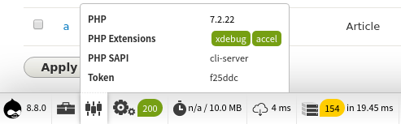

<!-- _class: lead -->
# 2.6 デバッグ環境の構築

---

ここまでのセクションでhello_worldモジュールのコードもある程度の量になってきました。

そろそろ、コードを読み書きするためのデバッグ環境を整備していきましょう。

---

<!-- _class: lead -->
## 2.6.1 コーディングスタンダード

---

### 2.6.1.1 editorconfig

2.1章で説明したとおり、Drupalのコードには `.editorconfig` が含まれています (editorconfigって何だっけ？という方は2.1章を読み直しましょう)。

editorconfigでは、インデント幅や改行コードなどコードに関する基本的ないくつかのフォーマットを定義することができます。

Visual Studio CodeやVim、Emacsなどの主要なエディタや、PHPStormなどのIDEでサポートされていますので、利用するようにしてください。

---

### 2.6.1.2 phpcsによるコーディング規約のチェック

Drupalのコーディングスタンダードのドキュメントは [Coding standards](https://www.drupal.org/docs/develop/standards) にあります。

これに対応するPHPの代表的なlintツールである [PHP_CodeSniffer](https://github.com/squizlabs/PHP_CodeSniffer) のルールも [drupal/coder](https://packagist.org/packages/drupal/coder) というライブラリ名でpackagist.orgに公開されています。

これを使って自分の書いたコードがコーディングスタンダードに準拠しているか確認できるようにしましょう。

---

```txt
# "drupal/coder" をglobalにインストール
$ composer global requre drupal/coder

# phpcsコマンドにパスを通す
# "drupal/coder" がphpcsに依存しているため、phpcsは先のコマンドでインストールされます
$ export PATH=$PATH:"$(composer -q global config data-dir)/$(composer -q global config bin-dir)"

# "drupal/coder が定義しているコーディングスタンダードをphpcsのコンフィグに追加
$ phpcs --config-set installed_paths \
  "$(composer -q global config data-dir)/$(composer -q global config vendor-dir)/drupal/coder/coder_sniffer"

# phpcsがデフォルトでロードするコーディングスタンダードを設定
$ phpcs --config-set default_standard Drupal,DrupalPractice
```

---

それでは、hello_worldモジュールのコードをチェックしてみましょう。

```txt
$ phpcs web/modules/custom/hello_world -v
Registering sniffs in the Drupal standard... 
Registering sniffs in the DrupalPractice standard... 
DONE (151 sniffs registered)
Creating file list... DONE (1 files in queue)
...
Processing HelloWorldController.php [PHP => 306 tokens in 54 lines]... DONE in 23ms (0 errors, 0 warnings)

```

---

特に問題がなければ、`errors` と `warnings` が0件になります。もし、コーディングスタンダードに準拠していないコードが検出された場合は、先に進まずにここで直してしまいましょう。

ただし、以降のセクションの解説の都合で、あえて設計的な警告が出るようなサンプルコードが一時的に含まれるケースもあります。

そのため、フォーマット以外に関する警告が出る場合は、それらは一旦は無視してください。


---

なお、`phpcs` の代わりに `phpcbf` を使うとコードの修正までやってくれます。

ここでは手動でphpcsコマンドを実行しましたが、実際に使う場合はファイルを保存した時に自動的にチェックされるようにしたほうが簡単です。

先に名前を挙げたエディタやIDEを使えば実現できますので、自動化してコードの開発自体に集中できるようにしましょう。以下のリンクが参考になります。

[Installing Drupal Code Sniffer on Vim, Sublime Text, Visual Studio Code, Komodo, TextMate, Atom, Emacs & Geany](https://www.drupal.org/docs/8/modules/code-review-module/installing-drupal-code-sniffer-on-vim-sublime-text-visual-studio)

---

コードのフォーマットを「動作に関係ないから」という理由で軽視すると、どんどんメンテナンスコストが増大していきます。

正しいコードのフォーマットは、エンジニアのアウトプットやシステムの品質の一部です。しっかりと押さえておきましょう。

Drupalのコーディングスタンダードやdrupal/coderについて、もっと詳しく知りたい場合は以下を参照してください。

- [Coding standards](https://www.drupal.org/docs/develop/standards)
- [Installing Coder Sniffer](https://www.drupal.org/docs/8/modules/code-review-module/installing-coder-sniffer)

---

<!-- _class: lead -->
## 2.6.2 xdebugによるリモートデバッグ

---

PHPの [xdebug](https://xdebug.org/) 拡張を使うと、任意の場所(ブレークポイント)で処理を止めてオブジェクトや変数の状態を確認・変更したり、コールスタックと呼ばれる「どの関数がどんな順番で実行されたか」といった情報を確認することができます。

これらの機能はコードを書く時だけではなく、読む時にも非常に有用です。

xdebugに関してDrupalに独自なものは全くありませんので解説は割愛しますが、先に進む前にxdebugによるリモートデバッグができる状態にしておいてください。

---

<!-- _class: lead -->
## 2.6.3 develモジュール

---

Drupalには [devel](https://www.drupal.org/project/devel) というデバッグを支援するためのモジュールがあります(残念ながら、コアには含まれていません...)。

develには以下のような機能が含まれています。
- ダミーコンテンツの生成
- パフォーマンス等を可視化するプロファイラー
- デバッグ支援のためのヘルパー関数

---

それでは、さっそくdevelモジュールを有効にしてみましょう。`/admin/modules` の `DEVELOPMENT` パッケージにある4つのモジュール全てにチェックを付けて有効化してください。


---

### 2.6.3.1 ダミーコンテンツの生成

ダミーコンテンツの生成機能は、先ほど有効化したモジュールうちの一つ、`Devel Generate` モジュールで提供されています。

上部のメニューの Manage -> Configuration -> Development に進んで `/admin/config/development` にアクセスしてください。

「Generate ***」から、Drupalのコアに含まれるノード、ユーザー、メニュー、タクソノミーなどのダミーデータを生成することができます。

---


---

試しにいくつかのデータを生成してみてください。

これらの機能は `DevelGenerateBase` というプラグインのベースクラスから派生しています。このクラスを継承することで独自のデータ生成処理を作ることも可能です。

---

### 2.6.3.2 パフォーマンス等を可視化するプロファイラー

プロファイラーに関する機能は `Web Profiler` モジュールで提供されています。

モジュールを有効にすると、サイトの下部に様々な情報がタブでグループ化して表示されます。


それぞれのタブで表示される情報を左から順に簡単に紹介します。

---

#### Drupalに関する情報

Drupalのバージョンやインストールプロファイル、drupal.orgのドキュメントへのリンクなどが表示されます。


---

#### 開発要ツールへのリンク集

キャッシュのクリア、ルート、エンティティ、フィールド、セッション、サービスコンテナの一覧、phpinfo()などを表示することができます。


---

#### PHPに関する情報

PHPに関する情報が表示されます。



---

#### 処理時間とメモリ使用量

PHPの処理時間やメモリ使用量が表示されます。


---

#### ネットワーク情報

TTFBなどネットワークに関する情報が表示されます。


---

#### データベースクエリの統計情報

発行されたDBのクエリの統計情報が表示されます。

タブをクリックして詳細レポートを見ると、クエリの詳細内容やクエリの発行元などの詳細を確認することができます。


---

#### カレントユーザーの情報

現在ログインしているカレントユーザーの情報が表示されます。


---

#### Viewsの情報

現在アクセスしているURLで、どのようなViewsが使われているかの情報が表示されます。

タブをクリックして詳細レポートを見ると、利用されているviewsのidや処理時間などの詳細を確認することができます。


---

#### ブロックの情報

ブロック情報が表示されます。

タブをクリックして詳細レポートを見ると、利用されているブロックのidや配置先のリージョンなどの詳細を確認することができます。


---

#### フォームの情報

現在アクセスしているURLで、どのようなフォームが使われているかの情報が表示されます。

`hook_form_alter` を実装する際にDOMからフォームのidを確認しましたが、こちらで確認した方がより簡単です。

タブをクリックして詳細レポートを見ると、利用されているフォームのidや生成元のメソッドなどの詳細を確認することができます。


---

#### モジュールの情報

現在有効になっているモジュールとテーマの情報が表示されます。

`/admin/modules` や `/admin/appearance` と違い、タブをクリックして詳細レポートを見ると、モジュールやテーマの `.info.yml` のパスを確認することができます。


---

#### キャッシュの情報

Drupalの内部キャッシュ情報が表示されます。

タブをクリックして詳細レポートを見ると、キャシュのIDやヒット数などの詳細を確認することができます。


---

#### アセットの情報

アセット(js,css)の情報が表示されます。


---

駆け足でWeb Profilerでどのような情報が確認できるかを紹介しました。

全ての機能を利用する必要はありませんので、なんとなくどんな機能があるかを把握しておき、開発で必要になったら活用するようにしてください。

---

### 2.6.3.3 デバッグ支援のためのヘルパー関数

Develモジュールには、デバッグ支援のためのヘルパー関数が多数用意されています。

この機能を利用して、2.5章で開発した `HelloWorldController::inspectUser` でユーザーオブジェクトをダンプしてみましょう。

---

それでは、`HelloWorldController::inspectUser` に、以下のように `dpm($user)` を追加してください。

```php
  /**
   * Inspect user information.
   */
  public function inspectUser(AccountInterface $user = NULL) {
    dpm($user);

    $content = "User id: " . $user->id() . ", username: " . $user->getAccountName();

    return [
      "#markup" => $content,
    ];
  }
```

---

`/inspect_user/1` にアクセスすると、`$user` オブジェクトの詳細がダンプされます。


---

この方法はブラウザ上で視覚的に確認できるため便利ですが、xdebugによるリモートデバッグの方が柔軟性が高いため、必要に応じて使い分けてください。

`dpm` 以外にも様々なヘルパー関数があります。詳細は以下のドキュメントを参考にしてください。

[dpm() and other Devel functions](https://www.drupal.org/docs/8/modules/devel/dpm-and-other-devel-functions)

---

### 2.6.3.4 ローカル環境向けのデバッグ設定

これまでは、フックやルートを追加する度に手動でキャッシュをクリアしてきました。この他にもjs/cssの追加など、ローカル環境での開発中にキャッシュクリアが必要となるシーンは頻繁にあります。

いちいち手動でキャッシュをクリアするのは非効率なので、ローカル環境向けにキャッシュを無効にしましょう。

---

`web/sites/default/settings.php` を開いて末尾を見てください。次のようになっていると思います。

---

```php
/**
 * Load local development override configuration, if available.
 *
 * Use settings.local.php to override variables on secondary (staging,
 * development, etc) installations of this site. Typically used to disable
 * caching, JavaScript/CSS compression, re-routing of outgoing emails, and
 * other things that should not happen on development and testing sites.
 *
 * Keep this code block at the end of this file to take full effect.
 */
#
# if (file_exists($app_root . '/' . $site_path . '/settings.local.php')) {
#   include $app_root . '/' . $site_path . '/settings.local.php';
# }
$config_directories['sync'] = '../config/sync';
$databases['default']['default'] = array (
  'database' => 'sites/default/files/.ht.sqlite',
  'prefix' => '',
  'namespace' => 'Drupal\\Core\\Database\\Driver\\sqlite',
  'driver' => 'sqlite',
);
```

---

Drupalで特定環境向けの設定を行う場合、以下の行をコメントアウトして、 `settings.local.php` で設定する事が推奨されています。

```php
# if (file_exists($app_root . '/' . $site_path . '/settings.local.php')) {
#   include $app_root . '/' . $site_path . '/settings.local.php';
# }
```

まず、上記の3行のコメントアウトを外しましょう。

---

ちなみにコメントに書かれている通り、この3行は `settings.php` の末尾にあるのが望ましい姿です。

しかし、Drupalがインストール時にsettings.phpの末尾にいくつかの設定を追記するため、インストール後は末尾ではなくなっています。

例えば、先のコードだと `settings.local.php` が先に読まれてからDB接続の設定がされているため、 `settings.local.php` でDB接続の設定を変更することができません。

実際のプロダクトのコードでは `settings.local.php` が必ず最後にロードされるようにしておきましょう。

---

次に、 `web/sites/default/settings.local.php` を新規に作成しましょう。コアで提供しているサンプルファイルが `web/sites/example.settings.local.php` にあるので、これをそのままコピーして使います。

```txt
$ cp web/sites/example.settings.local.php web/sites/default/settings.local.php
```

コピーした `web/sites/default/settings.local.php` を開き、コメントアウトされている `$settings` 変数の定義が全て有効になるように変更してください。

最後に、ここで一度キャッシュをクリアしてください。

---

`settings.local.php` のファイルの詳細な解説は割愛しますが、以下の様な設定がされています。

- `/sites/development.services.yml` のサービス定義をロード
- css/jsのアグリゲーションを無効化
- Internal Page Cache/Dynamic Page Cacheなどのいくつかの主要なキャッシュを無効化

これで頻繁にキャッシュをクリアする必要はなくなりますが、キャッシュ機能の確認もできなくなる、という副作用がある点には注意してください。

---

## まとめ

このセクションでは、エディタ・デバッグ環境の整備に役立つ情報を紹介しました。

「木こりのジレンマ」が有名な例ですが、良い仕事をするにはまず良い道具を整備する事が重要です。どんな道具を使っても構いませんが、効率の良い環境作りに継続的にコストをかけるようにしてください。

---

## ストレッチゴール

1. 利用しているエディタ・IDE環境で、リアルタイムもしくはファイルを保存した時にphpcs(またはphpcbf)によるコードフォーマットのチェックを自動的に行えるようにし、どのように実現したか説明してください。

2. 利用しているエディタ・IDE環境で、xdebugによるリモートデバッグが実行できるようにし、どのように実現したか説明してください。

---

3. Develモジュールを無効にすると `dpm` 関数が利用できないため、 `/inspect_user/1` にアクセスすると例外が発生します。これを回避するために、Develモジュールが有効になっている場合のみ、`dpm` 関数を実行するように修正してください。
