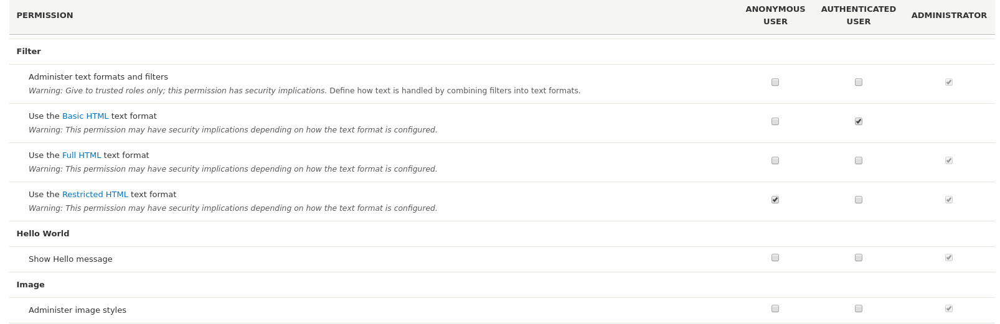
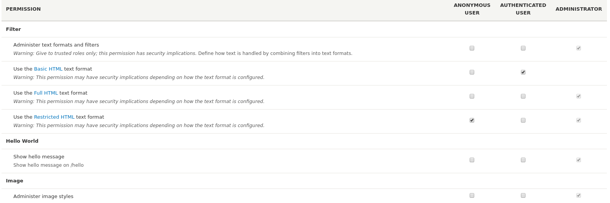

<!-- _class: lead -->
# 2.7 権限の定義とアクセス制御

---

Drupalはコアの機能として [ロールベースのアクセス制御(RBAC)](https://en.wikipedia.org/wiki/Role-based_access_control) をサポートしています。

言葉にすると簡単ですが、これはDrupalを採用する上での非常に大きなメリットの一つです。

---

例えばRuby on RailsやLaravelではフレームワーク自体にはパーミッションやロールの機能がないため、外部のライブラリを組み合わせて実装する必要があります。

前者だと [Devise](https://github.com/heartcombo/devise)(ユーザー認証) + [cancancan](https://github.com/CanCanCommunity/cancancan)(パーミッション) + [rofiy](https://github.com/RolifyCommunity/rolify)(ロール)、後者だと [spatie/laravel-permission](https://github.com/spatie/laravel-permission) や [jeremykenedy/laravel-roles](https://github.com/jeremykenedy/laravel-roles) などのライブラリが多く利用されていると思います。

(Laravel詳しくなので詳しい方教えてください！)

---

フレームワーク自体に機能がない場合、ビジネスやプロジェクトの都合に合わせて使うライブラリを選択できる半面、以下のような問題もあります。

- 採用したライブラリが活発にメンテナンスされなくなる、フレームワークのメジャーアップデートにすぐに(もしくは永久に)対応しない場合がある
- マイナーなライブラリを選択すると技術情報が少ない
- 複数のライブラリを組み合わせる場合、組み合わせて動くかどうかの検証が必要になる
- UI/UXが統一されず、場合によっては独自に作り込む必要がある

---

ちなみにRuby on Railsのユーザー、パーミッション、ロールは個別のライブラリに分割されているものが多く、Rails 1.x〜3.xくらいの世代ではライブラリ自体の隆盛も大きかったため、Railsのメジャーアップデートの度に苦労した覚えがあります。

フレームワーク自体でRBACの機能が提供されていると、このような（ビジネスとしてはあまり本質的ではない)問題が発生しないのは大きなメリットです。

---

このセクションでは、モジュールでの権限の定義やアクセス制御の実装について解説します。

Drupalのロールと権限についての基本的な理解がある前提となりますので、自信がない方は先に [【Drupal 8入門】モジュールのインストール、ユーザー作成と権限の設定](https://thinkit.co.jp/article/10082?page=0%2C2) を参照してください。

---

<!-- _class: lead -->
## 2.7.1 権限の定義

---

権限を定義する場合は、 `{module_name}.permissions.yml` というファイルを新規に追加します。

`hello_world.permissions.yml` を次のように作成してください。

```yml
show hello message:
  title: 'Show hello message'
```

ymlのトップレベル要素、つまり `show hello message` が権限の内部名称になります。権限には `title` キーが必ず必要です。

---

それでは、 `/admin/people/permissions` にアクセスして定義した権限が認識されているか確認しましょう。以下のように `Show hello message` という権限が追加されていると思います。



---

`description` キーを設定すると、権限の説明を定義することができます。

`hello_world.permissions.yml` を次のように変更してください。

```yml
show hello message:
  title: 'Show hello message'
  description: 'Show hello message on /hello'
```

---

再度 `/admin/people/permissions` にアクセスすると、以下のように `description`  で定義した説明が表示されています。



---

また、`rectrict access` キーを `true` に設定すると、管理UI上に「この権限は信頼できるロールにのみ付与してください」という趣旨の警告メッセージが追加されます (動作になにか影響があるわけではありません)。

付与することによってアクセスをバイパスするような強い権限を定義する場合は、このキーを設定してください。

---

<!-- _class: lead -->
## 2.8.2 ルートに対して静的に権限のチェックを行う

---

さて、権限が定義できたところで `/hello` のルートにアクセスした時に、 `show hello message` 権限を持っているかどうかチェックするようにしましょう。

ルートに対しての静的な権限チェックは、 `{module_name}.routing.yml` のみで実現できます。

---

`hello_world.routing.yml` の `hello_world.hello` ルートの定義を以下の様に変更してください。

```yml
hello_world.hello:
  path: '/hello'
  defaults:
    _controller: '\Drupal\hello_world\Controller\HelloWorldController::helloWorld'
    _title: 'Hello World!'
  requirements:
    _permission: 'show hello message'
```

`requirements` キーの子要素に `_permission` を定義し、値に権限の内部名称を設定することで、ルートにアクセスした際に権限があるかどうかがチェックされます。

---

それでは、`AUTHENTICATED USER` ロールに `show hello message` 権限を付与してください。その後、以下の2点の動作を確認しましょう。
- (2.4章で作成した) user1でログインし `/hello` にアクセスするとメッセージが表示されること
- ログアウトした状態で `/hello` にアクセスするとアクセスが拒否されること

---

複数の権限を持っているかチェックしたい場合は、 `_permissions` に複数の権限を設定し、 `,` か `+` で区切ります。

複数の権限をANDでチェックする例
```yml
  requirements:
    # 'show hello message' と `use advanced search' の両方の権限があればアクセスを許可
    _permission: 'show hello message,use advanced search'
```

複数の権限をORでチェックする例
```yml
  requirements:
    # 'show hello message' と `use advanced search' のどちらかの権限があればアクセスを許可
    _permission: 'show hello message+use advanced search'
```

---

`AUTHENTICATED USER` ロールに付与する権限を以下4つのパターンに従って変更し、「複数の権限をANDでチェックする例」、「複数の権限をORでチェックする例」が期待通り動くかどうか確認してみてください。

|show hello message|use advanced search|
|--|--|
|OFF|OFF|
|OFF|ON|
|ON|OFF|
|ON|ON|

---

なお、 `,` と `+` の前後にスペースを含めると権限の名称が正しく認識されないので注意が必要です。

詳細は [Structure of routes](https://www.drupal.org/docs/8/api/routing-system/structure-of-routes) の `_permission` のセクションを参照してください。

---

また、詳細な解説は省きますが、 `permission_callbacks` というキーを定義することで、PHPのコードで権限を動的に定義することもできます。

例えば、Drupalのノードはコンテツタイプと呼ばれる独自のデータ型を持ったサブクラス（のようなもの）を管理UIから追加することができます。コンテンツタイプが新しく定義された場合、そのタイプに対するCRUDの権限の定義も自動的に追加されると便利です。

このようなケースでは権限を静的に定義せず、PHPのコードで必要な権限を動的に判断したほうが柔軟に拡張ができます。興味がある方は [node.permissions.yml](https://github.com/drupal/drupal/blob/8.8.x/core/modules/node/node.permissions.yml#L27) を参考にしてください。

---

<!-- _class: lead -->
## 2.7.2 ルートに対してロールのチェックを行う

---

今度は権限ではなくロールでチェックしてみましょう。ロールでのチェックも権限のチェックとほぼ同じです。

 `{module_name}.routing.yml` の `requirements` キーの子要素に `_role` を定義し、値にロールの内部名称を設定することで、ルートにアクセスした際に権限があるかどうかがチェックされます。

---

`hello_world.routing.yml` の `hello_world.say_something` ルートの定義を以下の様に変更してください。

この変更により、 `/say_something/{message}` にアクセスするためには `administrator` ロールが必要になります。

```yml
hello_world.say_something:
  path: '/say_something/{message}'
  defaults:
    _controller: '\Drupal\hello_world\Controller\HelloWorldController::saySomething'
    _title: 'Say Something!'
  requirements:
    _role: 'administrator'
```

---

それでは、次の動作を確認しましょう。

- 管理者ユーザーでログインし、 `/say_something/{message}` にアクセスするとメッセージが表示されること
- user1でログインし `/say_something/{message}'` にアクセスするとアクセスが拒否されること

複数のロールでチェックしたい場合は、 `_role` に複数のロールを設定し、 `,` か `+` で区切ります。これも権限でチェックする場合と同様です。

---


<!-- _class: lead -->
## 2.7.3 アクセス権限のチェックをPHPのコードで実装する

---

ここまではルートに対する権限とロールのチェックをymlで静的に定義してきました。

条件が簡単であればこの方法で対応できますが、もっと複雑な条件に対応しなければならないケースもよくあります。

`_permission` や `_role` の代わりに `_custom_access` を設定すると、任意のPHPのコールバックにアクセス権限のチェックを委譲することができます。

`_permission` のチェックと同様の機能を `_custom_access` で実装し直してみましょう。

---

まず、`hello_world.hello` ルートの `requirements` を以下のように変更してください。

```yml
  requirements:
    _custom_access: '\Drupal\hello_world\Controller\HelloWorldController::helloWorldAccess'
```

次に、`HelloWorldController.php` に上記で指定した `helloWorldAccess` を追加します。

---

```php

use Drupal\Core\Access\AccessResult;
...

  /**
   * Access check for helloWorld().
   *
   * @param \Drupal\Core\Session\AccountInterface $account
   *   The current user.
   *
   * @return \Drupal\Core\Access\AccessResultInterface
   *   Access result. @see \Drupal\Core\Access\AccessResultInterface
   */
  public function helloWorldAccess(AccountInterface $account) {
    if ($account->hasPermission('show hello message')) {
      return AccessResult::allowed();
    }

    return AccessResult::forbidden();
  }
```

---

それでは、コードを見ていきましょう。

`_custom_access` で指定するコールバックは、以下の仕様に従って実装する必要があります。
- 引数として `\Drupal\Core\Session\AccountInterface` を受け取ること
- 戻り値として ` \Drupal\Core\Access\AccessResultInterface` を返すこと
- 引数として `\Symfony\Component\Routing\Route` を受け取っても良い
- 引数として `\Drupal\Core\Routing\RouteMatch` を受け取っても良い

最後の2つは必須ではないので今回の実装では省略しました。

---

`$account` にはカレントユーザーの情報が格納されており、`hasPermission()` でカレントユーザーが `show hello message` 権限を持っているかをチェックしています。

`AccontInterface` が提供するAPIについては [AccountInterface](https://api.drupal.org/api/drupal/core%21lib%21Drupal%21Core%21Session%21AccountInterface.php/interface/AccountInterface) を参照してください。

---

先述したとおり、`_custom_access` で指定するコールバックは戻り値として ` \Drupal\Core\Access\AccessResultInterface` を返す必要があります。

Drupalのコアでは、このインターフェースを実装した以下のクラスが定義されています。

- [AccessResultAllowed](https://api.drupal.org/api/drupal/core%21lib%21Drupal%21Core%21Access%21AccessResultAllowed.php/class/AccessResultAllowed)
- [AccessResultNeutral](https://api.drupal.org/api/drupal/core%21lib%21Drupal%21Core%21Access%21AccessResultNeutral.php/class/AccessResultNeutral)
- [AccessResultForbidden](https://api.drupal.org/api/drupal/core%21lib%21Drupal%21Core%21Access%21AccessResultForbidden.php/class/AccessResultForbidden)

このインターフェースを実装した独自のクラスのを定義し、そのインスタンスを返しても構わないのですが、その必要性があるケースは少ないと思います。

---

`AccessResult::allowed()` は `AccessResultAllowed` のインスタンスを生成するstaticメソッドです。つまり、`return AccessResult::allowed()` は `return new AccessResultAllowed()` と等価になります。

同様に、`AccessResultNeutral`、 `AccessResultForbidden` のインスタンスを返すメソッドとして、 `AccessResult::neutral`、`AccessResult::forbidden`  が用意されています。

コールバック関数がアクセスコントロールに関して判断すべきではない(他のモジュールに判断を委ねたい)場合は、 `AccessResultNeutral` を返してください。

---

また、権限のチェックは非常によく扱うユースケースですので、専用のAPIが用意されています。先ほどのコードは次のように `allowedIfHasPermission` を使って実装することもできます。

```php
  /**
   * Access check for helloWorld().
   *
   * @param \Drupal\Core\Session\AccountInterface $account
   *   The current user.
   *
   * @return \Drupal\Core\Access\AccessResultInterface
   *   Access result. @see \Drupal\Core\Access\AccessResultInterface
   */
  public function helloWorldAccess(AccountInterface $account) {
    return AccessResult::allowedIfHasPermission($account, 'show hello message');
  }
```

---

こちらの実装の方が見通しがいいですね。

AccessResultクラスには、他にも便利なヘルパーメソッドが多数用意されています。詳細は [AccessResult](https://api.drupal.org/api/drupal/core%21lib%21Drupal%21Core%21Access%21AccessResult.php/class/AccessResult/) を参照してください。

---

## まとめ

このセクションでは、権限の定義とアクセスコントロールの基本について解説しました。

実際のビジネスロジックでは、単にユーザーの権限やロールだけではなく、システム上に存在するデータの状態に応じてアクセス可否が動的に変わるケースもよくあります。

このようなもう少し複雑なケースでも実装すべきインターフェースは同じなので、このセクションの内容をしっかりと把握しておきましょう。

---

## ストレッチゴール

1. `hello.hello` にアクセスした時に、`show hello message` か `use advanced search` のどちらかの権限を持っていればアクセスを許可するように修正してください。
 
2. `hello_world.say_something` の `_role` で設定したロールのチェックを `_custom_access` で実装し直してください。

3. `hello_world.say_something` にアクセスした時に、 `{message}` に `a` が含まれている場合はアクセスを拒否するように修正してください。
