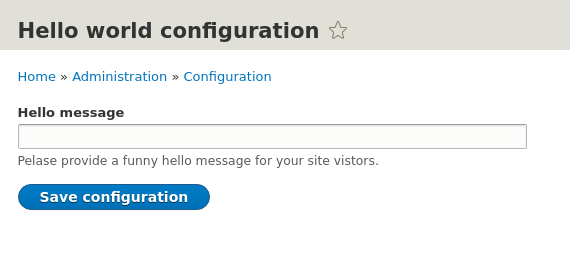
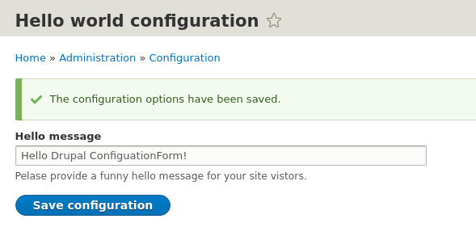
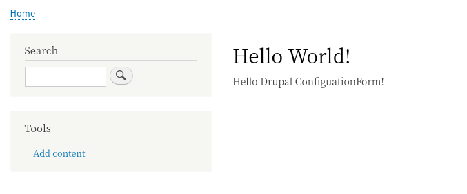

<!-- _class: lead -->
# 2.8 設定フォーム

---

ある程度複雑なアプリケーションになると、管理画面を作成してアプリケーションの振る舞いを設定できるようにしたくなります。

Drupalでは、設定を参照・保存するAPIや、設定を管理するためのフォームを生成するAPIがコアの機能として提供されています。

設定画面を生成する専用のAPIまで用意されているというのは比較的珍しい気もしますが、これのおかげで非常に簡単に管理用の設定機能をUI込みで開発することができます。

---

それでは、2.5章で開発した `/hello` にアクセスすると "Hello World!!!" を表示する機能を拡張して、表示する文字列を管理画面から設定できるようにしてみましょう。

---

<!-- _class: lead -->
## 2.8.1 管理画面のルーティング

---

それでは、早速コードを書いていきましょう。管理用の設定画面も抽象化して考えれば「特定のURLにアクセスされた時に何かの処理を行う」ことに変わりはありません。まずは `{module_nane}.routing.yml` にルートを定義しましょう。

`hello_world.routing.yml` に以下の定義を追加してください。

```yml
hello_world.setting_form:
  path: '/admin/config/hello_world_configuration'
  defaults:
    _form: '\Drupal\hello_world\Form\HelloWorldConfigurationForm'
    _title: 'Hello world configuration'
  requirements:
    _permission: 'administer site configuration'

```

---

`_form` というキーが新しく出てきた以外に、特に新しい要素はありませんね（？？な場合は2.5章、2.7章を見直しましょう)。

`_permission` で指定している `administer site configuration` は、あらかじめコアで定義されているサイト全体を管理するための権限です。

この権限は非常に強いため、実際のプロダクトでコードを書く場合は、モジュール専用の管理権限を定義したほうが望ましいです(このセクションの最後のストレッチゴールで修正しましょう)。

---

また、必須ではありませんが次のメリットがあるため、設定画面の `path` は `/admin/config/` 以下にすることを推奨します。

- コアのツールバーモジュールが `/admin/config` へのリンクを提供している
- `/admin/config` 以下は管理用テーマが適用されるため、テーマの機能による副作用が起こりにくい

2点目はDrupalの開発経験が少ないとピンと来ないかもしれませんが、カスタムテーマがコアが提供するcss/jsやDOMを考慮せずに実装され、管理画面が正常に動かなかったりレイアウトが崩れるというのは、Drupalでは比較的よく発生する問題です。

---

次に、`_form` を見ていきましょう。

これも必須ではありませんが、Drupalのモジュールでフォームを定義する場合、名前空間に `Form` を含めるのが慣例です（こちらは先ほどと違い、何か機能的にメリットがあるわけでありません)。

[Structure of routes](https://www.drupal.org/docs/8/api/routing-system/structure-of-routes) の `_form` の説明を見ると、
```
_form: A class name implementing Drupal\Core\Form\FormInterface. See form API in Drupal 8 for an example.
```
となっています。

---

このインターフェースを実装したクラスにどのようなものがあるか見てみましょう。[interface FormInterface](https://api.drupal.org/api/drupal/core%21lib%21Drupal%21Core%21Form%21FormInterface.php/interface/FormInterface/) にアクセスしてください。

`Hierarchy` のセクションにある、 `Expanded class hierarchy of ***` や `All classes that implement ***` をクリックすると、このインターフェースをサポートするクラスが確認できます。

また、いちいちブラウザでアクセスしなくても多くのエディタやIDEでも同じようなナビゲーションが可能です。このような情報の探し方は非常によく発生しますので、素早く探せるように開発環境を整備することに時間を使いましょう。

---

<!-- _class: lead -->
## 2.8.2 管理画面の実装

---

では、`_form` で指定したフォームのクラスを書いていきましょう。

`src/Form/HelloWorldConfigurationForm.php` を新規に作成し、以下のように実装してください (コードの解説は後で行います)。

---

```php
<?php

namespace Drupal\hello_world\Form;

use Drupal\Core\Form\ConfigFormBase;
use Drupal\Core\Form\FormStateInterface;

/**
 * Configuration form for hellow_world module.
 */
class HelloWorldConfigurationForm extends ConfigFormBase {

  /**
   * {@inheritDoc}
   */
  protected function getEditableConfigNames() {
    return ['hello_world.settings'];
  }

  /**
   * {@inheritDoc}
   */
  public function getFormId() {
    return 'hello_world_configuration_form';
  }

  // (次のページへ続く)
```

---

```php
  /**
   * {@inheritDoc}
   */
  public function buildForm(array $form, FormStateInterface $form_state) {
    $config = $this->config('hello_world.settings');

    $form['hello_message'] = [
      '#type' => 'textfield',
      '#title' => 'Hello message',
      '#description' => 'Please provide a funny hello message for your site vistors.',
      '#default_value' => $config->get('hello_message'),
    ];

    return parent::buildForm($form, $form_state);
  }

  /**
   * {@inheritDoc}
   */
  public function submitForm(array &$form, FormStateInterface $form_state) {
    $this->config('hello_world.settings')
      ->set('hello_message', $form_state->getValue('hello_message'))
      ->save();

    parent::submitForm($form, $form_state);
  }

}
```

---

<!-- _class: lead -->
## 2.8.3 保存した設定を参照する

---

最後に、設定された文字列を表示するように `HelloWorldController::helloWorld` を変更します。

```php
  /**
   * Just say a configured hello message.
   */
  public function helloWorld() {
    return [
      "#markup" => \Drupal::service('config.factory')->get('hello_world.settings')->get('hello_message'),
    ];
  }

```

---

<!-- _class: lead -->
## 2.8.4 動作確認とコードの解説

---

それでは動作を確認していきましょう。キャッシュをクリアして `/admin/config/hello_world_configuration` にアクセスしてください。以下のような管理画面が表示されます。



---

表示したい文字列を入力して "Save configuration" ボタンを押すと設定が保存されます。



---

`/hello` にアクセスして、設定した文字列が表示されることを確認してください。



---

それでは、`HelloWorldConfigurationForm` クラスのコードから解説していきます。

Drupalで設定用のフォームを開発する場合は、`ConfigFormBase` を継承したクラスを定義します。なお、 `ConfigFormBase` は `FormInterface` を実装しています。

そのため、`HelloWorldConfigurationForm` は `_form` の値としてして可能になるというわけです。

---

`ConfigFormBase` を敬称したクラスでは、最低限以下のメソッドを実装する必要があります。
- [getEditableConfigNames](https://api.drupal.org/api/drupal/core%21lib%21Drupal%21Core%21Form%21ConfigFormBaseTrait.php/function/ConfigFormBaseTrait%3A%3AgetEditableConfigNames/)
- [getFormId](https://api.drupal.org/api/drupal/core%21lib%21Drupal%21Core%21Form%21FormBuilderInterface.php/function/FormBuilderInterface%3A%3AgetFormId/)
- [buildForm](https://api.drupal.org/api/drupal/core%21lib%21Drupal%21Core%21Form%21FormBuilderInterface.php/function/FormBuilderInterface%3A%3AbuildForm/)
- [submitForm](https://api.drupal.org/api/drupal/core%21lib%21Drupal%21Core%21Form%21FormInterface.php/function/FormInterface%3A%3AsubmitForm/)

---

### 2.8.4.1 getEditableConfigNames

`getEditableConfigNames` は、設定フォームが書き換え可能なコンフィグのキーの配列を返します。今回のサンプルでは `hello_world.settings` としました。

このように明示的にキーを宣言することにより、コアや他のモジュールで管理しているコンフィグの書き換えが予防されます。

---

### 2.8.4.2 getFormId

`getFormId` はフォームのIDを返します。

決まったルールはありませんが、IDにモジュール名を含めるなどしてユニークになるように実装しましょう。

---

### 2.8.4.3 buildForm

`buildForm` でフォームの構造を定義します。

今回の例では、`hello_message` というキーを持つテキストフィールドを定義しています。

`#type` を変更することで、テキストフィールド以外のフォーム要素も利用可能です。詳細は [Form and render elements](https:/api.drupal.org/api/drupal/elements) を参照してください。

---

実際にコンフィグを読み書きするには [ConfigFactoryInterface](https://api.drupal.org/api/drupal/core%21lib%21Drupal%21Core%21Config%21ConfigFactoryInterface.php/interface/ConfigFactoryInterface/) を使う必要があります。

親クラスの `ConfigFormBase` (正確には `config.factory` サービス経由)でこのインターフェースのインスタンスが初期化されています。そのため、単に `$this->config` でコンフィグにアクセスすることができます。

また、親クラスが `ConfigFormBase` の場合は保存(submit)ボタンのコールバックは親クラスで定義されているので、最後に親クラスの同名のメソッドを実行しています。

---

### 2.8.4.4 submitForm

`submitForm` では、入力された値をコンフィグに保存しています。

今回は入力されたテキストの値をそのまま保存していますが、保存する際にフォーマットの変換等が必要な場合はこのメソッドに実装することになります。

Drupal 7では、 `system_settings_form` というAPIでフォームを作成した場合、変換等が不要な場合はsubmit関数の実装を省略できましたが、Drupal 8では必ず実装する必要があります。

---

### 2.8.4.5 validateForm

今回は実装しませんでしたが、 [validateForm](https://api.drupal.org/api/drupal/core%21lib%21Drupal%21Core%21Form%21FormInterface.php/function/FormInterface%3A%3AvalidateForm/) を実装すると、保存前にバリデーションを行うことができます。

---

### 2.8.5 コンフィグの保存先

保存されたコンフィグの実体はデータベースの `config` というテーブルに格納されます。

今回の例だと
```sql
select * from config where name = 'hello_world.settings';
```
というSQLクエリを実行すれば、データベース内に保存された値を確認することができます。

---

また、Drupal 8の[Configuration Management](https://www.drupal.org/docs/8/configuration-management) 機能を使うと、DBに格納した設定をymlファイルとしてエクスポートできます。

もちろん、このセクションで開発したコンフィグもymlのエクスポート対象になります。

継続的なデプロイを実現する非常な強力な機能なので、実際のプロダクトでは積極的に活用してください。Config Managementについては2.11〜2.13章で詳しく解説します。

---

## まとめ

このセクションでは、設定フォームを追加して設定の保存と読み出しを行いました。

設定フォームのUI生成や設定の参照・保存など、必要になる全ての機能がコアでサポートされているため、とても短いコード量で設定を管理する事ができます。

どんなシステムでも開発中・運用中に仕様は変わっていくものです。
変更の可能性が高いパラメータは設定可能にしておくと柔軟な運用ができるようになります。

---

このセクションで解説したの内容のドキュメントは [ConfigFormBase with Simple Configuration API](https://www.drupal.org/docs/8/api/form-api/configformbase-with-simple-configuration-api) にありますので、不明点がある場合は合わせて参照してください。

---

## ストレッチゴール

1. `administer hello world` 権限を定義し、`hello_world.setting_form` にアクセスする際にチェックするように変更してください。

2. `hello.say_something` にアクセス可能なロールをフォームから設定できるようにしてください。なお、ロールは複数選択可能とします (2.7章のストレッチゴール2.も参照)。

3. `hello.say_something` にアクセスした時に、 `{message}` に含むことができない文字列をフォームから設定できるようにしてください。文字列はtextareaで入力し複数の文字列を設定する場合は改行して入力する仕様とします (2.7章のストレッチゴール3.も参照)。

---

4. 3. で追加した機能で、設定値に空行がある場合はエラーとなるようにバリデーションを実装してください。
